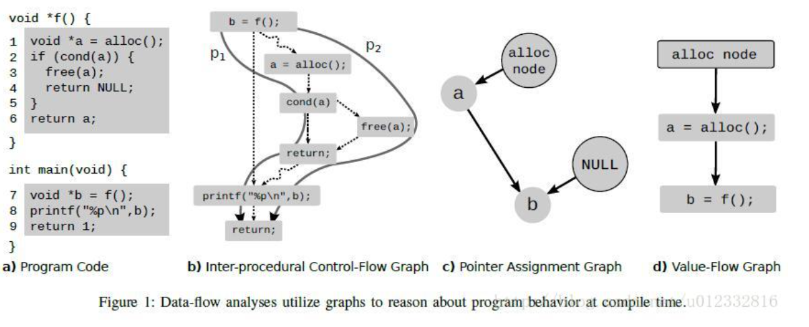
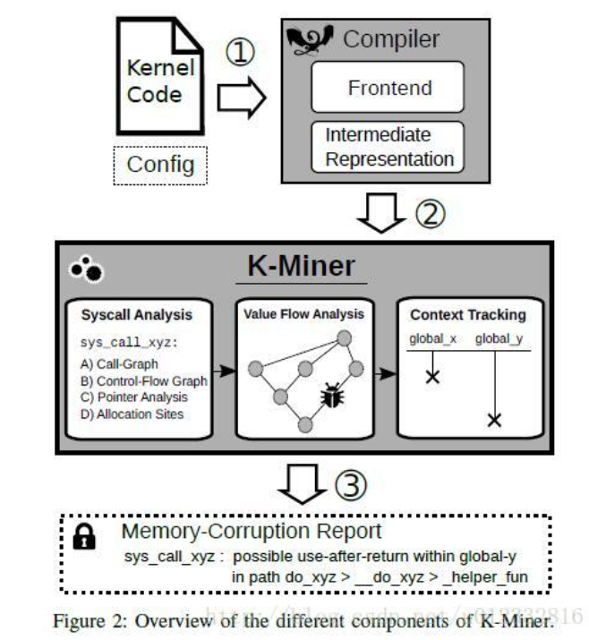
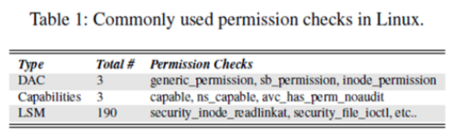
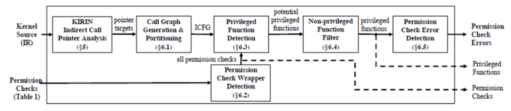

# vulnerability
## vulnerability detection
	漏洞检测主要分为静态检测和动态检测。
	* 静态检测
		* 源代码漏洞检测
			主要包括基于中间表示的漏洞检测和基于逻辑推理的漏洞检测.
			* 基于模式的漏洞检测
			* 基于代码相似性的漏洞检测
				核心思想是相似的代码很可能含有相同的漏洞，只需要根据漏洞代码实例就可以检测目标程序中是否含有相同的漏洞。
		* 二进制漏洞检测
			* 二进制程序分析
			* 基于二进制相似性的漏洞检测
				*	函数代码特征
				*	函数与文件内其他函数的交互关系特征
				*	函数与其他文件的交互关系特征
			* 基于模式的漏洞检测
	* 动态检测
		动态检测技术指在真实环境或模拟环境中实际运行程序,通过观察程序运行过程中的状态来发现漏洞。
		难点在于如何生成覆盖率高的测试用例,或者生成触发应用程序漏洞发生的测试用例。
		根据测试用例生成方式不同,模糊测试可分为基于变异的模糊测试和基于生成的模糊测试。
		* 基于生成的模糊测试
		    基于某种已知结构生成随机测试用例。
		* 基于进化的模糊测试
			基于程序的响应生成新的测试用例。
		* 基于变异的模糊测试
			变异可以是随机改变、改变一些字节/比特位等等。
			* 种子优化
				对种子文件进行变异,触发目标应用程序的潜在崩溃以发现新的漏洞。
				* 如何获取高质量的初始种子文件
					常用的收集方法包括使用现有的POC代码、使用基准测试用例以及从互联网爬取文件等方法。
				* 如何从种子池选取高质量的种子文件进行变异生成测试用例.
			* 测试用例生成
				测试用例的质量直接影响模糊测试的性能.高质量测试用例在更短的时间内覆盖更多的程序路径或触发更多的潜在漏洞。
			* 测试用例选择
				需要对测试用例进行筛选,选择高质量的测试用例（例如：触发漏洞或到达新路径）,过滤掉无效的测试用例,从而进一步提高测试性能。
		* 动态符号执行
			符号执行是一种程序分析技术，可以通过分析程序来得到让特定代码区域执行的输入。
			把程序的输入变为符号值，那么程序计算的输出值就是关于符号输入值的函数。
			使用符号值代替具体值执行程序，多款工具应用于漏洞检测，包括KLEE, SAGE等.

			符号执行分析过程：
				* 符号执行会在全局维护两个变量，符号状态θ，符号化的路径约束PC。
				* 符号状态θ，记录了程序中每个变量到符号表达式的映射。
				* 符号化路径约束PC，用来表示路径条件，初始值为true。
				* θ和PC会在符号执行过程中不断更新，当符号执行结束时，求解PC就可以得到覆盖所有路径的输入。
			* 约束生成
### **Sys:A static/symbolic tool for finding good bugs in good (browser) code.**
	本文介绍了一个将静态检查和符号执行结合起来的漏洞检测工具Sys。Sys将漏洞检测分为两个步骤：首先利用静态检查将可能出现错误的代码进行标记；然后利用符号执行判断标记的代码是否存在bug。 作者利用Sys对Chrome，Firefox以及FreeBSD进行了测试，总共发现51个bug，其中有43个被确认（并且作者获得了很多奖金）。
#### Goal
	目的：自动检测浏览器中的安全漏洞。

	问题1: browsers check a log.
		* static checkers : 在源码中查找"buggy patterns". 可以考虑提供自动修复功能？？
	问题2: static checkers 不能找到很多bug.
	问题3: 符号执行 难且慢.
		* 全程序符号执行开销巨大，效率太低。对于浏览器或者操作系统这样大规模的代码，基本不可用。
	
#### 新方法
	static checking + underconstrained 符号执行。

	static checking: 寻找"buggy patterns"，确定潜在的漏洞点。
		* 尽量高的recall（tp/(tp+fn)）(找得全)，即Sys需要尽量减少漏报，把降低误报的任务交给符号执行。
	符号执行: 遍历所有可能的值，直接跳转到候选错误点并执行，降低误报。
		* 对可能存在bug的路径(从static checker获取的)进行符号执行。
		* 将用户提供的symbolic checker应用到路径上。
	underconstrained： 从任何地方开始，保证符号执行可以从程序的任意一点开始进行，从而降低符号执行的开销。 
		* constraints 就是把许多代码表示成逻辑公式。
		* SMT Solver.

##### using Sys to find bugs
##### Uninitialized memory
	static extension:
		对于每一个栈上分配的内存对象，extension会对allocation后续的所有路径进行流敏感的遍历。如有没有显式的store，extension会将第一个出现的load标记为潜在的未初始化。extension没有追踪指针偏移，而是把每一个偏移都看作是一个新的追踪位置。
	symbolic checker:
		Sys用shadow memory来检测未初始化内存的使用。Sys会对static pass标记的每条路径运行symbolic checker，起始位置是每一个可能未初始化使用的栈变量s。对于s的每一个bit，Sys会在shadow memory里标记一个对应的bit，用1和0表示uninit和not-uninit。对于每一个store，Sys会修改shadow memory里对应的bit为0。在s被读取时，checker会检查shadow memory里对应的bit是否为1，以确认是有存在未初始化内存的使用.
##### Heap out-of-bounds
	Concrete out-of-bounds: 是指索引为常量的越界访问。
	static extension：
		主要对三种操作进行标记：
			1. phi节点，可以给操作数引入常量。
			2. 编译器生成的undef常量，undef可能为任意值，会造成潜在的越界读写。
			3. 索引为常量的getelementptr指令。
		static pass会确认上述1，2的常量是否可以到达3，并把这个信息传给symbolic checker。但是pass也会忽略一些情况：比如父类的对象（可能与子类对象的布局不同）以及动态大小的结构体成员变量等等。
	symbolic checker:
		由于是对常量的检测，符号执行的作用是过滤不可达路径。

#### 与其他静态检测工具的对比
	作者选择了Clang Static Analysis和Semmle与Sys进行对比，进行了未初始化内存的测试。上述两个工具的扩展性足够好，并且已经被应用在Mozilla的代码上。
	误报的情况多数是因为静态分析无法对变量的取值进行判断。
	另外Sys还存在其他工具能检测的漏报。
		1. 4个是因为Sys跳过了某些函数；
		2. 4个是因为分析的block超过了Sys的阈值；
		3. 2个是因为编译器优化消除了bug。

#### 与其他符号执行工具的对比
	作者表示angr和KLEE都无法直接对Firefox进行处理。（angr跑了24小时被作者手动停掉）。

#### 贡献
	1. 实现了一个结合静态分析和符号执行的漏洞检测框架，提供了五个checker（包括uninitialized memory, out-of-bounds access, use-after-free以及taint analysis），检测出51个浏览器相关的bug；
	2. 提出了将符号执行扩展到大型codebase的方法；
	3. 提供了一个基于Haskell，用户可自行扩展的检测系统。

#### reference
- http://hackdig.com/10/hack-155064.htm : 解释性文章 
- https://blog.csdn.net/u013648063/article/details/109120000 ： 解释性文章
- 李正 等:深度学习在漏洞检测研究中的应用进展 ： 漏洞检测综述
- http://www.infocomm-journal.com/cjnis/article/2019/2096-109x/2096-109x-5-1-00001.shtml ： 源代码静态漏洞检测
-----------------------------------------------------------------------------------------------------
--
### **K-Miner: Uncovering Memory Corruption in Linux**
	作者在这篇文章中提出了一种新的、基于LLVM的静态源码分析框架：K-Miner，它能够分析大规模的内核源码（例如：Linux内核），采用大规模指针分析（scalable pointer analysis）、过程间分析（inter-procedural analysis）和全局-上下文敏感分析（global, context-sensitive analysis）等技术，可以系统的挖掘几种不同类型的内存崩溃漏洞（包括dangling pointers, user-after-free, double-free 和 double-lock）。
#### 一、background
	目前，已经有很多种在运行时保护系统的方法（例如：控制流完整性CFI等），运行时保护系统并不能消除造成内存崩溃（memory corruption）的根本原因。然而，与运行时相对应的是静态源码分析，但是在目前的静态分析框架中，存在很多不完善的地方，例如，这种方法只能限制在局部的、过程内的检查，或者是只能基于单个源文件的检查（这些限制都是由于路径爆炸造成的），这对于代码量庞大的工程（例如：Linux内核）来说，是根本行不通的。
#### 二、面临的挑战
	静态分析方法必须考虑所有可能的路径和状态，这就导致路径爆炸问题，但是，剪枝或者是忽略某些部分（路径或状态等）都会导致分析结果不可靠。这就限制了静态源码分析只能是基于局部的过程内分析，或者是基于单个文件的分析。
	作者为了处理上述问题，采用的方法是：基于系统调用接口来分割内核代码，每个系统调用作为一个执行（分析）路径的入口，这样就有效的解决路径爆炸问题，使得K-Miner可以分析复杂的内核代码，并可以执行过程间的数据流（inter-procedural data-flow analysis）分析。
	但是，分割内核代码也不是一件简单的事情，因为在内核中，有很多的全局数据结构被频繁的使用，以及每个系统调用之间的同步问题，全局内存状态（context）问题，复杂的指针关系和别名问题等。
	具体来说，K-Miner面临四个挑战：
	1. 处理全局状态问题
	  在静态分析过程中，要想执行过程间分析，就必须考虑全局的数据结构，因此，局部的指针访问（例如函数内部）可能会影响全局的数据结构，因为局部指针可能只是一个别名（alias）而已。本文中使用的是稀疏程序表示（sparse program representation）技术，并结合控制流分析和数值流分析等技术来解决全局状态问题。
	2. 处理代码量太大问题
	  目前的Linux内核代码超过240万行，对于如此巨大的代码量，对它直接进行静态分析是及其困难的，因此，作者通过分割内核代码的方式，按照系统调用接口把它进行划分，这样就可以极大的减少单次分析的代码量，使K-Miner分析Linux内核成为可能。
	3. 处理误报率太高的问题
	  粗粒度的近似分析程序行为，出现高误报率是不可避免的，而开发者没有这么多的时间去手工分析大量的误报结果，因此，减少误报率是提高程序可用性的重要基础。作者利用尽可能多的信息，并精心设计每次的分析过程（individual analysis passes）来减少误报率，并在生成报告之前，对分析结果进行净化（sanitize）、去重（deduplicate）和过滤（filter），最大限度的减少误报率。
	4.  多路分析问题
	  为了尽可能多的检测造成内存崩溃的bug，K-Miner必须能够同步每次的分析结果（individual pass），并且利用已知的结果去分析未知的结果，提高分析的准确性和精确性。为了提高分析效率，还必须重用LLVM产生的中间结果（IR）,因此，IR产生的结果首先被保存到磁盘中，然后在后序的分析中重新导入。 
#### 技术概念
	* 数据流分析
	静态分析的通用方法是把程序和一些预编译的属性（pre-compiled properties）作为输入，对于给定的属性，去查找所有可能的路径。而这里的属性包括：活性分析（liveness analysis）、死码分析（dead-code analysis）、类型状态分析（typestate analysis）和空值分析（nullness analysis）。     在图1中，子图a是一个简单的示例代码，通过分析子图c的指针分配图PAG（Pointer Assignment Graph）我们可以知道，存在一条路径，使得变量b被赋值为空，因此会产生一个对应的空值报告。
	此外，在静态分析中，另外一个被使用的数据结构是：过程间控制流图ICFG（Inter-procedural Control-Flow Graph）,如子图b所示，它是一个全局的控制流图，可以被用来执行路径敏感性分析（path-sensitive analysis）。最后子图d是一个数值流图VFG（Value-Flow Graph）,该图作为污点分析技术的辅助图，可以用来跟踪单个的内存对象。

	* memory-corruption vulnerabilities
	内存奔溃漏洞一般分为以下几种：integer overflow，uaf，dangling pointer，double free, buffer overflow, missing pointer checks, uninitialized data, type errors, synchronization errors.
#### K-Miner运行机制

	K-Miner是基于LLVM和过程间静态数值流分析（SVF）之上静态源码分析框架，的主要的工作流程分为三步：
	1. K-Miner首先接收两个输入，一个是**内核代码**，另一个是**一份配置文件**，该配置文件是内核特征（kernel features）的一个列表，用来告诉前端解析器，哪些内核模块需要编译，哪些不需要编译。编译器根据这两个输入去构建抽象语法树（AST）,并把它转化为中间表示语言（IR）,作为后序阶段的输入。
	2. 把上一个阶段得到的中间表示语言作为本阶段的输入，去遍历配置文件中列出来的每一个系统调用，**对于每一个系统调用**，K-Miner都生成以下数据结构：一个调用图（CG）、一个指针分析图（PAG）、一个数值流图（VFG）和几个相关的内部数据结构。有了以上结果，就可以对每一个系统调用进行相应的分析（例如，空指针解引用分析等）。
	3. 对于第二步中的分析结果，如果检测到有内存漏洞，则在这一步中产生相应的分析报告（报告包含相应的内核版本、配置文件、系统调用以及程序执行路径等）。
#### reference
- https://blog.csdn.net/u012332816/article/details/79795643 ： 解释性文章

-----------------------------------------------------------------------------------------------------
--
### **PeX: A Permission Check Analysis Framework for Linux Kernel**
	本文介绍了一个用于Linux内核的静态权限检查框架PeX：
	1. PeX可以很好地、可伸缩地检测出内核代码中任何缺失的、不一致的和冗余的权限检查。从高层次上讲， PeX静态地探索从用户入口点（例如，系统调用）到特权函数的所有可能的程序路径，并且检测出其中的错误。
	2. 以一组已知的权限检查作为输入，自动识别出所有其他的权限检查（包括他们的包装器）。并且，PeX的控制分析也能够自动识别出每个权限检查和它们潜在的特权函数之间的映射。
	
	本文的贡献总结如下：
	1. **新技术**：我们提出并实现了PeX，一个用于Linux内核的静态权限检查分析框架。我们还开发了新的技术，可以执行可伸缩的间接调用分析，并自动识别权限检查和特权函数的过程。
	2. **实际影响**：我们使用 PeX 分析了最新Linux内核v4.18.5中的DAC、Capabilities和LSM权限检查,发现了36个新的权限检查错误，其中14个已经被内核开发人员确认。
	3. **社区贡献**：我们将以开源项目的形式发布PeX，同时发布的还有已确定的权限检查和特权函数之间的映射。这将允许内核开发人员使用PeX验证他们的代码，并使用他们自己的领域改进映射，从而为PeX做出贡献。
#### 一、背景
	权限检查通过为特权功能提供访问控制，从而在操作系统安全性中发挥重要作用。
	然而，对于内核开发人员来说，正确地应用新的权限检查并可伸缩地验证现有检查的可靠性是特别具有挑战性的，这是由于内核的代码基数大且复杂。

	Linux中的权限检查分为三种：
	1. 自主访问控制DAC
		DAC根据主体的身份或它们所属的组来限制对关键资源的访问。在某种意义上，DAC是一种粗粒度的访问控制模型。在这种Linux DAC的设计下，"root"绕过所有的权限检查。
	2. Capabilities
		a. 自Linux内核2.2(1999)以来，Capabilities 通过将root特权划分为小集合来支持细粒度的访问控制。
		b. CAP应该是细粒度的、不同的。然而，由于缺乏明确的范围定义,保护一个特权函数的特定Capabilities的选择是基于内核开发人员在实践中的理解而做出的。不幸的是，这就导致了CAP_SYS_ADMIN 的频繁使用(1167中有451个，超过38%)，并且它只是作为另一个根处理; grsecurity指出,有19个Capabilities确实相当于完整的根。
	3. Linux安全模块
		a. LSM是在内核v2.6 (2003) 中引入的，它提供了一组细粒度的可插入钩子, 这些钩子被放置在内核的各个安全临界点上。系统管理员可以向LSM钩子注册自定义的权限检查回调，从而执行不同的安全策略。
		b. LSM的一个常见用途是在Linux中实现强制访问控制 (MAC)  (例如， SELinux ,AppArmor) : 例如，当一个进程试图读取一个符号链接的文件路径时，将调用security_inode_readlink来检查这个进程是否具有对符号链接文件的读权限。这个钩子的SELinux回调检查是否有策略规则可以授予这个权限(例如，允许domain_atype. b:lnk_file_read)。
		c. LSM及其MAC机制的有效性在很大程度上取决于钩子是否在所有的安全临界点上正确地放置。如果一个钩子在任何临界点丢失，MAC就没有办法强制执行权限检查。

#### 二、权限检查错误的例子
	对于某一个特权函数（例如vfs_readlink），不同路径的权限检查条件不同，因此会出现缺失，不一致和冗余的权限检查。
#### 三、挑战
	1. 内核中间接调用分析。
		第一个关键挑战是linux内核中间接调用的频繁使用，以及以可伸缩的、精确的方式静态分析间接调用的困难。
		a. 为了实现模块化设计，内核提出了一组不同的抽象层，这些抽象层指定了不同具体模块的公共接口。
		b. 在这个内核编程范式下，一个抽象层将一个接口定义为一组间接函数指针，而一个具体模块则用自己的实现来初始化这些指针。
		c. 内核庞大的代码基数使得对内核接口中大量函数指针的解析成为一个挑战性问题，这也使得现有的精确指针分析技术不可伸缩。而SVF，这种使用流和上下文敏感值流的高精度先进分析技术，也不能运用到庞大的Linux内核中去。
		d. 基于类型这种简单的函数指针分析技术虽然能够运用到Linux内核中，但是由于在内核中的函数指针通常共享相同的类型，从而导致很多的错误定位，基于类型的间接分析的精确度也就不高。
	2. 缺乏完整的权限检查、特权函数及其映射
		第二个挑战是在Linux中健全地列举出一组权限检查,并推断出权限检查和特权函数之间的映射。
		虽然已知一些常用的DAC、Capabilities和LSM权限检查,但是内核开发人员经常设计一些在内部使用基本权限检查的自定义权限检查(包装程序)。然而，此类权限检查的完整列表从没被记录下来。而且，Linux内核没有明确指定哪个权限检查应该保护哪个特权函数的文档。现有的静态权限错误检查技术并不适用于解决这些问题。
#### 四、PeX的设计

##### 4.1 KIRIN间接调用分析
##### 4.2 调用图的产生和分区
##### 4.3 权限检查包装器检测
##### 4.4 特权函数检测
#### 五、实现与评价
##### 5.1 KIRIN 的评估
	1. 解析率: K-Miner 只能解析间接调用站点的1%;只能用于defconfig, 不用于allyesconfig.
	2. 解析的平均目标:对于KIRIN来说，每个已解析的间接调用站点的平均间接调用目标数比基于类型的方法要少得多。
	3. 分析时间:基于类型的方法是最快的，可以在1分钟内完成对两种配置的分析。KIRIN的运行速度比基于类型的方法慢。但是，对于defconfig， KIRIN的分析时间 (≈1分钟)与基于类型方法的分析时间相当，而KIRIN对allyesconfig 的分析时间为6.6分钟。基于SVF的K-Miner完成对defconfig的所有系统调用的分析大约需要9869分钟，比KIRIN慢得多。
##### 5.2 PeX的结果
	1. 对于allyesconfig, PeX+TYPE和PeX+KM在12小时的实验限制内无法完成分析。PeX+TYPE在ICFG中产生了太多的(假)边，在PeX分析的最后阶段还发生了路径爆炸;在超时之前，只报告了19个bug。同时，PeX+KM在较早的指针分析阶段就已经出现超时，因此无法报告任何错误。
	2. 对于defconfig，PeX+TYPE和PeX+KM都能够完成分析。在这个配置下，PeX+KIRIN (original)和PeX+TYPE都报告了21个bug (是allyesconfig检测到的36个bug中的一个子集)。PeX+ KM产生有限数量的警告，导致只检测到6个bug,其余的都没有发现。
#### 六、refernce
- https://www.usenix.org/conference/usenixsecurity19/presentation/zhang-tong : 会议链接(含pdf,slide,video)
- https://www.cnblogs.com/chengzhenghua/p/13227113.html : 解释性文章
- k-miner
-----------------------------------------------------------------------------------------------------
--
## authentication and authorisation
	验证： something you know/hava/are.
## other
- recall  ： 找得全。
- precision ： 找得对。
- word2vec模型将程序切片转换成向量表示。
- PDG ： program dependency graph.
- 高质量的漏洞数据集是应用深度学习实现漏洞检测的关键.在软件漏洞领域,尚未形成标准的漏洞数据集,研究者通常需要自己去构造数据集.有部分研究者公开自己的数据集。