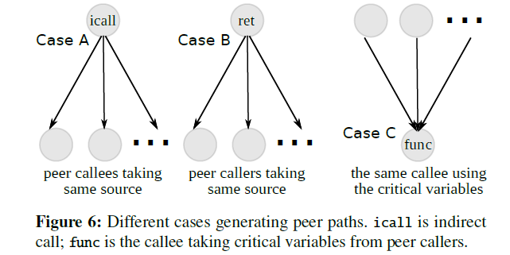

# vulnerability
## System hardening
###  Hiding in the Particles: When Return-Oriented Programming Meets Program Obfuscation
	It transforms program functions into obfuscated ROP chains that coexist seamlessly with the surrounding software stack and can withstand popular static and dynamic deobfuscation approaches.
	raindrop takes as input an ELF binary and obfuscates one or more user-defined functions, introducing different ROP-based obfuscations.
## vulnerability detection
	漏洞检测主要分为静态检测和动态检测。
	* 静态检测
		核心技术是数据流分析和污点分析。
		* 源代码漏洞检测
			主要包括基于中间表示(AST, CFG, PDG, CPG(包含前三个图))的漏洞检测和基于逻辑推理的漏洞检测.
			* 基于模式的漏洞检测
			* 基于代码相似性的漏洞检测
				核心思想是相似的代码很可能含有相同的漏洞，只需要根据漏洞代码实例就可以检测目标程序中是否含有相同的漏洞。
			* 基于学习的漏洞检测
				核心思想是将源代码以数值的形式表示并提交给学习模型，利用学习模型挖掘源代码的深层次表征特征和关联性. 
				1. 对源代码进行解析或构建程序切片以保留与漏洞检测相关的信息。
				2. 使用词嵌入等技术将源代码中间表示或切片映射到向量空间。
				3. 借助机器学习或深度学习模型强大的大数据挖掘能力学习源代码蕴含的各类信息（如：控制依赖和数据依赖信息）。在训练学习模型时，还可以配合使用传统静态分析的方法来获取更为丰富的源代码特征。使用传统静态分析对源代码的显式特征进行挖掘，使用机器学习方法对源代码图结构表示中的隐式特征进行挖掘，将这两种特征相结合，形成互补，为源代码漏洞的发现和挖掘提供更加有效地支撑；
				4. 实现漏洞检测。
		* 二进制漏洞检测
			主要以经过反汇编等手段处理后的二进制代码作为输入，设法恢复程序的信息，运用模式匹配或补丁对比等方式实现漏洞检测.
			* 二进制程序分析
			* 基于二进制相似性的漏洞检测
				*	函数代码特征
				*	函数与文件内其他函数的交互关系特征
				*	函数与其他文件的交互关系特征
			* 基于模式的漏洞检测
	* 动态检测
		动态检测技术指在真实环境或模拟环境中实际运行程序,通过观察程序运行过程中的状态来发现漏洞。
		难点在于如何生成覆盖率高的测试用例,或者生成触发应用程序漏洞发生的测试用例。
		根据测试用例生成方式不同,模糊测试可分为基于变异的模糊测试和基于生成的模糊测试。
		* 基于生成的模糊测试
		    基于某种已知结构生成随机测试用例。
		* 基于进化的模糊测试
			基于程序的响应生成新的测试用例。
		* 基于变异的模糊测试
			变异可以是随机改变、改变一些字节/比特位等等。
			* 种子优化
				对种子文件进行变异,触发目标应用程序的潜在崩溃以发现新的漏洞。
				* 如何获取高质量的初始种子文件
					常用的收集方法包括使用现有的POC代码、使用基准测试用例以及从互联网爬取文件等方法。
				* 如何从种子池选取高质量的种子文件进行变异生成测试用例.
			* 测试用例生成
				测试用例的质量直接影响模糊测试的性能.高质量测试用例在更短的时间内覆盖更多的程序路径或触发更多的潜在漏洞。
			* 测试用例选择
				需要对测试用例进行筛选,选择高质量的测试用例（例如：触发漏洞或到达新路径）,过滤掉无效的测试用例,从而进一步提高测试性能。
		* 动态符号执行
			1. 符号执行是一种程序分析技术，可以通过分析程序来得到让特定代码区域执行的输入。将具体执行和符号执行相结合，以具体的值作为程序的输入，执行程序，收集符号约束，修改收集的符号约束内容以构造不同的可执行路径。
			2. 把程序的输入变为符号值，那么程序计算的输出值就是关于符号输入值的函数。
			3. 使用符号值代替具体值执行程序，多款工具应用于漏洞检测，包括KLEE, SAGE等.

			符号执行分析过程：
				* 符号执行会在全局维护两个变量，符号状态θ，符号化的路径约束PC。
				* 符号状态θ，记录了程序中每个变量到符号表达式的映射。
				* 符号化路径约束PC，用来表示路径条件，初始值为true。
				* θ和PC会在符号执行过程中不断更新，当符号执行结束时，求解PC就可以得到覆盖所有路径的输入。
				* 约束生成
### 综述：源代码漏洞静态分析技术
#### 软件漏洞分析技术基本概念
#### 源代码漏洞静态分析技术
##### 源代码的表示方法
##### 源代码的分析方法
###### 传统静态分析技术
###### 基于学习的静态分析技术
##### 分析与讨论
	源代码漏洞静态分析时，主要存在以下5个难点：
	1. 源代码的表示。
		无论是传统静态分析还是基于学习的静态分析，都需要将源代码转换为某种中间表示。不同的中间表示所包含的源代码信息不同。如何选择和构建合理的源代码中间表示方法以尽可能多地包含源代码信息是当前的一个难点。
	2. 源代码的建模。
		由于代码中对内置函数和外部库的引用越来越频繁，各种动态代码引入也越来越常见。
		i. 如何在缺乏源代码支持的情况下，对内置函数和外部引用库的行为进行建模。
		ii. 如何对程序的动态行为进行分析。
		iii. 如何针对大型项目进行高效的过程间分析以保证程序数据流的完整性。
		iV. 如何自动化地对Source和Sink进行识别和推理，对代码中出现的净化例程进行合理地评估也是具有挑战的。
	3. 机器学习方法的选择。
		将机器学习技术引入到静态分析中是当前的研究趋势，但并不是所有的机器学习方法都适用于程序分析。如何选择和构建合理的学习模型来理解和学习源代码表示的信息是基于学习的静态分析的关键问题。
	4. 漏洞分析方法的普适性。
		当前的研究大多针对用某一特定类型语言编写的软件程序展开。改善漏洞分析方法的普适性，提高分析模型的适配能力是当前静态分析中的关键问题。
	5. 数据集的匮乏。
		如何构建统一规范的数据集，如何在数据稀缺的情况下对漏洞进行有效挖掘是一大难题。
#### 总结
	（1）使用直观的图形化结构表示源代码
	（2）合理的代码嵌入
	（3）将源代码的显式特征和隐式特征相结合
	（4）合理、适度地使用深度学习技术
	（5）从待检测项目中学习[1]。通过从待检测项目中学习，也许能够避免由于数据集稀缺导致模型过拟合的问题，帮助我们在真实场景下构建高性能的检测模型.
#### reference
- [1] [79] Ahmadi M, Farkhani R M, Williams R, et al. Finding Bugs Using Your Own Code: Detecting Functionally-similar yet Inconsistent Code[C]//30th {USENIX} Security Symposium ({USENIX} Secu-rity 21). 2021.

### **Sys:A static/symbolic tool for finding good bugs in good (browser) code.**
	本文介绍了一个将静态检查和符号执行结合起来的漏洞检测工具Sys。Sys将漏洞检测分为两个步骤：首先利用静态检查将可能出现错误的代码进行标记；然后利用符号执行判断标记的代码是否存在bug。 作者利用Sys对Chrome，Firefox以及FreeBSD进行了测试，总共发现51个bug，其中有43个被确认（并且作者获得了很多奖金）。
#### Goal
	目的：自动检测浏览器中的安全漏洞。

	问题1: browsers check a log.
		* static checkers : 在源码中查找"buggy patterns". 可以考虑提供自动修复功能？？
	问题2: static checkers 不能找到很多bug.
	问题3: 符号执行 难且慢.
		* 全程序符号执行开销巨大，效率太低。对于浏览器或者操作系统这样大规模的代码，基本不可用。
	
#### 新方法
	static checking + underconstrained 符号执行。

	static checking: 寻找"buggy patterns"，确定潜在的漏洞点。
		* 尽量高的recall（tp/(tp+fn)）(找得全)，即Sys需要尽量减少漏报，把降低误报的任务交给符号执行。
	符号执行: 遍历所有可能的值，直接跳转到候选错误点并执行，降低误报。
		* 对可能存在bug的路径(从static checker获取的)进行符号执行。
		* 将用户提供的symbolic checker应用到路径上。
	underconstrained： 从任何地方开始，保证符号执行可以从程序的任意一点开始进行，从而降低符号执行的开销。 
		* constraints 就是把许多代码表示成逻辑公式。
		* SMT Solver.

##### using Sys to find bugs
##### Uninitialized memory
	static extension:
		对于每一个栈上分配的内存对象，extension会对allocation后续的所有路径进行流敏感的遍历。如有没有显式的store，extension会将第一个出现的load标记为潜在的未初始化。extension没有追踪指针偏移，而是把每一个偏移都看作是一个新的追踪位置。
	symbolic checker:
		Sys用shadow memory来检测未初始化内存的使用。Sys会对static pass标记的每条路径运行symbolic checker，起始位置是每一个可能未初始化使用的栈变量s。对于s的每一个bit，Sys会在shadow memory里标记一个对应的bit，用1和0表示uninit和not-uninit。对于每一个store，Sys会修改shadow memory里对应的bit为0。在s被读取时，checker会检查shadow memory里对应的bit是否为1，以确认是有存在未初始化内存的使用.
##### Heap out-of-bounds
	Concrete out-of-bounds: 是指索引为常量的越界访问。
	static extension：
		主要对三种操作进行标记：
			1. phi节点，可以给操作数引入常量。
			2. 编译器生成的undef常量，undef可能为任意值，会造成潜在的越界读写。
			3. 索引为常量的getelementptr指令。
		static pass会确认上述1，2的常量是否可以到达3，并把这个信息传给symbolic checker。但是pass也会忽略一些情况：比如父类的对象（可能与子类对象的布局不同）以及动态大小的结构体成员变量等等。
	symbolic checker:
		由于是对常量的检测，符号执行的作用是过滤不可达路径。

#### 与其他静态检测工具的对比
	作者选择了Clang Static Analysis和Semmle与Sys进行对比，进行了未初始化内存的测试。上述两个工具的扩展性足够好，并且已经被应用在Mozilla的代码上。
	误报的情况多数是因为静态分析无法对变量的取值进行判断。
	另外Sys还存在其他工具能检测的漏报。
		1. 4个是因为Sys跳过了某些函数；
		2. 4个是因为分析的block超过了Sys的阈值；
		3. 2个是因为编译器优化消除了bug。

#### 与其他符号执行工具的对比
	作者表示angr和KLEE都无法直接对Firefox进行处理。（angr跑了24小时被作者手动停掉）。

#### 贡献
	1. 实现了一个结合静态分析和符号执行的漏洞检测框架，提供了五个checker（包括uninitialized memory, out-of-bounds access, use-after-free以及taint analysis），检测出51个浏览器相关的bug；
	2. 提出了将符号执行扩展到大型codebase的方法；
	3. 提供了一个基于Haskell，用户可自行扩展的检测系统。

#### reference
- http://hackdig.com/10/hack-155064.htm : 解释性文章 
- https://blog.csdn.net/u013648063/article/details/109120000 ： 解释性文章
- 李正 等:深度学习在漏洞检测研究中的应用进展 ： 漏洞检测综述
- http://www.infocomm-journal.com/cjnis/article/2019/2096-109x/2096-109x-5-1-00001.shtml ： 源代码静态漏洞检测
-----------------------------------------------------------------------------------------------------
--
### **K-Miner: Uncovering Memory Corruption in Linux**
	作者在这篇文章中提出了一种新的、基于LLVM的静态源码分析框架：K-Miner，它能够分析大规模的内核源码（例如：Linux内核），采用大规模指针分析（scalable pointer analysis）、过程间分析（inter-procedural analysis）和全局-上下文敏感分析（global, context-sensitive analysis）等技术，可以系统的挖掘几种不同类型的内存崩溃漏洞（包括dangling pointers, user-after-free, double-free 和 double-lock）。
#### 一、background
	目前，已经有很多种在运行时保护系统的方法（例如：控制流完整性CFI等），运行时保护系统并不能消除造成内存崩溃（memory corruption）的根本原因。然而，与运行时相对应的是静态源码分析，但是在目前的静态分析框架中，存在很多不完善的地方，例如，这种方法只能限制在局部的、过程内的检查，或者是只能基于单个源文件的检查（这些限制都是由于路径爆炸造成的），这对于代码量庞大的工程（例如：Linux内核）来说，是根本行不通的。
#### 二、面临的挑战
	静态分析方法必须考虑所有可能的路径和状态，这就导致路径爆炸问题，但是，剪枝或者是忽略某些部分（路径或状态等）都会导致分析结果不可靠。这就限制了静态源码分析只能是基于局部的过程内分析，或者是基于单个文件的分析。
	作者为了处理上述问题，采用的方法是：基于系统调用接口来分割内核代码，每个系统调用作为一个执行（分析）路径的入口，这样就有效的解决路径爆炸问题，使得K-Miner可以分析复杂的内核代码，并可以执行过程间的数据流（inter-procedural data-flow analysis）分析。
	但是，分割内核代码也不是一件简单的事情，因为在内核中，有很多的全局数据结构被频繁的使用，以及每个系统调用之间的同步问题，全局内存状态（context）问题，复杂的指针关系和别名问题等。
	具体来说，K-Miner面临四个挑战：
	1. 处理全局状态问题
	  在静态分析过程中，要想执行过程间分析，就必须考虑全局的数据结构，因此，局部的指针访问（例如函数内部）可能会影响全局的数据结构，因为局部指针可能只是一个别名（alias）而已。本文中使用的是稀疏程序表示（sparse program representation）技术，并结合控制流分析和数值流分析等技术来解决全局状态问题。
	2. 处理代码量太大问题
	  目前的Linux内核代码超过240万行，对于如此巨大的代码量，对它直接进行静态分析是及其困难的，因此，作者通过分割内核代码的方式，按照系统调用接口把它进行划分，这样就可以极大的减少单次分析的代码量，使K-Miner分析Linux内核成为可能。
	3. 处理误报率太高的问题
	  粗粒度的近似分析程序行为，出现高误报率是不可避免的，而开发者没有这么多的时间去手工分析大量的误报结果，因此，减少误报率是提高程序可用性的重要基础。作者利用尽可能多的信息，并精心设计每次的分析过程（individual analysis passes）来减少误报率，并在生成报告之前，对分析结果进行净化（sanitize）、去重（deduplicate）和过滤（filter），最大限度的减少误报率。
	4.  多路分析问题
	  为了尽可能多的检测造成内存崩溃的bug，K-Miner必须能够同步每次的分析结果（individual pass），并且利用已知的结果去分析未知的结果，提高分析的准确性和精确性。为了提高分析效率，还必须重用LLVM产生的中间结果（IR）,因此，IR产生的结果首先被保存到磁盘中，然后在后序的分析中重新导入。 
#### 技术概念
	* 数据流分析
	静态分析的通用方法是把程序和一些预编译的属性（pre-compiled properties）作为输入，对于给定的属性，去查找所有可能的路径。而这里的属性包括：活性分析（liveness analysis）、死码分析（dead-code analysis）、类型状态分析（typestate analysis）和空值分析（nullness analysis）。     在图1中，子图a是一个简单的示例代码，通过分析子图c的指针分配图PAG（Pointer Assignment Graph）我们可以知道，存在一条路径，使得变量b被赋值为空，因此会产生一个对应的空值报告。
	此外，在静态分析中，另外一个被使用的数据结构是：过程间控制流图ICFG（Inter-procedural Control-Flow Graph）,如子图b所示，它是一个全局的控制流图，可以被用来执行路径敏感性分析（path-sensitive analysis）。最后子图d是一个数值流图VFG（Value-Flow Graph）,该图作为污点分析技术的辅助图，可以用来跟踪单个的内存对象。


	* memory-corruption vulnerabilities
	内存奔溃漏洞一般分为以下几种：integer overflow，uaf，dangling pointer，double free, buffer overflow, missing pointer checks, uninitialized data, type errors, synchronization errors.
#### K-Miner运行机制

	K-Miner是基于LLVM和过程间静态数值流分析（SVF）之上静态源码分析框架，的主要的工作流程分为三步：
	1. K-Miner首先接收两个输入，一个是**内核代码**，另一个是**一份配置文件**，该配置文件是内核特征（kernel features）的一个列表，用来告诉前端解析器，哪些内核模块需要编译，哪些不需要编译。编译器根据这两个输入去构建抽象语法树（AST）,并把它转化为中间表示语言（IR）,作为后序阶段的输入。
	2. 把上一个阶段得到的中间表示语言作为本阶段的输入，去遍历配置文件中列出来的每一个系统调用，**对于每一个系统调用**，K-Miner都生成以下数据结构：一个调用图（CG）、一个指针分析图（PAG）、一个数值流图（VFG）和几个相关的内部数据结构。有了以上结果，就可以对每一个系统调用进行相应的分析（例如，空指针解引用分析等）。
	3. 对于第二步中的分析结果，如果检测到有内存漏洞，则在这一步中产生相应的分析报告（报告包含相应的内核版本、配置文件、系统调用以及程序执行路径等）。
#### reference
- https://blog.csdn.net/u012332816/article/details/79795643 ： 解释性文章

-----------------------------------------------------------------------------------------------------
--
### **PeX: A Permission Check Analysis Framework for Linux Kernel**
	本文介绍了一个用于Linux内核的静态权限检查框架PeX：
	1. PeX可以很好地、可伸缩地检测出内核代码中任何缺失的、不一致的和冗余的权限检查。从高层次上讲， PeX静态地探索从用户入口点（例如，系统调用）到特权函数的所有可能的程序路径，并且检测出其中的错误。
	2. 以一组已知的权限检查作为输入，自动识别出所有其他的权限检查（包括他们的包装器）。并且，PeX的控制分析也能够自动识别出每个权限检查和它们潜在的特权函数之间的映射。
	
	本文的贡献总结如下：
	1. **新技术**：我们提出并实现了PeX，一个用于Linux内核的静态权限检查分析框架。我们还开发了新的技术，可以执行可伸缩的间接调用分析，并自动识别权限检查和特权函数的过程。
	2. **实际影响**：我们使用 PeX 分析了最新Linux内核v4.18.5中的DAC、Capabilities和LSM权限检查,发现了36个新的权限检查错误，其中14个已经被内核开发人员确认。
	3. **社区贡献**：我们将以开源项目的形式发布PeX，同时发布的还有已确定的权限检查和特权函数之间的映射。这将允许内核开发人员使用PeX验证他们的代码，并使用他们自己的领域改进映射，从而为PeX做出贡献。
#### 一、背景
	权限检查通过为特权功能提供访问控制，从而在操作系统安全性中发挥重要作用。
	然而，对于内核开发人员来说，正确地应用新的权限检查并可伸缩地验证现有检查的可靠性是特别具有挑战性的，这是由于内核的代码基数大且复杂。

	Linux中的权限检查分为三种：
	1. 自主访问控制DAC
		DAC根据主体的身份或它们所属的组来限制对关键资源的访问。在某种意义上，DAC是一种粗粒度的访问控制模型。在这种Linux DAC的设计下，"root"绕过所有的权限检查。
	2. Capabilities
		a. 自Linux内核2.2(1999)以来，Capabilities 通过将root特权划分为小集合来支持细粒度的访问控制。
		b. CAP应该是细粒度的、不同的。然而，由于缺乏明确的范围定义,保护一个特权函数的特定Capabilities的选择是基于内核开发人员在实践中的理解而做出的。不幸的是，这就导致了CAP_SYS_ADMIN 的频繁使用(1167中有451个，超过38%)，并且它只是作为另一个根处理; grsecurity指出,有19个Capabilities确实相当于完整的根。
	3. Linux安全模块
		a. LSM是在内核v2.6 (2003) 中引入的，它提供了一组细粒度的可插入钩子, 这些钩子被放置在内核的各个安全临界点上。系统管理员可以向LSM钩子注册自定义的权限检查回调，从而执行不同的安全策略。
		b. LSM的一个常见用途是在Linux中实现强制访问控制 (MAC)  (例如， SELinux ,AppArmor) : 例如，当一个进程试图读取一个符号链接的文件路径时，将调用security_inode_readlink来检查这个进程是否具有对符号链接文件的读权限。这个钩子的SELinux回调检查是否有策略规则可以授予这个权限(例如，允许domain_atype. b:lnk_file_read)。
		c. LSM及其MAC机制的有效性在很大程度上取决于钩子是否在所有的安全临界点上正确地放置。如果一个钩子在任何临界点丢失，MAC就没有办法强制执行权限检查。


#### 二、权限检查错误的例子
	对于某一个特权函数（例如vfs_readlink），不同路径的权限检查条件不同，因此会出现缺失，不一致和冗余的权限检查。
#### 三、挑战
	1. 内核中间接调用分析。
		第一个关键挑战是linux内核中间接调用的频繁使用，以及以可伸缩的、精确的方式静态分析间接调用的困难。
		a. 为了实现模块化设计，内核提出了一组不同的抽象层，这些抽象层指定了不同具体模块的公共接口。
		b. 在这个内核编程范式下，一个抽象层将一个接口定义为一组间接函数指针，而一个具体模块则用自己的实现来初始化这些指针。
		c. 内核庞大的代码基数使得对内核接口中大量函数指针的解析成为一个挑战性问题，这也使得现有的精确指针分析技术不可伸缩。而SVF，这种使用流和上下文敏感值流的高精度先进分析技术，也不能运用到庞大的Linux内核中去。
		d. 基于类型这种简单的函数指针分析技术虽然能够运用到Linux内核中，但是由于在内核中的函数指针通常共享相同的类型，从而导致很多的错误定位，基于类型的间接分析的精确度也就不高。
	2. 缺乏完整的权限检查、特权函数及其映射
		第二个挑战是在Linux中健全地列举出一组权限检查,并推断出权限检查和特权函数之间的映射。
		虽然已知一些常用的DAC、Capabilities和LSM权限检查,但是内核开发人员经常设计一些在内部使用基本权限检查的自定义权限检查(包装程序)。然而，此类权限检查的完整列表从没被记录下来。而且，Linux内核没有明确指定哪个权限检查应该保护哪个特权函数的文档。现有的静态权限错误检查技术并不适用于解决这些问题。
#### 四、PeX的设计

##### 4.1 KIRIN间接调用分析
##### 4.2 调用图的产生和分区
##### 4.3 权限检查包装器检测
##### 4.4 特权函数检测
#### 五、实现与评价
##### 5.1 KIRIN 的评估
	1. 解析率: K-Miner 只能解析间接调用站点的1%;只能用于defconfig, 不用于allyesconfig.
	2. 解析的平均目标:对于KIRIN来说，每个已解析的间接调用站点的平均间接调用目标数比基于类型的方法要少得多。
	3. 分析时间:基于类型的方法是最快的，可以在1分钟内完成对两种配置的分析。KIRIN的运行速度比基于类型的方法慢。但是，对于defconfig， KIRIN的分析时间 (≈1分钟)与基于类型方法的分析时间相当，而KIRIN对allyesconfig 的分析时间为6.6分钟。基于SVF的K-Miner完成对defconfig的所有系统调用的分析大约需要9869分钟，比KIRIN慢得多。
##### 5.2 PeX的结果
	1. 对于allyesconfig, PeX+TYPE和PeX+KM在12小时的实验限制内无法完成分析。PeX+TYPE在ICFG中产生了太多的(假)边，在PeX分析的最后阶段还发生了路径爆炸;在超时之前，只报告了19个bug。同时，PeX+KM在较早的指针分析阶段就已经出现超时，因此无法报告任何错误。
	2. 对于defconfig，PeX+TYPE和PeX+KM都能够完成分析。在这个配置下，PeX+KIRIN (original)和PeX+TYPE都报告了21个bug (是allyesconfig检测到的36个bug中的一个子集)。PeX+ KM产生有限数量的警告，导致只检测到6个bug,其余的都没有发现。
#### 六、refernce
- https://www.usenix.org/conference/usenixsecurity19/presentation/zhang-tong : 会议链接(含pdf,slide,video)
- https://www.cnblogs.com/chengzhenghua/p/13227113.html : 解释性文章
- k-miner

-----------------------------------------------------------------------------------------------------
--
### Automatically Identifying Security Checks for Detecting Kernel Semantic Bugs
	研究 安全检查。
	We observe that security checks are in fact very informative in inferring critical semantics in OS kernels.
	a. 系统地研究安全检查，并且提出了一种自动化识别OS内核中安全检查的方法。
	b. 提供多个分析器，包含NULL-pointer dereferencing, missing error handling, and double fetching。
	c. 用 Linux kernel 和 FreeBSD kernel 进行评估方法。
#### 1. Introduction
	a. 介绍安全检查。
	b. 描述安全检查的代码语义，列举安全检查实例，以及实例跟漏洞的关系。识别危险变量的作用。
	c. 识别安全检查的重要性。
	d. 说明安全检查识别是一个有挑战性的问题。
	e. 简要介绍本文的方法。
	f. 介绍成果
	贡献：
	- A study of security checks.
	- Automatic identification of security checks.
	- Detection of three classes of semantic bugs.
	- A new, open-source tool.
#### 2. A Study of Security Checks
##### 2.1 Definition of Security Checks
##### 2.2 Handling Security-Check Failures
	FH: 1) 返回错误码. 2) 停止执行. 3) 修正错误码. 4) 发布错误信息.
#### 3. CHEQ: Identifying Security Checks
##### 3.1 A Motivating Example
##### 3.2 Approach Overview
##### 3.3 Finding Error-Handling Functions and Error Codes
##### 3.4 Identifying FH Primitives
	识别有错误处理原语的基本块。
	1. 即使有错误码列表，识别返回错误的原语也可能很复杂，并不是函数中使用的所有错误代码都会被返回，值是否为错误代码取决于某些上下文。例如，赋值指令中的NULL仅在赋值以函数的返回值为目标时是错误代码。错误码还可以跨函数传播和更改。为了精确地识别返回错误的原语，需要进行数据流分析来决定返回指令最终是否返回错误代码。我们通过识别内核的每个函数F中的返回指令开始数据流分析。为了确定返回指令的返回值ret是否是错误代码，我们向后分析其传播的值，即ret的所有来源。来源可以是常数、局部变量、全局变量或者参数。如果来源是一个常数错误码，则可以确定包含修改ret值指令的基本块。因为返回值是由最后一次赋值决定的，所以一旦找到源就停止反向数据流分析。在我们的实现中，我们选择不使用别名分析来进行数据流分析，因为错误码传播比较简单，通常不涉及复杂的指向关系。例如，我们没有看到任何错误代码通过一个指针存储到内存中，然后通过另一个指针加载的例子。
	2. 我们通过识别相应函数的调用实现识别发出错误消息或停止执行的错误处理原语。对于不返回错误代码或调用异常处理函数的即时错误修复情况，通常这种修复仅限于一些简单的场景，比如用旧值或边界值重置变量。因此，如果一个条件语句比较两个变量a和b，并且a = b或b = a出现在条件语句之后的基本块中，我们将其识别为一个即时的错误修复。这样的分析绝不是完整的，但只能涵盖我们在研究中观察到的大多数错误修复情况。
##### 3.5 Constructing FH Graph
	在收集了所有具有错误处理的基本块后，下一步是分析条件语句的分支，看它们是否符合安全检查的定义。为了便于对所有分支的错误处理特性进行分析，我们提出构造错误处理图--带有错误处理特性边的增强控制流图。图6.2就是一个错误处理图例子。图是用迭代算法构造的。最初，所有边都标记为NO-FH，然后算法从函数入口遍历控制流图。当到达一个带有错误处理原语的基本块时，该算法根据以下策略更新前向可达边和后向可达边的属性。
	①	对于错误修复和异常处理原语，由于它们不传播，我们只更新当前基本块的传入边和传出边的属性。
	②	对于返回错误代码的原语，由于错误代码传播，我们迭代更新当前基本块所有传入边和传出边的属性。根据安全检查的定义，在分支上合并属性。我们有一个专用的标志来区分错误处理和错误返回。
##### 3.6 Identifying Security Checks
	在错误处理图中，识别安全检查条件语句简化为查询条件语句的输出边的错误处理属性。具有至少一个MUST-FH输出边和至少一个MA Y -FH或NO-FH输出边的条件语句被标识为安全检查。紧接着，检查当前包含安全检查条件语句的函数。
	
	thinking: 如果该安全检查条件语句的安全检查失败分支属于Must_Handle_err，异常处理函数属于停止执行类型，并且危险变量来源于形参，那么称当前函数为安全检查函数，将其插入函数列表中。
#### 4. Detecting Critical Kernel Semantic Bugs ？/存在水分
##### 4.1 Detecting Null-Pointer Dereferencing
	1. 先找到NULL指针的安全检查
	2. 后向查找是哪个函数(A)的返回值
	3. 从每个调用A的位置，前向查找对返回值的使用
	4. 基于 check/(check+uncheck) 比例，推测缺失安全检查
##### 4.2 Detecting Missing Error Handling
	1. 先找到可能会返回异常代码的函数
	2. 然后计算对它的返回值做了多少次安全检查
##### 4.3 Detecting Double-Fetch Bugs
	介绍实例，解释bug类型。
	说明检测方法。
#### 5. Implementation
#### 6. Evaluation
	Linux kernel and BSD kernel
##### 6.1 Evaluating Security-Check Identification
	a. 统计结果


	b. False Negatives
		1. 简单描述计算方法。
		2. 描述漏报率以及原因
	c. False Positives 
		1. 随机抽样分析结果。
		2. 描述抽样结果。
		3. 分析误报的原因。
		4. 怎么解决？（可选)
	d. Scalability
		描述实验环境以及运行时空情况。
	e. Generality
		描述通用性。
##### 6.2 Evaluating Semantic-Bug Detection
	为了证明安全检查的有用性，我们描述了在Linux 和 FreeBSD kernel 上bug检测的结果。由于有限的空间，我们将主要描述Linux的细节。
	To demonstrate the usefulness of security checks, we describe the results of our bug detection on both the Linux and FreeBSD kernels. Due to limited space, we will primarily focus on the details for the Linux kernel.
	设置比例阈值，获取输出结果，手工确认分析结果。、
	a. NULL-pointer dereferencing bugs.
	b. Missing error handling bugs.
	c. Double-fetch bugs.
	We believe that the promising bug-detection results mainly benefit from CHEQ’s identification of security checks, which helps automatically infer what are critical and erroneous, and thus eliminate overwhelming false reports.
#### 7 Related Work
	总结方法的创新性。
	1. 叙述前人的工作。
	2. 与其他方法对比，cheq的先进性。
#### 8 结论
#### 9 感谢
#### reference

### OOPSLA11 - RoleCast: finding missing security checks when you do not know what checks are.

### CCS19 - Detecting Missing-Check Bugs via Semantic- and Context-Aware Criticalness and Constraints Inferences
	我们进一步提出对等切片构建去收集享有相似语义和上下文的危险变量切片。这些切片可以用于交叉检查潜在缺失安全检查的危险变量。
	贡献点：
	a. 一个缺失安全检查漏洞检测工具。
	b. 多个新技术。 1. 对等语义切片构建识别具有相似的语义和上下文的代码路径。   2. 自动化的危险变量推断找到目标，缩小了目标范围。  3. 两层类型分析。
	c. 许多Linux Kernel bugs.
#### 2 Missing Checks in OS Kernels
	从NVD中抽样200个最近的漏洞，分析后得知其中有119(59.5%)个是用安全检查修复的。
##### 2.1 Impact of Missing-Check Bugs
	a. 多少安全漏洞是由安全检查缺失导致的。
		60%。
	b. 缺失安全检查导致的安全漏洞类型。
		* DoS 51.2%
		* Over flow 16%
		* Bypass privi 14.3%
		* info leak 11.7%
		* memory corrupt 6.7%
		* code exec 3.4%
	c. 缺失安全检查导致的漏洞影响力。
		缺失检查的目标是 buffer length (CVE-2017-18017), function return value, pointer value, and permissions。
		容易造成 buffer overflow, use-after-free, memory corruption, permission pass，which will finally result in data losses, information leaks, and even attackers control of the whole system。
#### 4 Design of CRIX
##### 4.1 Identifying Targets of Indirect Calls
	在编译时期，很难知道非直接调用的有效目标是哪个address-taken functions.
	比较指针分析和类型分析的利弊。
	基于类型分析的方法，非直接调用尝试匹配address-taken function的参数个数和类型。若匹配，则是潜在的有效目标。这个方法常用于CFI。
	现存一种方法[7]，使用 objects of same struct type to restrict indirect-call 目标。 首先收集所有的函数指针，然后利用struct和函数签名匹配 分析indirect-call。
###### Two-Layer Type Analysis
	单层类型分析使用函数签名约束非直接调用目标。
	双层类型分析进一步的使用struct约束非直接调用目标，类似[7]中方法。
	思路：对于OS kernels, 88%被取过地址的函数首先存放在结构体的函数指针域中，然后解引用调用该函数。因此，未被存放进结构体函数指针域中的函数一定不是结构体中非直接调用的目标函数。12%被取过地址的函数未存储进struct，则使用单层类型分析。
	分析流程：若对结构体类型a的函数指针域b进行了赋值，那么对a类型结构体的域b进行解引用，有效目标函数是赋值的address-taken function set。
	结果：大大降低误报率，（猜 高达90%）。
	技术要求：保证 field-sensitive, 通过分析struct的offset实现。对于offset不确定的场景(union)，使用field-insensitive。
###### Type-Escaping Analysis for False Negatives
	类型逃逸分析，即类型混淆分析，降低漏报率。
	1. 多态场景。例如一个函数指针存储于结构体A，但是结构体B可以指向结构体A的内存空间，并通过结构体B调用函数指针。
	2. 类型强制转换。pointer -> integer
	3. 指针传递。pointer -> pointer
	当找到一个逃逸类型结构体，这个结构体类型的函数指针域仅使用单层类型分析，效率高，防止漏报。
	为了应对这个局限性，将获得函数地址的结构体进行数据流分析，查看其是否发生过类型转换，或者其函数指针字段是否赋值给其他结构体类型。如果发生类型混淆，则只采用单层类型分析识别非直接调用。
	a. 目的：获取<<type,index>, func>map。
	b. 设计思路：在构建(type,function)map的过程中，判断赋值语句前后的变量是否有发生类型混淆。若发生类型混淆，利用llvm的GetElementPtrInst类或LoadInst类的部分接口，提取出变量的上层类型，用混淆变量(赋值变量)更新被混淆变量(被赋值变量)的(type,function)map，避免类型逃逸的发生。
	c. 实现思路：
```
1. 分析初始化语句。 2. 分析赋值语句。 3. 分析类型转换语句。 4. 分析内存拷贝函数。
		↓					↓					↓				↓
--A={.func=func}--		--A.func=func--			--typeA = typeB-- 
		↓					↓							↓
		-------------→  <<type,index>, func>map  ←-------
```
	Map更新条件：
	i. 初始化语句中，存在此类情况则更新该Map；
	ii. 赋值(store)语句中：
		存在形如A.Field = FuncPtr的情况更新Map；
		存在形如A.FieldA = B.FieldB,且FieldB为函数指针则，将B.FieldB对应的Map合并到A.FieldA的Map中
	iii. 在调用中，例如A.Field(para1,para2,…)，遍历TransitMap[A.type],更新A.Field的FunsMap。
###### personal understanding
	源代码中，非直接调用的存在方式[4]：
		callback functions
		jump-table entries
		virtual functions
	函数指针存在的形式[4]：
		a. Global Function Pointers
		b. Struct Field
		c. Formal Parameters
		d. Class Members
		e. Others. Local variables ,etc.

	应用场景：代码优化，漏洞检测，CFI软件加固，静态分析调用流图。
	识别方法：① 指针分析	 ② 类型分析
	
	对于类型分析,
		动态分析方法，Type Feedback。
		静态分析方法，CHA & MLTA & RTA。 CHA & MLTA 是基于匹配函数签名，添加了类和结构的限制。RTA在CHA和MLTA的基础上添加对象实例化的限制，认为没有实例化的对象，其虚方法不会被调用, 需要维护实例化类的数据结构，并且遍历程序的所有代码。
	
	可做的点：
	1. 非直接调用+混淆？
###### reference
- [1] Lu, Kangjie, and Hong Hu. "Where does it go? refining indirect-call targets with multi-layer type analysis." Proceedings of the 2019 ACM SIGSAC Conference on Computer and Communications Security. 2019.
- [2] Y. Sui and J. Xue. Value-Flow-Based Demand-Driven Pointer Analysis for C and
C++. IEEE Transactions on Software Engineering, PP, 09 2018.
- [3] Bacon, David F., and Peter F. Sweeney. "Fast static analysis of C++ virtual function calls." Proceedings of the 11th ACM SIGPLAN conference on Object-oriented programming, systems, languages, and applications. 1996.
- [4] Aigner, Gerald, and Urs Hölzle. "Eliminating virtual function calls in C++ programs." European conference on object-oriented programming. Springer, Berlin, Heidelberg, 1996.
- [5] Lu, Kangjie, Aditya Pakki, and Qiushi Wu. "Detecting missing-check bugs via semantic-and context-aware criticalness and constraints inferences." 28th {USENIX} Security Symposium ({USENIX} Security 19). 2019.
- [6] Blasczyk, Zachary M., et al. "On the prevalence of indirect function calls in middleware software systems." 2017 IEEE International Conference on Electro Information Technology (EIT). IEEE, 2017.
- [7] X. Ge, N. Talele, M. Payer, and T. Jaeger. Fine-grained control-flow integrity for kernel software. In 2016 IEEE European Symposium on Security and Privacy (EuroS P), pages 179–194, 2016.

##### 4.2 Identifying Critical Variables
###### 4.2.1 Identifying Security Checks for Critical Variables
	CRIX 首先使用 LRSan 中的方法识别安全检查。 IF语句存在两个分支，一个处理安全检查失败(a. 返回错误码. b. 调用异常处理函数)，另一个继续正常执行流程。因此，识别安全检查需要符合这样的错误处理模式。 然而， LRSan 仅支持错误码返回的场景， CRIX扩展了这个功能。
	Linux kernel 中的基本异常处理函数大多用汇编实现，例如BUG(), panic()等。
	为了确保基于启发式的方法报告正确的异常处理函数，我们手动过滤误报的cases. 
	最后，将CRIX和LRSan的结果进行比较，对比安全检查数量。
	一旦找到我们识别到安全检查，我们就把检查对象作为危险变量。
###### 4.2.2 Identifying Sources and Uses of Critical Variables
	Sources: 危险变量从哪儿传播过来的？
	Uses: 危险变量在哪儿被使用？
	inter-procedural 数据流分析： 后向分析识别源头，前向分析识别使用。  确保都是危险变量？
	* Definition of sources
		过程间后向数据流分析收集 sources.
		* 错误码常数
		* 某种函数的返回值或者参数， 例如不可信的输入函数。
		* 全局变量
		* others: When CRIX cannot find a predecessor instruction, the current values are marked as sources.
		* 后向查找父基本块
		* allocation 不可能是 source.
		* 若SCOpd = LoadInst取出的数据，那么找到LoadInst的地址别名，判断是否属于LI所属基本块的前驱(前向分析)。  分析 StoreInst 和 CallInst的参数。  **先存到某个指针里，然后再load出来，那么就需要别名分析。**
	* Definition of uses
		过程间前向数据流分析收集 uses.
		* 指针解引用
		* 内存索引访问
		* 二元操作
		* None. 其他认为是没有对危险变量进行使用。

		该算法以关键变量集(CVSet)和函数集(FuncSet)作为输入。CVSet是从安全检查中提取的被检查变量，FuncSet是预先收集的输入函数(例如copy_from_user)和汇编函数的集合。FuncSet在CRIX的预处理阶段被收集，与安全检查标识同时被收集。然后算法产生两个集作为输出:SrcSet和UseSet，分别是源集和使用集。CVUseSet包含当前CV的直接使用和转发使用，由LL VM的value.users()函数返回。
		CVUseSet 包含CV的立即使用，通过LLVM的value.users()函数获取。
	Criticalness is instead inferred by measuring how frequently a critical variable is checked before being used。
##### 4.3 Constructing Peer Slices
	1. 从危险变量的源头构建前向切片。
	2. 从危险变量的使用构建后向切片。
	3. 交叉检查切片找到缺失检查的场景。
	存在路径爆炸和语义上下文不相关问题。
	为了解决这个问题，针对source和use引入对等切片构建。

	对等切片构建满足两个要求：
	a. 足够多的对等切片。
	b. 对等切片满足相似的语义和上下文。
	call和return指令会产生对等路径。
	尤其，
	对于source，非直接调用和返回指令有多个目标。 在非直接调用中， 所有callee的参数都来源于同一个caller函数的参数。
	对于use, 当被使用的危险变量是当前某个函数A的参数，对函数A的直接调用会产生很多边。参数从不同caller传递到同一个callee函数A，他们在相似上下文上享有相似的语义。


	对于source 和 use, 找到不同类型的对等路径如上图所示。
	对于每个危险变量源头，执行前向数据流分析。 当遇到非直接调用并且将source作为参数，我们收集所有的非直接调用callee，并将它们作为对等路径。 类似的，当遇到一个返回指令，我们分析是否返回一个危险变量或者是否危险变量被写进参数所指向的内存。 如果是这样，把调用callee函数指令之后的caller当作对等路径。
	对于每个危险变量的使用，执行后向数据流分析。 如果危险变量是当前函数A的参数，所有调用函数A的caller都是对等路径。
	切片遇到 条件语句或者路径结尾 结束。因此，每个切片最多一个条件语句。？？ 遇到checker函数也应该结束。？？未对切片进行形式化说明。
	Note that ending at the closest conditional statement would not cause false negatives because the slices sets are collected in a recursive manner？？？ 有问题？

	对于每个危险变量的源头和使用，对等切片分成四类：
	* Source-ret - Case B
	* Source-param - Case B
	* Source-Arg - Case A
	* Use-Param - Case C
 
#### 6 evaluation
##### 6.4 False Positives
	1. 不精确的指向分析
		采用anderson或者Steensgaard 指针分析去降低误报率。
		这个有待考量？需要解决跨函数，域敏感，控制流/上下文敏感的问题
	2. 无关紧要的检查
		有些检查是冗余的，例如调试代码，驱动关闭函数，资源清理函数等，都被系统保证正确性。
		linux维护者不情愿修复这些场景，因此我们利用基于模式匹配的方法查找资源释放路径，从而过滤掉这些误报。[S. Saha, J.-P. Lozi, G. Thomas, J. L. Lawall, and G. Muller. Hector: Detecting resource-release omission faults in error-handling code for systems software.]
	3. 隐式的检查
		使用check函数进行隐式的检查。
		维护一个checker函数的列表解决这个问题？
	4. 程序越小，误报率越高，因为对等切片少。
	
	新增：
	5. ret 获取的危险变量，在之后的数据流未使用。
##### 6.5 False Negatives
	类型逃逸分析消除漏报率。
	多层类型分析增加对struct，array, global variable, and vector等类型的支持。
	漏报率的分析
	1. 收集近期linux kernel 因缺失安全检查导致的bug， 分析输出结果是否包含这些bug。
	2. 绘制RF与漏报率的二维图。
#### 7 discussion
##### 7.1 确定 ms bug 的可利用性和安全影响
	利用符号执行验证 ms bug.
	利用危险变量的使用确定潜在安全影响。
	总而言之，自动化确定bug可利用性和安全影响是一个研究难题。 ms 场景的可利用性和安全影响 可以解决误报问题。
	 
#### reference
- https://www.youtube.com/watch?v=0pDNH-1pvzc : 视频

#### code
	Ctx->SecurityCheckSets[F] : F内所有SecurityCheck.
	Ctx->CheckInstSets[F] : F内所有的SecurityCheckInst.
	DataFlowAnalysis::findInFuncSourceCV : 在当前函数内追溯危险变量的源头。
	MissingChecksPass::identifyCheckedTargets : 查找危险变量的源头。
	address-taken functions : 被取过地址的函数

#### CVE
- CVE-2019-15030 : 安全检查位置不准确导致的安全检查缺失bug。 -> 安全检查bug检测标准。
- CVE-2019-14821： 安全检查约束不完整或者不准确导致安全检查缺失bug。 -> 安全检查bug检测标准。 
- CVE-2019-15098： 安全检查缺失导致空指针引用bug。 -> 安全检查bug检测标准。
- CVE-2019-14896/14897： 安全检查缺失导致缓冲区溢出bug。
注: bug描述以及修复方法：https://git.kernel.org/pub

#### thinking
- 除了做交叉约束检查，安全检查切片还可以做什么？ 用安全检查切片辅助漏洞发现。
- 非直接调用场景必须要有调用指令？ ->  不可信目标导致漏报？
- kernel -> source code -> scalibility.
- 交叉检查 ->  切片相似度匹配方法改进？
- ret 获取的危险变量，在之后的数据流未使用？ -> decrease fp.
- ret 场景未写入变量？需要修复？
- 这三类切片场景的头尾不明确？头尾的怎么确定？  √
- 安全检查的准确性 -- incorrect or inaccurate
- 在一个函数体内，对同一个危险变量有多个不同的安全检查，那么与其他对等切片的语义判断？ 一样的？
- 关于变量域的安全检查切片，如何交叉检查是一个问题？
- 安全检查函数的结果分析？
- 若是一个全新的bug，所有切片都没有安全检查，那么可以通过添加一个安全检查从而找到其他缺失检查的位置？
- 对于切片约束的正确性，如果存在一个相同的语义而约束是相反的，如何校正的问题？
- 实验对比：优化方面，前后结果的漏洞数量差距、增删的漏洞正确性对比。 -- 实验输出不唯一？？？
- 识别危险变量的source和use，会重复遍历相同的指令，需要考虑唯一性。
- 非直接调用目标函数体 为空或只返回。
- 使用之前是否检查！需要找到危险变量被使用的位置，然后判断时候作了检查，否则误报。
- 人工记录误报点。下次运行就不用
- ppt制作汇报 -- 重点
- 安全检查切片中，安全检查与异常处理函数的配对关系？异常处理函数是否得当，危险级别是否恰当？
- 只写安全检查函数，忽略安全检查条件语句？
- 使用代码度量指标作为特征，进行机器学习分析。
- 利用输出结果，automatic program repair？
- 利用指针分析进行信息泄漏，比如代码段地址等？malloc后未free? 检测 Use-after-return/scope bug? 
- 漏洞可达性？ DataFetchFunction 输入点 - 参考crix附录？插桩、动态执行 获取函数函数调用路径？
- CWE ： 从这些漏洞类型中受到启发，从而得知一种新漏洞检测方法？static initialization-order fiasco bugs for global objects?
- llvm IR for llvm-mctoll (binaries?) or wllvm（c or c++) or capstone2llvmir?
- on-demand ≈ selective ？
- cross-checking -> 切片向量化映射到向量空间，使用ml/dl进行漏洞检测？
- 对于外部库的分析，怎么解决效率问题？例如中间件。
-------------------------------------------------------------------------------------------------------

### CCS20 - Exaggerated Error Handling Hurts! An In-Depth Study and Context-Aware Detection
	研究 安全处理。
	OS因各种不合理的输入而触发许多种错误。 为了稳定性，开发者捕获并处理这些潜在的errors。 现存研究集中在错误处理的完备性和充分性。 we find that handling an error with an over-severe level (e.g., unnecessarily terminating the execution) instead hurts the security and reliability. We call such a case Exaggerated Error Handling (EEH). 分析EEH bugs的影响力。 至今无人研究检测EEH。
	本文工作。
	1. first conduct an in-depth study on EEH。
	2. 基于 study, propose an approach,EeCatch, to detect EEH bugs in a context-aware manner. 识别错误，extract 上下文（空间与时间）并且自动化推断错误处理的适合的severity level。 最后 EeCatch使用推断的危险程度去检测EHH bugs（它使用的错误处理函数超过了推断的危险程度)。
	3. 实验结果分析。 对潜在的bug进行人工确认。向社区提交 patches. 最后社区修复48个 EHH bugs, 从而验证了EeCatch的有效性。 To the best of our knowledge, we are the first to system-atically study and detect EEH bugs. We hope the findings could raise the awareness of the critical consequences of EEH bugs to help developers avoid them.
#### INTRODUCTION
	1. 描述 EH 处理的场景。 根据实验说明，EH处理的普遍性。
	2. 基于 危险性，将错误处理分成多个级别。 While less-severe errors require only warning or logging,more-severe errors may warrant the termination of whole-systemexecution. EEH: if the impact of the EH is more severe thanthe actual consequences of the error, it unexpectedly introducessecurity and reliability issues such as unnecessarily crashing thekernel. 举实例：利用上下文关系，降低错误的处理级别，将错误交给caller处理。 
	3. 根据研究，分析 EEH bugs产生的原因。 大多数是因为 incorrect reasoning about the severity of the error and (2) improper use of assertions in production code. 如何用数据说明EEH bugs的产生原因？
	4. EEH bugs的危害。 通过调研内核奔溃样例的方式，说明EEH bugs样例的普遍性。 如何用数据体现EEH bugs的种类分析的正确性？
	5. 说明EEH是一个至今无人研究的领域，目前都是对错误处理的研究都体现在完备性和充分性 (-- 需要论文支撑)。 接着突出自己的主题。
	6. 阐述检测EEH bugs 所要遇到的挑战。 
		a. 对于相同的错误，错误处理可能不一样。 用实例解释。
		b. 对错误的危险性进行推断是不直观的。
		c. 错误处理的方式有很多，并且没有对这些方法进行完整的总结。 EH is diverse and there is no single comprehensive list of EH techniques.
		d. 识别EH。
		简而言之，技术挑战。
		i. There are no clear patternsto identify errors, their handlers, terminating functions, andwrappers of such functions in the kernel.
		ii.  It is not clear yet what factors constitute thecontexts for EH, and how the contexts should be modeled andincorporated to determine error severity.

	本文的工作如下。
	1. 首先研究Linux kernel的EEH问题。 收集并分析239 EEH bugs实例，手动识别错误，EH机制，基于这些结果分配危险级别。 解释这些EEH bugs的修复方式。
	2. 通过总结研究的规则，开发了EECATCH。 
		a. 自动化识别错误和EH机制。
		b. 建立error的二维上下文, 包含合适的空间和时间上下文信息。
		c. 基于识别的errors, EH机制和上下文，用上下文信息自动化推断error的危险级别。
		d. 通过识别已部署的EH的危险级别 并且 与推断的危险级别相比较，检测EEH bugs.
		注:对于上下文感知检测，使用  inter-procedural, flow-, context-, field-sensitive 静态分析。 应用概率方式去检测漏洞[1]。
	3. 使用LLVM[2]实现 EECATCH。将其应用于 latest stable version of the Linux kernel 来评估其有效性和规模性。 说下运行时间和成果。 crash process, crash kernel。
	本文贡献如下。
	1. EEH的首次研究。 介绍EEH概念。 对EEH bugs深度调研 原因和影响。 基于危险级别对EH分类。
	2. EEH的上下文感知检测。 提出一种上下文感知的EEH bugs检测方法。 通过建模并抽取空间和时间的上下文的方式，自动化利用上下文推断error的危险级别。 自动化危险变量溯源。 基于模式自动化识别EH functions.
	3. 开源工具以及bug成果。

#### Evaluation
#### reference
- [1] Dawson Engler, David Yu Chen, Seth Hallem, Andy Chou, and Benjamin Chelf.2001.  Bugs As Deviant Behavior: A General Approach to Inferring Errors inSystems Code.SIGOPS Oper. Syst. Rev.35, 5 (Oct. 2001), 57–72.   https://doi.org/10.1145/502059.502041 : 应用概率方式去检测漏洞. 
- [2] Chris Lattner and Vikram Adve. 2004.  LLVM: A Compilation Framework for Lifelong Program Analysis & Transformation. InProceedings of the InternationalSymposium on Code Generation and Optimization: Feedback-directed and Runtime Optimization (CGO ’04). IEEE Computer Society, 75–
	
-------------------------------------------------------------------------------------------------------
### KUBO: Precise and Scalable Detection of User-triggerable Undefined Behavior Bugs in OS Kernel
	1. Undefined Behavior bugs (UB）reside in software implemented  in  relatively  low-level  programming  languages  e.g.,C/C++， 包括包括整数溢出，除零操作，空指针解引用以及越界访问等等。 先前的工作基本都是为了scalability放弃precision,从而导致很高的误报率，严重影响他们的可用性。 
	2. KUBO 关注由用户空间输入导致的UB(**以漏报换误报**)。 KUBO的高精度来源于 UB-triggering 路径和状态 的可满足性验证。 KUBO 发现了 23 UB。 KUBO (27.5%）的误报率比最先进的UB detector (91%) 低很多。 bug reports 很容易分类。
#### Introduction
	1. OS的安全性。
	2. 介绍UB. 注： [1]中提及了C语言的未定义行为UB。 个人理解， 这个UB(Undefined Behaviour) 就是非预期的程序行为，我觉得跟bug是等价的。
	3. UB 容易检测和触发。 注： 瞎说一通，没任何数据证明。
	4. 先前关于检测UB的工作都遵循相同的idea：  They focus on UB instructions in code and try to determine if the corresponding UB conditions can  be  satisfied [2]。 然后讲解它们的缺点。
	5. 描述一个scalable UB detector的特点。对先前的工作做一个总结。
	
	本文工作如下。
	1. 提出了KUBO（Kernel-Undefined Behavior Oracle），主要关注由用户空间输入导致的UB。 设计了一种 后向用户空间输入 tracking 技术去检查 UB condition是否被这个输入修改。
	2. 为了 scalability and precision, 执行 an on-demand incremental inter-procedural analysis (**沿调用链按需后向分析**)， 从每个UB指令开始，回溯到潜在用户输入点， 解决了标准符号执行不能应用于大规模程序的问题。 另外，  Named  incremental  call  chain  upwalk： 当needed时，仅回溯到一个在调用链上的被选择的caller。 这个need 是被  empirical UB triggerability indicator (Bug Triggerability Indicator BTI)决定。 After BTI is analyzed to be true, KUBO then scans the dependent parameters and only dive into the callers that taint them.
	3. KUBO 收集沿途的路径约束，使用 SMT solver和UB condition 求解， 来确保路径可达且受用户输入控制。 KUBO 通过post-bug analysis 分析每个UB的结果，**((which checks if the value affected by a UB instruction is later used in an unintended way.))**
	4. 描述成果。 分析时间，检测和提交bugs。
	5. 根据这些bugs的通性，总结一个编程规范。
	6. 评估KUBO的精度 in  two controlled experiments using independently established ground truth。
		a. 对一个 old kernel version (包含19个已知的UB, CVE), can 12/19 (验证一些UB bugs)。
		b. 对一个 latest kernel version, KUBO 报告了 40 UBs, 手动验证can 29/40（发现一些UB bugs)。 低误报率，和一些使用了heavier分析技术的UB detectors一样低，但是这些工具关注 a subset of UB (算术错误，整数溢出等）并且无法 解决 scalibility。

	本文的贡献：
	1. Userspace triggerable bugs. It uses a light-weight, summary-based dataflow analysis (on-demand) to track UB’s dependencies on data fetch from userspace. 
	2. High-precision  detection. apply a new inter-procedural analysisthat tracks data and control dependencies across functioncalls.
	3. Scalable  inter-procedural  analysis. The  on-demand,  in-cremental  call  chain  upwalk  analysis,  centering  arounduser-controlled data. 
	4. Open  source。

	本文其他章节的安排。
#### Background and Motivation
##### Undefined behaviours in kernel
##### Prior efforts on finding UB
##### Severity of kernel UBs
#### KUBO System Design
##### key concepts and terms
	1. Userspace input。 KUBO只针对以下类型的UB以及UB条件。 根据CVE的统计结果说明论文的可行性。


	针对用户空间输入，作者考虑以下三种情况：
	a. syscall/ioctl的参数
	b. sysctl/sysfs
	c. memory data transfer function（例如copy_from_user()）
	**根据调查统计，其他类型的不可信UB输入源（network payload and I/O device)引发的bug比较少。(工作量--)。 列举做这些输入源的previous work**。 这个也可以作为limitation。
	2. Discussed UB scope and triggering condition。
	3. UB  instruction。 如果一条指令直接导致UB, 那么称它为 UB instruction。
##### System overview
	KUBO的检测流程如下图所示：


	KUBO选取UBSan所插桩的指令作为UB指令，并通过Backward Userspace Input Tracking来确认UB指令是否处理用户空间输入的数据以及UB条件是否会满足，并进行相应报告。对于更为复杂的情况，则需要利用BTI（Bug Triggerability Indicator）Calculation以及Callchain Upwalk来确认。
	具体来说，
	* Backward Userspace Input Tracking通过污点分析为数据标记tag（Userspace Input，Const以及Not known yet）。
	* BTI利用符号执行以及约束求解来判断bug是否会被触发。
	* Callchain Upwalk在调用链中向后回溯，以解决过程间检测的问题。


#### reference
- [1] A N S I / I S O.  Iso/iec 9899:2018.  https://www.iso.org/standard/74528.html, 2018. ： ISO规定的C语言标准
- [2] https://www.kernel.org/doc/html/v4.14/dev-tools/ubsan.html : UBSAN, 一种内核支持的 runtime undefined behaviour checker。 在编译时期，在可能导致UB的地方插入check代码。 GCC has that feature since 4.9.x (see -fsanitize=undefined option and its suboptions). GCC 5.x has more checkers implemented.
-------------------------------------------------------------------------------------------------------
### TrustCom21:  VulChecker: Achieving More Effective Taint Analysis by Identifying Sanitizers Automatically 
	The paper provides a tool and set of techniques to detect sanitizers in code. Santiizers are pieces of code that inspect or alter input or other data to avoid attacks based on such input or data. The tool detection strength is evaluated against other tools (for more general purpose), and it performs better. The tool's falso positive rate is particularly good.
	This paper solves the automatic detection of vulnerabilities in Web applications and proposes an identification method based on semantic analysis. The experimental results show that the proposed approach is highly effective in improving vulnerability detection based on taint analysis.
-------------------------------------------------------------------------------------------------------
### PatchDB: A Large-Scale Security Patch Dataset
	安全补丁, embedding both vulnerable code and the corresponding fixes, 对于漏洞检测和维护具有重要意义。 
	本文构建了一个名为 PatchDB 的大规模补丁数据集，分为基于NVD，wild-based, synthetic 这三种数据集。
	为了提高数据收集效率和减少人工验证的工作量，我们开发了一种新的最近链接搜索方法，以帮助找到最有前途的安全补丁候选。
	我们提供了一个合成数据集，它使用一种新的过采样方法，通过丰富原始补丁的控制流变体，在源代码级别合成补丁。
	实验结果表明，PatchDB有助于提高安全补丁识别的性能。
-------------------------------------------------------------------------------------------------------
### SelectiveTaint: Efficient Data Flow Tracking With Static Binary Rewriting
	略看：类似 污点分析场景下的静态前向程序切片，获取污点分析相关的指令集合。对比主流的二进制动态污点分析技术，静态方法具有更加卓越的性能。
-------------------------------------------------------------------------------------------------------
## authentication and authorisation
	验证： something you know/hava/are.
## other
- recall  ： 找得全。
- precision ： 找得对。
- word2vec模型将程序切片转换成向量表示。
- PDG ： program dependency graph.
- 高质量的漏洞数据集是应用深度学习实现漏洞检测的关键.在软件漏洞领域,尚未形成标准的漏洞数据集,研究者通常需要自己去构造数据集.有部分研究者公开自己的数据集。
- cross-checking 
	1. scalibility. not every.
	2. similarity. Find sufficient semantically-similar code. Majority. Minority. Assumption.
	3. granularity. Optimize the comparison levels. Not too coarse-grained or too fine-grained.
- submiting linux bug into linux community.
	1. 安装邮件客户端
		使用 git send-email 发送 patches. 在 `~/.gitconfig` 中添加。
```
[sendemail]
  ; setup for using git send-email; prompts for password
  smtpuser = myemailaddr@gmail.com
  smtpserver = smtp.googlemail.com
  smtpencryption = tls
  smtpserverport = 587
```
		安装邮件客户端：https://nickdesaulniers.github.io/blog/2016/06/18/mutt-gmail-ubuntu/
	2. Make fixes
		using static analysis, a different compiler, and/or more compiler warnings turned on. 
		kernel -> bugzilla running as a issue tracker.
	3. 有详细的提交信息
		格式如： `<subsystem>/<sub-subsystem>: <descriptive comment>`
		提交命令： `git commit <files> -s`。 `-s` 是为了添加签名
	4. 生成patch file.
		生成命令： `git format-patch HEAD~<number of commits to convert to patches>`。
		这些 patch file 	将被发送到 Linux Kernel Mailing List (lkml)。
		应用补丁： `git am <patchfile>`。
	5. checkpatch
		在提交 patch 之前， 运行这个内核 linker。
```
./scripts/checkpatch.pl 0001-x86-build-don-t-add-maccumulate-outgoing-args-w-o-co.patch
total: 0 errors, 0 warnings, 9 lines checked
```
		需要修改 commit 的话，`git commit --amend <files updated>`
	6. 将patch 发送给自己
```
$ git send-email \
0001-x86-build-require-only-gcc-use-maccumulate-outgoing-.patch
```
	7. 发送patch
		对于每个子系统，都有许多 maintainers。 查找维护者。
```
$ ./scripts/get_maintainer.pl 0001-x86-build-don-t-add-maccumulate-outgoing-args-w-o-co.patch
Person A <person@a.com> (maintainer:X86 ARCHITECTURE (32-BIT AND 64-BIT))
Person B <person@b.com> (maintainer:X86 ARCHITECTURE (32-BIT AND 64-BIT))
Person C <person@c.com> (maintainer:X86 ARCHITECTURE (32-BIT AND 64-BIT))
x86@kernel.org (maintainer:X86 ARCHITECTURE (32-BIT AND 64-BIT))
linux-kernel@vger.kernel.org (open list:X86 ARCHITECTURE (32-BIT AND 64-BIT))
```
		发送 patches。
```
$ git send-email \
--cc-cmd='./scripts/get_maintainer.pl --norolestats 0001-my.patch' \
--cc person@a.com \
0001-my.patch
```
	8. 管理反馈
		Patchwork 追踪 patch 进程: https://patchwork.kernel.org/project/LKML/list/。
	9. 对反馈的回应
```
$ git send-email \
--cc-cmd='./scripts/get_maintainer.pl --norolestats 0001-my.patch' \
--cc person@a.com \
--in-reply-to 2017datesandletters@somehostname \
0001-my.patch
```
	当然可以将这个函数加进 `~/.bashrc` 
```
function kpatch () {
  patch=$1
  shift
  git send-email \
    --cc-cmd="./scripts/get_maintainer.pl --norolestats $patch" \
    $@ $patch
}
```
	调用方式：
```
kpatch 0001-Input-mousedev-fix-implicit-conversion-warning.patch --cc anyone@else.com
```
	
	
	参考： 
	a. how to send patches to the kernel in these documents. 
	https://nickdesaulniers.github.io/blog/2017/05/16/submitting-your-first-patch-to-the-linux-kernel-and-responding-to-feedback/
	https://kernelnewbies.org/FirstKernelPatch
	b. how to track your submitted patches.
	https://lore.kernel.org/patchwork/project/lkml/list/


## 写论文
	- 论文introduction中最好讲解 a. 背景知识。 b. 一个跟idea相关的例子 c. 重要性，它的作用。 d. 挑战性。 e. 本文工作。
	- 论文需要discussion(局限性和未来工作), 相关工作章节。
	**details**
	- 对于代码片段，需要在图中能够表达 主题 - 注释，以及箭头标记等。
	- 贡献要简要且全面地概括自己的工作。
	- 介绍的首段需要多一点引用。
	- 论文编写尽可能用 latex。
	- 如何检测一类新漏洞 -- 通过cvedetails.com总结模式。 
	- 拓宽视野，看相关论文。
###综述
	关注领域牛人，他们的论文和引用文献。 本领域的课题组和牛人。高引用次数的文献。
	对于相同的文献，我们查找原始的文献，接着写自己的理解。
## todo
- 写extra
- 学习
- 漏洞挖掘：1. 历史漏洞。 2. 搜索关键函数。 3. 从功能看源码。
- DSN-AITS 视频和ppt by June 1
	- The attendees can participate in the paper discussions asynchronously via Slack channels. In addition, we will arrange a video conferencing Q&A session for each paper, where the authors will answer live. 
	- 提交网址：https:*****//www.********dropbox.com/request/**********DQEkvTdTcOP6FtVc0UOD
	- 注： 
		- a. mp4-format videos，slides. 都要满足一些要求。
		- b. The conference virtual background for your speaker inset can be downloaded 
		- c. You can create the video with Zoom
		- d. Introduction slide at the beginning of your presentation that clearly lists the name of your paper and the authors
		- e. Closing slide to thank your audience and/or collaborators and list your contact information should you wish to receive follow-up questions from attendees
		- f. With page numbers
		- g. convert ppt into PDF Format.
	- PPT
		- background -> motivation -> system overview(design & implementation) -> evaluation -> conclusion
			1. Security checks safeguard the OS kernel state. 1
			2. Some common classes of security checks. 2
			3. why安全检查切片。 3
			4. Possible approaches and challeges. 可能性方法(程序切片) 和构建切片的挑战。 4
			5. 安全检查切片的定义以及切片准则 5-6
			6. SCSlicer overview 7
			7. implementation 8
			8. Evaluation 9
			9. limitation 10
			10. conclusion 11
		- reference: crix ppt, DSN20-bestpaper video 3:00-。

