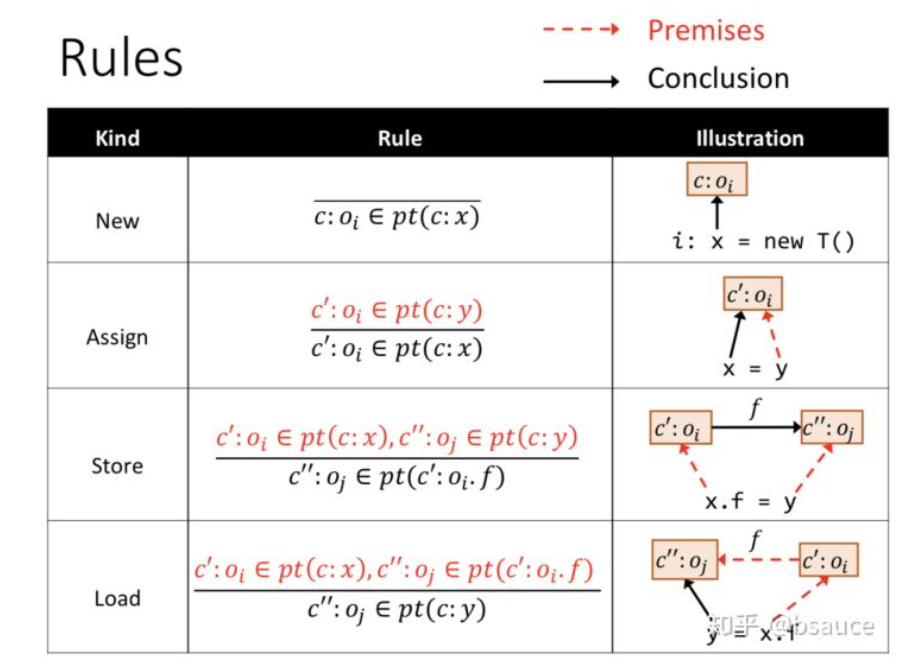
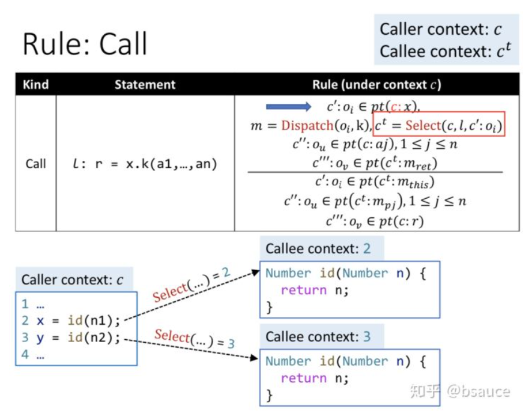
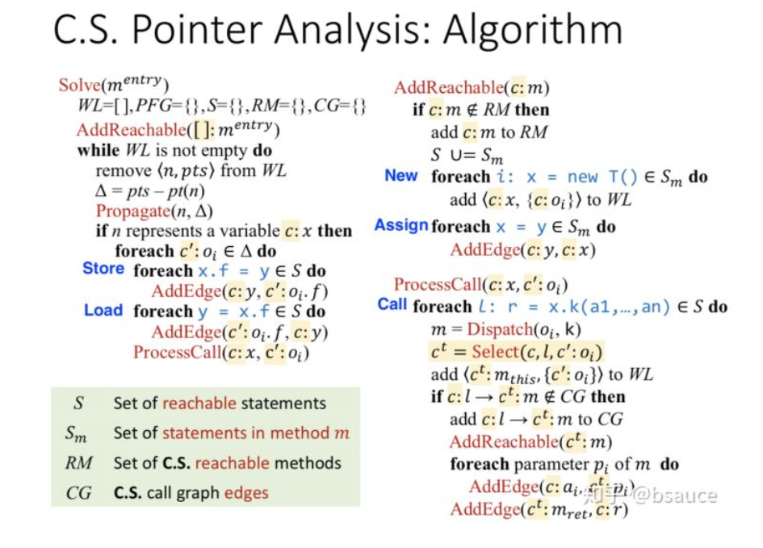

# PA
## theory
### context sensitivity 
#### conception
	call-site sensitivity (call-string)：根据调用点位置的不同来区分上下文
	Cloning-Based Context Sensitivity：每种上下文对应一个节点，标记调用者行数。
	Context-Sensitive Heap： 面向对象程序（如Java）会频繁修改堆对象，称为heap-insensitive。 所以不仅要给变量加上下文，也要给堆抽象加上下文，称为heap context (本文是基于allocate-site来进行堆抽象的）。
#### rules
 标记： 根据调用者的行数来区分不同上下文，只要区分了函数、变量、堆对象，就能够区分实例域、上下文敏感的指针（变量+对象域）。C—上下文（暂时用调用点的行数表示），O—对象，F—对象中的域。

	New, Assign, store, load规则：

 
	call指令规则：
	- 上下文对于Dispatch(o~i~, k)（找目标函数）没有影响，根据o~i~指向和函数签名k找到目标函数。
	- select(c, l, c':o~i~, m)根据调用时的信息来给调用目标函数选择上下文（c是调用者的上下文，l是调用者的行号，c':o~i~是x对象的指向集合，m是目标函数），c^t^表示目标函数的上下文（后面会叙述如何Select如何选择上下文）。c是可以累积的，一连串的调用，上下文将用一连串的行数来表示。
	- 传递this变量：c^t^:m~this~是目标函数c^t^:m的this变量
	- 传递参数：c^t^:m~pj~是目标函数c^t^:m的第j个形参
	- 传递返回值：c^t^:m~ret~是目标函数c^t^:m的返回值
 
#### context sensitivity pointer analysis algorithm
	和过程间指针分析相比，仍然分为两个过程，分别是构造PFG和根据PFG传递指向信息。主要区别是添加了上下文。
	PFG构造：Call需要加参数传递、返回值传递的边。 Assign、Store、Load加边。

	符号：
	- m^entry：入口main函数
	- S：可达语句的集合（就是RM中的语句）
	- S~m~：函数m中的语句
	- RM：可达函数的集合
	- CG：调用图的边
	
	流程：
	1. 先处理New、Assign指令。AddReachable(c:m)只多了上下文。
	2. 遍历WL，Propagate()和原来相同。
	3. 处理Store、Load指令，AddEdge()只多了上下文。
	4. 处理Call指令，ProcessCall()，多了一行c^t^=Select(c,l,c':o~i~,m)，在找到调用目标函数之后，需选择被调用的函数的上下文。
#### context sensitivity variants 上下文的选取	
	上下文的选取主要以下三类：
	- call-site sensitivity
	- object sensitivity
	- type sensitivity
	
### reference

## Precision-Guided Context Sensitivity for Pointer Analysis
	 针对上下文不敏感算法，本文首次介绍不准确的原因以及所在的位置。 通过仅把上下文敏感应用到精度损失严重的方法（简称ZIPPER), ZIPPER使得传统的上下文敏感指针分析运行效率更快同时保持了它所有的精度。
	 the first research work that shows how and where most imprecision is introduced in a context-insensitive pointer analysis. By applying context sensitivity only to the precision-critical methods identified by ZIPPER (context insensitivity to other methods), 	ZIPPER enables a conventional context-sensitive pointer analysis (e.g., 2-object-sensitivity) to run much faster while retaining essentially all of its precision. 

## A Principled Approach to Selective Context Sensitivity for Pointer Analysis
	
### reference
- https://zhuanlan.zhihu.com/p/140400355 : 南大软件分析课程8——指针分析-上下文敏感
- https://cs.nju.edu.cn/50/1b/c1654a479259/page.htm : 论文成果

## application
### CFLSteensAA
	这是一种基于控制流不敏感上下文不敏感的别名分析技术。
	目前的实现,对于函数内的别名分析,其较为精准，而对于过程间的分析，别名结果都是MayAlias。
#### 自定义过程间分析
	基于调用流图和函数内的CFLSteens别名分析结果，我们实现了一种路径优化的过程间分析方法。
#### 目前的问题
	1. 函数内需存在赋值语句。
	2. 普通变量被识别问题。
	3. 什么时候合并到项目里。
	4. arm编译
		a. 交叉编译。
		b. 使用模拟环境，进行编译。