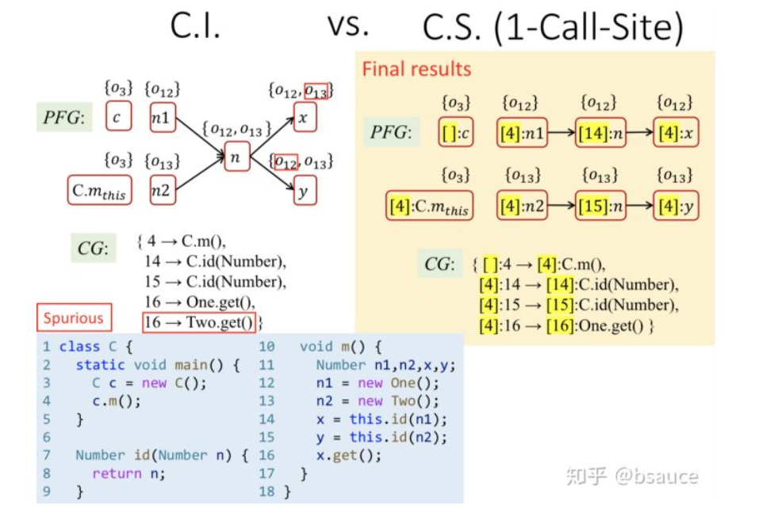
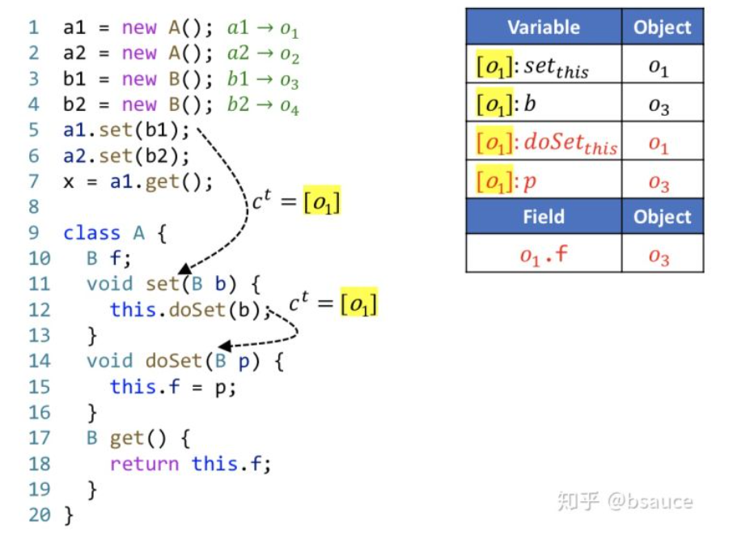
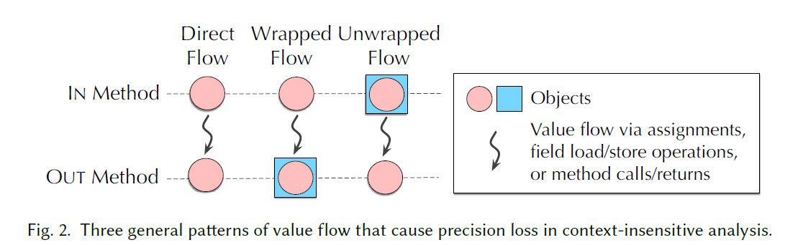

# PA
## theory
### context sensitivity 
#### conception
	call-site sensitivity (call-string)：根据调用点位置的不同来区分上下文
	Cloning-Based Context Sensitivity：每种上下文对应一个节点，标记调用者行数。
	Context-Sensitive Heap： 面向对象程序（如Java）会频繁修改堆对象，称为heap-insensitive。 所以不仅要给变量加上下文，也要给堆抽象加上下文，称为heap context (本文是基于allocate-site来进行堆抽象的）。
#### rules
 标记： 根据调用者的行数来区分不同上下文，只要区分了函数、变量、堆对象，就能够区分实例域、上下文敏感的指针（变量+对象域）。C—上下文（暂时用调用点的行数表示），O—对象，F—对象中的域。

	New, Assign, store, load规则：

 
	call指令规则：
	- 上下文对于Dispatch(o~i~, k)（找目标函数）没有影响，根据o~i~指向和函数签名k找到目标函数。
	- select(c, l, c':o~i~, m)根据调用时的信息来给调用目标函数选择上下文（c是调用者的上下文，l是调用者的行号，c':o~i~是x对象的指向集合，m是目标函数），c^t^表示目标函数的上下文（后面会叙述如何Select如何选择上下文）。c是可以累积的，一连串的调用，上下文将用一连串的行数来表示。
	- 传递this变量：c^t^:m~this~是目标函数c^t^:m的this变量
	- 传递参数：c^t^:m~pj~是目标函数c^t^:m的第j个形参
	- 传递返回值：c^t^:m~ret~是目标函数c^t^:m的返回值
 
#### context sensitivity pointer analysis algorithm
	和过程间指针分析相比，仍然分为两个过程，分别是构造PFG和根据PFG传递指向信息。主要区别是添加了上下文。
	PFG构造：Call需要加参数传递、返回值传递的边。 Assign、Store、Load加边。

	符号：
	- m^entry：入口main函数
	- S：可达语句的集合（就是RM中的语句）
	- S~m~：函数m中的语句
	- RM：可达函数的集合
	- CG：调用图的边
	
	流程：
	1. 先处理New、Assign指令。AddReachable(c:m)只多了上下文。
	2. 遍历WL，Propagate()和原来相同。
	3. 处理Store、Load指令，AddEdge()只多了上下文。
	4. 处理Call指令，ProcessCall()，多了一行c^t^=Select(c,l,c':o~i~,m)，在找到调用目标函数之后，需选择被调用的函数的上下文。
#### context sensitivity variants 上下文的选取	
	上下文的选取主要以下三类：
	- call-site sensitivity
	- object sensitivity
	- type sensitivity
##### call-site sensitivity
	原理： 又称为k-call-site sensitivity / k-CFA，不断添加调用行号。
		   k-limiting Context Abstraction。只取最后k个上下文，通常取k<=3。例如，函数的上下文通常取2，堆上下文通常取1。
上下文不敏感vs上下文敏感（1-Call-Site）：

##### object sensitivity
	原理：针对面向对象语言，用receiver object来表示上下文。对比1层的调用点敏感和对象敏感，时间和准确性上对象敏感显然更优，这是由面向对象语言的特点所确定的。
	对于面向对象语言，对象敏感的准确度要优于callsite敏感。

##### Type Sensitivity
	原理：牺牲精度，提高速度。基于创建点所在的类型，是基于对象敏感粗粒度的抽象，精度较低。
##### hybrid sensitivity
	多种方法的结合。
### reference

### object-sensitivity
#### custom implementation

### field-sensitivity
	把 aggregate的 field 当作一个独立的对象，而不是所有的field当作一个对象。
#### custom implementation
	如果field1 和 field2存在赋值关系，那么也可以互为别名的。 因此，对于指针分析来说，类型分析不是很适合。
	但是如果假定“不同域之间不会存在赋值关系”，以这种方式保证整体的准确性。个人觉得是一种以少量漏报换取误报的方法，但是需要调研 结构体不同域存在赋值关系的场景多不多。
	域非敏感。
	基于域的分析。
	域敏感。
	
--------------------------------------------------------------------
## 2004-Efficient Field-Sensitive Pointer Analysis for C
	flow- and context-insensitive pointer analysis.
	precisely modelling struct variables and indirect function calls.
	简单描述方法。
	实验证明可行性。 7 common C programs.
	实验表明 field-sensitive 的代价很大，但是精度高。
### Introduction
	静态分析经典语句：We say that a solution is sound if the inferred target set for each variable contains all actual runtime targets for that variable. A solution is imprecise if, for any variable, the inferred target set is larger than necessary.
	1. 描述下pa的现状。[1,2]
	2. 本文贡献：
		a. 语言的small extension.
		b. 实验评估。	
	本文是在[3]的基础上进行改进的。- 高效的实现方式和一些未解决的算法问题。
### Constraints-based Analysis
	1. 先基于约束集合介绍普通的指针分析流程。
	2. 提出两个问题：aggregate 和 function pointer. 对于前者，涉及 field-sensitive。 
	3. 基本的形式化推断规则。
	
### Extending the basic model
	
### reference
- [1] W. Landi. Undecidability of static analysis. : 静态分析的undecidability.
- [2] S. Horwitz. Precise flow-insensitive may-alias analysis is NP-Hard. : 流非敏感的别名分析的代价很大。 
- [3] S. H. Yong, S. Horwitz, and T. Reps. Pointer analysis for programs with structures and casting.

--------------------------------------------------------------------
## Precision-Guided Context Sensitivity for Pointer Analysis
	 针对上下文不敏感算法，本文首次介绍不准确的原因以及所在的位置。 通过仅把上下文敏感应用到精度损失严重的方法（简称ZIPPER), ZIPPER使得传统的上下文敏感指针分析运行效率更快同时保持了它所有的精度。
	 the first research work that shows how and where most imprecision is introduced in a context-insensitive pointer analysis. By applying context sensitivity only to the precision-critical methods identified by ZIPPER (context insensitivity to other methods), 	ZIPPER enables a conventional context-sensitive pointer analysis (e.g., 2-object-sensitivity) to run much faster while retaining essentially all of its precision. 

--------------------------------------------------------------------
## A Principled Approach to Selective Context Sensitivity for Pointer Analysis
### introduction
	1. 介绍了指针分析的重要性。
	2. 介绍上下文敏感的利弊。
	3. 介绍可选择的上下文敏感方法，难点在于如何有效的识别精度损失严重的函数。
	4. 引入ZIPPER方法，用于识别精度损失严重的函数。ZIPPER方法构建 precision flow graph(PFG), 精度损失严重的函数识别问题 被转化为 PFG上的图可达性问题。
	5. 引入ZIPPER-e方法，仅识别精度损失严重但效率很快的函数。
	6. 本文的贡献：
		* 介绍三种 value flow 模式，帮助理解上下文不敏感方法的不准确的原因和位置。
		* ZIPPER方法，有效识别三种 value-flow 模式。
		* ZIPPER-e 方法，运行更快。
		* 与其他选择性上下文敏感方法相比，ZIPPER和ZIPPER-e 是基于可解释性的不准确理论而非启发式的方法（不透明的机器学习或者多个分析参数的调节）
		* 评估ZIPPER和ZIPPER-e的有效性。
### 上下文敏感简介
	对于JAVA程序，上下文敏感被当作最有效提高分析精度的方法。
	上下文敏感指针分析可以分为三类：
	a. 上下文元素的种类
		调用点，分配点, 类型。
	b. 上下文元素的组成
		可以有多个元素，构造运行时调用栈。
		限制长度最大为k，仅选择最近k个元素，但是有许多元素对提高精度是无用的。作者设计了一种方法识别这种冗余的上下文元素。			
	c. 选择需要分析的程序块 (上下文敏感的选择性使用)
		在本文中，描述一种更加有原则的方法，解释什么时候忽略上下文敏感会引入不准确。
### 上下文不敏感指针分析的不准确原因
	某个函数存在对象传递且它被调用多次，所以这个函数需要分析多次才能保证准确度。
	因此，精度获取超过了额外的分析次数，上下文敏感才会被应用。
	一些术语引入：
	a. IN and OUT methods. 参数和返回值
	b. Object wrapping and unwrapping. 对象与对象的域
	c. 三种精度损失的模式- three value flows
		Direct flow: M函数的IN methods流入，M函数的OUT methods流出。 o -> o
		Wrapped flow:  o -> o.f
		Unwrapped flow: o.f -> o
 	详细解释这三种模式，并且举例子。
 
### reference
- https://zhuanlan.zhihu.com/p/140400355 : 南大软件分析课程8——指针分析-上下文敏感
- https://cs.nju.edu.cn/50/1b/c1654a479259/page.htm : 论文成果
	
--------------------------------------------------------------------
## 基于数据结构特征发现的脚本引擎(如pythonIDA)内置对象别名关系识别
	在脚本引擎中，通过调用特定的API序列，可以在内置对象之间创建共享内存区域，从而产生不同对象在共享内存区域上的别名关系。在其中一个对象上执行共享内存区域的释放操作，将会在与其有别名关系的其它对象内部产生悬挂指针，访问这些悬挂指针会触发释放后使用漏洞。
	sol: 利用别名关系识别UAF漏洞。
	1. 如何高效地识别内置对象别名关系。实现一种机制快速检测API序列的执行是否建立了对象间的共享内存区域。
		通过生成特殊的脚本引擎API调用序列，建立内置对象别名关系，并使用对象数据结构特征，将内置对象别名关系识别转化为图连通性识别，加快了内置对象别名关系识别速度。
			a. 提取脚本引擎内置对象的数据结构特征。该阶段主要采用动态插装的方式，使用脚本引擎API创建并访问内置对象并监控程序执行，获取程序运行时内置对象的内存地址。进一步，通过识别与对象起始地址相关的内存单元类型，提取脚本引擎内置对象的数据结构特征。 指针类型，可变数值类型和固定数值类型。
			b. 生成参数类型正确的脚本引擎API调用实例。采用静态分析技术来提取脚本引擎API对象参数的内存访问模式，并与第一阶段中提取的对象数据结构特征匹配，获得API对象参数候选集。进一步，使用获得的API对象参数列表，生成参数类型正确的脚本引擎API调用语句，并组合不同API调用语句产生测试样本。
			c. 负责监测共享内存区域来识别内置对象别名关系。使用动态测试的技术，获取程序运行时对象的内存地址，提取对应的内置对象数据结构特征，并转化为数据结构特征图存储。通过在API执行前后插入检查点的方式，分析数据结构特征图的变化，并根据数据结构特征图的变化识别内置对象别名关系。
		实验验证，传统别名分析方法，使用动态分析，针对一组待验证别名关系的内置对象，更改其中一个内置对象，如改变对象属性值等，并读取另一个内置对象中的内容，依据更改的内容是否能及时反映于读取操作中，判定内置对象别名关系的准确性。
	2. 如何利用识别出的对象别名关系检测脚本引擎的UAF漏洞。考虑生成API序列释放对象内部的共享内存区域，以产生悬挂指针。进一步，利用API序列针对性地访问悬挂指针，触发释放后使用漏洞。
		对于具有别名关系的两个对象，通过调用特殊的脚本引擎API序列，释放其中一个对象内部的共享内存区域，从而在另一个对象内部产生悬挂指针，随后调用特殊的脚本引擎API序列访问另悬挂指针，以触发释放后使用漏洞。
	
--------------------------------------------------------------------
## application
### AA
	静态AA。静态别名分析通过分析程序源代码来识别别名关系，常结合控制流图或调用图进行分析[24]，且为过程间分析[25][26]。通常静态别名分析所需时间与控制流图的复杂程度成正比，为了精简控制流图，Tobias等人提出将分支条件与变量状态关联，并依据变量状态来删除冗余分支[27]。
	动态AA。通过监控内存中变量的变化来识别别名关系，常在中间代码层面进行程序插装以判断不同变量之间是否共享同一内存区域[28][29]。Manu等人[30]提出实施简单的可达性分析，缩小监控范围提高分析性能。
	
#### CFLSteensAA
	这是一种基于控制流不敏感上下文不敏感的别名分析技术。
	目前的实现,对于函数内的别名分析,其较为精准，而对于过程间的分析，别名结果都是MayAlias。
##### 自定义过程间分析
	基于调用流图和函数内的CFLSteens别名分析结果，我们实现了一种路径优化的过程间分析方法。
##### field-sensitive 分析
	memory model: a pair of a memory object and offset.
	
##### 目前的问题
	1. 函数内需存在赋值语句。 √
	2. 普通变量被识别问题。 √
	3. 什么时候合并到项目里。 √
	4. 从全局变量中load数据进行分析，是不准确的，存在多线程的情况。 
	5. arm编译
		a. 交叉编译。
		b. 使用模拟环境，进行编译。
	6. check 函数进行显示检查，项目是支持的。对于隐式检查，我们是无法检测出来的，而且隐式检查的用处是什么，检查失败直接调用结束型异常处理函数。

	