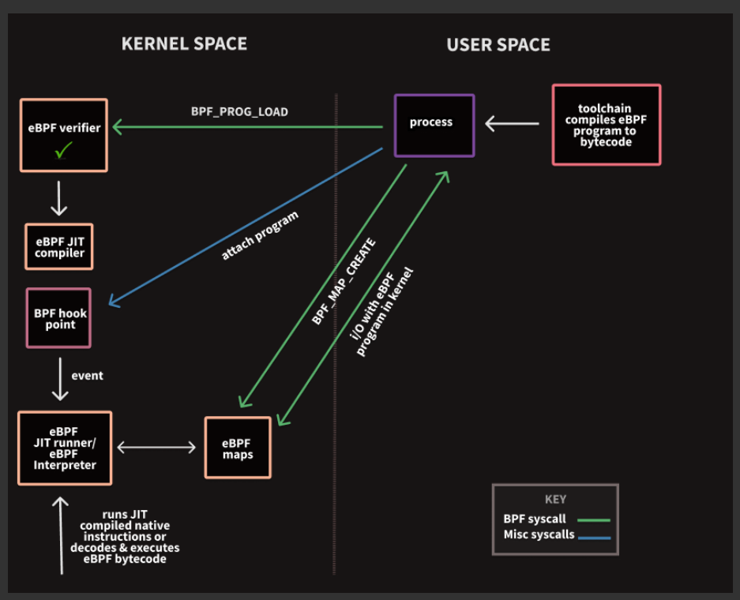
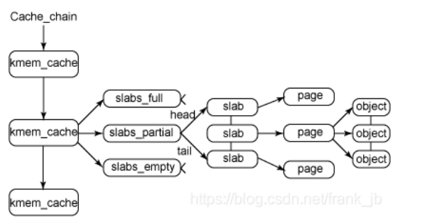

## 内核源码树的根目录：  
arch 特定架构的源码  
block  
crypto 加密API  
Documentation 内核源码文档  
drivers 设备驱动程序  
firmware 使用某些程序所需的设备固件  
init  内核引导和初始化  
ipc  进程间通信代码  
kenel 像调度程序这样的核心子程序  
lib 通用内核函数  
mm 内存管理和VM  
samples 示例代码  
script 编译内核所用的脚本  
sound 语音子系统  
tools 在linux开发中有用的工具  
virt  虚拟化基础结构  
CREDITS 开发者列表  
Makefile 基本内核的Makefile  

## 内核编译：
	1. 设置config  
		make config : 配置需要编译哪些模块。  遍历选择所要编译的内核特性。
		make allyesconfig：配置所有可编译的内核特性。
		可手动配置.config文件。
	2. 编译
		2.6以后的内核，代码之间的依赖关系会自动维护(无需make dep命令)。  
		make -jn  不正确的依赖可能导致编译过程出错。  

## 安装内核：  
make modules_install 将编译的模块安装到 /lib/modules  
编译时也会在内核代码树的根目录创建一个system.map符号对照表，将内核符号和它们的起始地址对应起来，调试用。  

## 内核开发：  
内核不能访问c库和c标准头文件，因为c库太大且低效，所以重新实现。  
必须使用GNU C  
缺乏内存保护机制。  
难以执行浮点运算。  
注意同步和并发。  
考虑移植的重要  
容量小且固定的内核栈，用户空间的栈巨大, x86的栈编译时配置大小，进程的内核栈的大小一般是两页。x86三级页表，默认4k页长。  
内核的内存不分页  
    
## 头文件：  
	include/*  
	arch/<architecture>/include/asm  
	printk() 可以指定优先级，如 KERN_ERR宏  
    
## 进程：  
进程退出执行后被设置为僵死状态，直到父进程执行wait()或waitpid()  
task == 进程  
x86(寄存器少）: thread_info 结构位于内核栈的尾端分配，少一个寄存器，便于用偏移量访问，所以它必须是task_strcut的第一个元素。  
进程状态切换： fork()创建一个进程，进入TASK_RUNNNING ,经过schedule()函数调用context_switch() ，进入 TASK_RUNNING  
-> do_exit() 结束  
-> 优先级高任务抢占， 进入 就绪状态 TASK_RUNNING  
-> 等待某种特定事件 ，进入TASK_INTERRUPTIBLE 或 TASK_UNINTERRUPTIBLE ，满足条件后 进入就绪状态。  
x86 current_thread_info: sp & ~(thread_size - 1)  
### 进程上下文
	内核态，运行于进程上下文，代表进程运行于内核空间。
	一个进程的上下文可以分为三个部分:用户级上下文、寄存器上下文以及系统级上下文。
		1. 用户级上下文: 正文、数据、用户堆栈以及共享存储区；
		2. 寄存器上下文: 通用寄存器、程序寄存器(IP)、处理器状态寄存器(EFLAGS)、栈指针(ESP)；
		3.  系统级上下文: 进程控制块task_struct、内存管理信息(mm_struct、vm_area_struct、pgd、pte)、内核栈。
### 进程创建  
	由fork和exec两个函数实现。  
	copy on write写时拷贝, 父进程和子进程共享同一个拷贝，只有在需要写入的时候，数据才会被复制。也就是资源在写之前是以只读的方式共享。  
	cred和real_cred是一个指针。
#### fork  
	fork的实际开销就是复制整个父进程的页表和给子进程创建唯一的进程描述符。一般fork后马上exec。  
#### 进程和线程的区别
	进程是资源（CPU、内存等）分配的基本单位，它是程序执行时的一个实例。程序运行时系统就会创建一个进程，并为它分配资源，然后把该进程放入进程就绪队列，进程调度器选中它的时候就会为它分配CPU时间，程序开始真正运行。
	线程是程序执行时的最小单位，它是进程的一个执行流，是CPU调度和分派的基本单位，一个进程可以由很多个线程组成，线程间共享进程的所有资源，每个线程有自己的堆栈和局部变量。
	
	区别与优劣。
		a. 多进程程序更健壮，多线程程序只要有一个线程死掉，整个进程也死掉了，而一个进程死掉并不会对另外一个进程造成影响，因为进程有自己独立的地址空间。
		b. 线程之间的通信更方便，同一进程下的线程共享全局变量、静态变量等数据，而进程之间的通信需要以通信的方式（IPC)进行。
		c. 进程是资源分配的最小单位，线程是程序执行的最小单位。
		d. CPU切换一个线程的花费远比进程要小很多，同时创建一个线程的开销也比进程要小很多。
### 进程的状态
	创建状态：如果创建工作无法完成，比如资源无法满足，就无法被调度运行，把此时进程所处状态称为创建状态。向PCB中填写资源信息。
	就绪状态：进程已经准备好，已分配到所需资源，只要分配到CPU就能够立即运行
	执行状态：进程处于就绪状态被调度后，进程进入执行状态
	阻塞状态：正在执行的进程由于某些事件（I/O请求，申请缓存区失败）而暂时无法运行，进程受到阻塞。在满足请求时进入就绪状态等待系统调用
	终止状态：进程结束，或出现错误，或被系统终止，进入终止状态。
	挂起操作行为：将进程从主存中移至外存中
	激活操作行为：将进程从外存中移到内存中
### 进程死锁
	死锁定理：S为死锁的条件是当且仅当S状态的资源分配图是不可完全简化的，该条件为死锁定理。
#### 必要条件
	互斥条件（Mutual exclusion）：资源不能被共享，只能由一个进程使用。
	请求与保持条件（Holdand wait）：已经得到资源的进程可以再次申请新的资源。
	非剥夺条件（Nopre-emption）：已经分配的资源不能从相应的进程中被强制地剥夺。
	循环等待条件（Circular wait）：系统中若干进程组成环路，改环路中每个进程都在等待相邻进程正占用的资源。
#### 解决办法
	处理死锁的方法有四种：1) 预防死锁    2) 避免死锁    3)检测和解除死锁
	a. 预防死锁
		破坏四个必要条件之一即可
	b. 避免死锁
		1) 资源按序分配   2) 银行家算法。
	c. 解除死锁的方法有两种：1) 资源剥夺法   2) 撤消进程法    3)进程回退法
### IPC
	数据传输、共享数据、通知事件、资源共享和进程控制。
	IPC的方式通常有管道(包括无名管道和命名管道)、消息队列、信号量、共享存储、Socket、Streams等。其中 Socket和Streams支持不同主机上的两个进程IPC。
#### 管道
	管道，通常指无名管道，是 UNIX 系统IPC最古老的形式。
	通常调用 pipe 的进程接着调用 fork。
	当一个管道建立时，它会创建两个文件描述符：fd[0]为读而打开，fd[1]为写而打开。要关闭管道只需要关闭这两个文件描述符即可。
	若要数据流从父进程流向子进程，则关闭父进程的读端(fd[0])与子进程的写端(fd[1]);反之，则可以使数据流从子进程流向父进程。
	特点：
		a. 半双工(数据流向仅有一个方向)，具有固定的读端和写端
		b. 只能用于父进程或兄弟线程之间通信(具有血缘关系的线程之间)
		c. 一种特殊文件，可以用普通的read、write函数进行读写，但又不是普通文件，不属于任何其它文件系统，仅存在于内存之中
#### 命名管道（FIFO)
	FIFO，也称为命名管道，它是一种文件类型。
	特点：
		a. 与无名管道不同，命名管道可以在无关进程间通信。
		b. FIFO以一种特殊设备文件形式存在于文件系统中，有路径名与之关联。
#### 消息队列
	消息队列，是消息的链接表，存放在内核中。一个消息队列由一个标识符(即队列ID)来标识。比如说发送信号。
	特点：
		a. 消息队列是面向记录的，其中的消息具有特定的格式以及特定的优先级
		b. 消息队列独立于发送与接收进程。进程终止时，消息队列及其内容并不会被删除
		c. 消息队列可以实现消息的随机查询, 消息不一定要以先进先出的次序读取,也可以按消息的类型读取	
#### 信号量
	信号量(semaphore)是一个计数器。信号量用于实现进程间的互斥与同步，而不是用于存储进程间通信数据。
	特点：
		a. 信号量用于进程间同步，若要在进程间传递数据需要结合共享内存
		b. 信号量基于操作系统的 PV 操作，程序对信号量的操作都是原子操作
		c. 每次对信号量的 PV 操作不仅限于对信号量值加 1 或减 1，而且可以加减任意正整数
		d. 支持信号量组
#### 共享内存
	shmget函数创建一段共享内存。
	使用shmat函数连接该共享内存到当前进程的地址空间，连接成功后把共享内存区对象映射到调用进程的地址空间，随后可像本地空间一样访问。
	特点：
		a. 共享内存是最快的一种 IPC，因为进程是直接对内存进行存取
		b. 因为多个进程可以同时操作，所以需要进行同步
		c. 信号量+共享内存通常结合在一起使用，信号量用来同步对共享内存的访问
#### socket
	socket 通信。
	
### 进程家族树：  
	所有进程都pid = 1的 init进程的后代.init 读取 initscript并执行其他的相关的程序。init进城的进程描述符由init_task静态分分配。  
	进程task_struct都有一个parent, list子进程。任务队列是一个双向的循环的的链表。list_entry(),  
	
## syscall 系统调用
	1. 以 SYSCALL_DEFINE0/* 宏定义系统调用。
		i. 所有的系统调用都使用了 asmlinkage 限定词，通知编译器仅从栈中提取该函数的参数。
		ii. 所有的系统调用在内核中以 sys_ 开头。
	2. linux系统调用的上下文切换时间短。
	3. syscall 指令从MSR 寄存器取出索引为IA32_LSTAR（0xC0000082）的值赋给RIP。在windows 10中，如果开启了KVA Shadow那么这个地址是nt!KiSystemCall64Shadow，否则是nt!KiSystemCall64。在 linux中， IA32_LSTAR 被设置为函数 entry_SYSCALL_64 的起始地址。
### 系统调用号
	每个系统调用都有一个系统调用号。系统调用号表示第几个系统调用表项。
	sys_call_table 记录所有已注册过的系统调用列表。
### 系统调用处理程序
	通知内核执行系统调用是靠 软中断 实现：引发一个异常促使系统切换到内核态执行异常处理程序，其实是系统调用中断处理程序。
		i. 设置中断号。对于 x86, 软中断靠 int 0x80/sysenter实现；对于 x64，软中断靠 syscall实现。
### 系统调用实现
	1. 考虑可移植性和健壮性。
	2. 参数验证。参数得合法，容易造成安全和稳定性问题。
### 上下文切换
	系统调用进行的是模式切换。模式切换最主要的任务只是切换进程寄存器上下文的切换。
#### user space to kernel space
	当发生 快速系统调用 syscall，产生异常，外设产生中断等事件时，会发生用户态到内核态的切换，具体的过程为：
	1. 通过 swapgs 切换 GS 段寄存器，将 GS 寄存器值（MSR，索引值为IA32_GS_BASE）和一个特定位置（MSR, 索引值为IA32_KERNEL_GS_BASE）的值进行交换，目的是保存 GS 值，同时将该位置的值作为内核执行时的 GS 值使用。
	2. 将当前栈顶（用户空间栈顶）记录在 CPU 独占变量区域里，将 CPU 独占区域里记录的内核栈顶放入 rsp/esp。
	3. 通过 push 保存各寄存器值。 //1-3保存并切换cpu上下文。
	4. 通过汇编指令判断是否为 x32_abi。
	5. 通过系统调用号，跳到全局变量 sys_call_table 相应位置继续执行系统调用。
	注：
		a. swapgs指令只可用于 64位，负责交换两个MSR(model specific register)的值(索引值为 IA32_GS_BASE and IA32_KERNEL_GS_BASE, 由于历史原因导致IA32_开头)。
		b. GS寄存器：be used as additional base registers in some linear address calculations.
		c. linux中， IA32_KERNEL_GS_BASE 寄存器用来保存kernel级别的数据结构指针，可以获取ring0的rsp值。
		d. linux中， IA32_GS_BASE 寄存器是为了满足由于 x64 体系的设计。
	参考： https://zhuanlan.zhihu.com/p/378030331 ： windows内核 - 系统调用
		   https://www.cnblogs.com/demonatic/p/12962119.html ： 深入理解linux系统调用	
#### kernel space to user space
	退出时，流程如下：
	1. 通过 swapgs 恢复 GS 值
	2. 通过 sysretq 或者 iretq 恢复到用户控件继续执行。如果使用 iretq 还需要给出用户空间的一些信息（CS, eflags/rflags, esp/rsp 等。

## interupt and interupt handler
	中断(由硬件产生的异步中断)本质上是一种特殊的电信号，由硬件设备发向处理器，处理器向操作系统反映此信号，然后操作系统处理这些数据。
	异常(同步中断)。1. 异常需要考虑和处理器时钟同步。2. 往往由软件引起。
	软中断是一种异常 -- 系统调用处理程序异常。
### interrpt context
	“中断上下文”就可以理解为硬件传递过来的这些参数和内核需要保存的一些环境，主要是被中断的进程的环境。
	中断上下程序共享所中断进程的内核栈。内核栈的大小是两页。
### interrupt handler
	1. 每种中断都有一个中断值(IRQ)，也对应一个中断处理程序。
	2. 一个设备的中断处理程序是它设备驱动程序(driver)的一部分。
	3. 中断处理程序运行在中断上下文的特殊上下文中。

## security  
	security.c中 security_ops 指向哪个就是使用哪个安全模块(security,smash,tomoyo).  

## mm
### shadow momory
	这个技术用来在内存中追踪和存储信息。
	shadow memory consists of shadow bytes that map to individual bits or one or more bytes in main memory. These shadow bytes are typically invisible to the original program and are used to record information about the original piece of data.
	常常被用于 memory-error checkers。也可以用于 检测和报告 内存的不正确访问。

## net
### drivers
#### RTL8169
	Realtek公司生产的一款千兆以太网卡.

## fs
### fs io
	相比write(系统调用), fwrite(库函数)会有一定的优化，减少进入内核空间的次数。 其他函数类似。

## modules
### eBPF
	extended Berkeley Packet Filter，用于支持用户态自定义包过滤方法的内核模块。
	tcpdump工具，常见的一些抓包工具的实现都与其有关。这种机制避免了拷贝一些不需要的包从内核态到进程，极大的提升了性能。
	seccomp沙箱，在设计时也借用了BPF的思想。
	
	本质上它是一种内核代码注入的技术：
		1. 内核中实现了一个cBPF/eBPF虚拟机；
		2. 用户态可以用C来写运行的代码，再通过一个Clang&LLVM的编译器将C代码编译成BPF目标码；
		3. 用户态通过系统调用bpf()将BPF目标码注入到内核当中；
		4. 内核通过JIT(Just-In-Time)将BPF目编码转换成本地指令码；如果当前架构不支持JIT转换内核则会使用一个解析器来模拟运行，这种运行效率较低；
		5. 内核在packet filter和tracing等应用中提供了一系列的钩子来运行BPF代码。
		6. 它的优点在于提供了一种在不修改内核代码的情况下，可以灵活修改内核处理策略的方法。

#### eBPF程序的编译
	eBPF 程序是用高级语言编写的，并使用 工具链BCC 编译成 eBPF字节码。
	eBPF VM 使用一个简单的指令集，该指令集使用 11 个* 64 位寄存器、一个程序计数器和一个 512 字节固定大小的堆栈。九个寄存器是通用读写，一个是只读堆栈指针，程序计数器是隐式的。指令集与 x86 类似，可对 64 位和 32 位值进行操作。 
```
// eBPF 字节码指令示例
BPF_MOV64_IMM （BPF_REG_0 ， 0 ）
BPF_STX_MEM （BPF_W ， BPF_REG_10 ， BPF_REG_0 ， - 4 ）
BPF_MOV64_REG （BPF_REG_2 ， BPF_REG_10 ）
BPF_ALU64_IMM （BPF_ADD ， BPF_REG_2 ， - 4 ）
BPF_JMP_IMM （BPF_JNE ， BPF_REG_0 ， 0 ， 1 ）
BPF_MOV32_IMM （BPF_REG_3 ， 为0xFFFFFFFF ）
```
#### eBPF程序的加载
	用户模式应用程序使用 bpf()系统调用 将字节码加载到内核中，其中 eBPF 验证器将执行许多检查以确保程序在内核中“安全”运行。这个验证步骤很关键 —— eBPF 为非特权用户公开了一条在 ring0 中执行的路径。
		1. 加载程序后，用户模式应用程序将程序附加到“挂钩点”，挂钩点是内核中可以附加 eBPF 程序的地方。
		2. eBPF 程序是事件驱动的，这意味着程序将在挂钩点发生某些事件时执行。经典用例是将 eBPF 程序附加到套接字，当数据写入时程序将在套接字中执行。
##### eBPF verifier
	verifier 强制执行一些通用规则集，找程序中不安全的指令。
	1. 首先构建程序的控制流图。
	2. 通过每个可能的控制流来验证每条指令是否有效以及所有内存访问都是安全的。
	3. 向程序添加运行时检查，确保在执行指针运算时在运行时不会违反允许的内存范围 - 插桩。
#### eBPF程序的执行
	如果 kconfig命令设置 CONFIG_BPF_JIT，eBPF程序是JIT成功验证和加载后编译成原生汇编指令。否则，当程序执行时，它会在 eBPF 解释器中运行，该解释器解码并执行 eBPF 字节码指令。 
#### eBPF程序与用户程序的交互
	用户模式应用程序可以使用 eBPF map和 eBPF 辅助函数 与内核中运行的 eBPF 程序交互并从中获取数据，这些函数通过bpf()系统调用进行访问。
##### eBPF map
	用户模式进程可以使用 eBPF map与内核中的 eBPF 程序进行交互。
	map 由五个不同的属性描述：type, key_size, value_size, max_entries, map_flags。
		
#### 黑名单
	sysctl的参数kernel.unprivileged_bpf_disabled决定了未经授权的用户是否允许运行eBPF程序。如果未设置，则允许非特权用户将 eBPF 程序附加到用户拥有的套接字。
	默认情况下未启用unprivileged_bpf_disabled。
#### 使用场景
	一个eBPF程序会附加到指定的内核代码路径中，当执行该代码路径时，会执行对应的eBPF程序。eBPF为用户模式应用程序提供了一种无需编写内核模块即可在内核中运行代码的方法。
		i. eBPF特别适合编写网络程序，将该网络程序附加到网络socket，进行流量过滤，流量分类以及执行网络分类器的动作。
		ii. eBPF程序可以修改一个已建链的网络socket的配置。
		iii. XDP工程会在网络栈的底层运行eBPF程序，高性能地进行处理接收到的报文。
		iV. 跟踪、检测、挂钩系统调用、调试，当然还有数据包捕获/过滤。
#### tc/BPF和XDP/BPF
	BPF对网络的处理可以分为tc/BPF和XDP/BPF，主要区别如下：
		i.XDP的钩子要早于tc，因此性能更高：tc钩子使用sk_buff结构体作为参数，而XDP使用xdp_md结构体作为参数，sk_buff中的数据要远多于xdp_md，报文需要上送到tc钩子才会触发处理程序。另外，由于XDP钩子位于网络栈之前，因此XDP使用的xdp_buff(即xdp_md)无法访问sk_buff元数据。

## slab allocator
	Linux 所使用的 slab 分配器的基础是 Jeff Bonwick 为 SunOS 操作系统首次引入的一种算法。Jeff 的分配器是围绕对象缓存进行的。在内核中，会为有限的对象集（例如文件描述符和其他常见结构）分配大量内存。Jeff 发现对内核中普通对象进行初始化所需的时间超过了对其进行分配和释放所需的时间。因此他的结论是不应该将内存释放回一个全局的内存池，而是将内存保持为针对特定目的而初始化的状态。
### slab allocator 的主要结构

	这是slab 结构的高层组织结构。
	1. 在最高层是 cache_chain，这是一个 slab 缓存的链接列表。 这对于 best-fit 算法非常有用，可以用来查找最适合所需要的分配大小的缓存（遍历列表）。 cache_chain 的每个元素都是一个 kmem_cache 结构的引用（称为一个 cache）。它定义了一个要管理的给定大小的对象池。
	2. 每个缓存 kmem_cache 都包含了一个 slabs 列表，这是一段连续的内存块（通常都是页面）。存在 3 种 slab：
	* slabs_full
	* slabs_partial
	* slabs_empty
		slabs_empty 列表中的 slab 是进行回收（reaping）的主要备选对象。正是通过此过程，slab 所使用的内存被返回给操作系统供其他用户使用。
	3. slabs 列表中的每个 slab 都是一个连续的内存块（一个或多个连续页），它们被划分成一个个对象。这些对象是从特定缓存中进行分配和释放的基本元素。注意 ** slab 是 slab 分配器进行操作的最小分配单位 **，因此如果需要对 slab 进行扩展，这也就是所扩展的最小值。通常来说，每个 slab 被分配为多个对象。
	4. 由于对象是从 slab 中进行分配和释放的，因此单个 slab 可以在 slab 列表之间进行移动。例如，当一个 slab 中的所有对象都被使用完时，就从 slabs_partial 列表中移动到 slabs_full 列表中。当一个 slab 完全被分配并且有对象被释放后，就从 slabs_full 列表中移动到 slabs_partial 列表中。当所有对象都被释放之后，就从 slabs_partial 列表移动到 slabs_empty列表中。

## PCI Bus Subsystem
### /proc/pid/pagemap
	允许用户空间程序检查页表和相关信息。例如，将虚拟地址转化为物理地址。
	对于每个虚拟地址，用一个64位的值表示它。 格式如下所示：
	* Bits 0-54  page frame number (PFN) if present
	* Bits 0-4   swap type if swapped
    * Bits 5-54  swap offset if swapped
    * Bit  55    pte is soft-dirty (see Documentation/vm/soft-dirty.txt), which helps to track which pages a task writes to.
    * Bit  56    page exclusively mapped (since 4.2)
    * Bits 57-60 zero
    * Bit  61    page is file-page or shared-anon (since 3.5)
    * Bit  62    page swapped
    * Bit  63    page present 

### Accessing PCI device resources through sysfs
	sysfs, usually mounted at /sys, provides access to PCI resources on platforms that support it.	
```
|-- 0000:17:00.0
|   |-- class
|   |-- config
|   |-- device
|   |-- enable
|   |-- irq
|   |-- local_cpus
|   |-- remove
|   |-- resource
|   |-- resource0
|   |-- resource1
|   |-- resource2
|   |-- revision
|   |-- rom
|   |-- subsystem_device
|   |-- subsystem_vendor
|   `-- vendor
```
	the domain number is 0000 and the bus number is 17 (both values are in hex). This bus contains a single function device in slot 0. 其中文件的含义如下。
	* resource : PCI resource host addresses (ascii, ro)
	* resource0..N : PCI resource N, if present (binary, mmap, rw1)

## 调试与优化
### Address Sanitizer - ASAN
	ASAN最早可以追溯到 LLVM 的 sanitizers项目（https://github.com/google/sanitizers），这个项目包含了AddressSanitizer，MemorySanitizer，ThreadSanitizer 和 LeakSanitizer等工具。这些工具可以检测用户空间的内存问题。通过在编译时加入指定的选项，就可以给用户程序加入 Address Sanitizer 功能。
	其中Address Sanitizer（ASAN）工具是一个内存错误检测器，可以检测以下问题：（可能有漏报）
	1）Out-of-bounds accesses to heap, stack and globals 堆、栈以及全局变量越界
	2）Use-after-free 即访问dangling pointer，已经free的指针
	3）Use-after-return (to some extent)，Use-after-scope
	4）Double-free, invalid free
	5）Memory leaks (experimental)

	ASan基于shadow memory实现，目前已经集成到Clang 3.1和GCC 4.8以上版本。
	`编译选项`:
	a. -fsanitize=address 使能Address Sanitizer工具
	b. -fsanitize=leak 只使能Leak Sanitizer，检测内存泄漏问题
	c. -fno-omit-frame-pointer 检测到内存错误时打印函数调用栈
	d. -O1 代码优化选项，可以打印更清晰的函数调用栈
#### 原理简介
	AddressSanitizer[1]主要包括两部分：插桩(Instrumentation)和动态运行库(Run-time library)。
	插桩主要是针对在llvm编译器级别对访问内存的操作(store，load，alloca等)，将它们进行处理。
	动态运行库主要提供一些运行时的复杂功能(比如poison/unpoison shadow memory)以及将malloc,free等系统调用函数hook住。
	该算法的思路是：如果想防住Buffer Overflow漏洞，只需要在每块内存区域右端（或两端，能防overflow和underflow）加一块区域（RedZone），使RedZone的区域的影子内存（Shadow Memory)设置为不可写即可, 越界就crush and report error。
	如： rz1 - mem1 - rz2 - mem2 - rz3 - mem3 - rz4
	
	内存映射:
	分为 main application mem 和 shadow memory 两类。
	对程序中的虚拟内存提供粗粒度的影子内存(每8个字节的内存对应一个字节的影子内存)。Poisoning a byte in the main memory means writing some special value into the corresponding shadow memory. 
	为了减少overhead，采用了直接内存映射策略，所采用的具体策略如下：Shadow=(Mem >> 3) + offset。每8个字节的内存对应一个字节的影子内存，影子内存中每个字节存取一个数字k,如果k=0，则表示该影子内存对应的8个字节的内存都能访问(unpoisoned:addressable)，如果0<k<7(First k bytes are unpoisoned, the rest 8-k are poisoned. The shadow value is k.),表示前k个字节可以访问，如果k为负数(poisoned:not addressable)，不同的数字表示不同的错误（e.g. Stack buffer overflow, Heap buffer overflow)。
	
	插桩：
	为了防止buffer overflow，需要将原来分配的内存两边分配额外的内存Redzone，并将这两边的内存加锁，设为不能访问状态，这样可以有效的防止buffer overflow(但不能杜绝buffer overflow)。对于 clang 编译器，估计是在 llvm IR 层进行的插桩，更高效、便携、简单等。
	插桩后的代码。在动态运行库中将malloc/free函数进行了替换。在malloc函数中额外的分配了Redzone区域的内存，将与Redzone区域对应的影子内存加锁，主要的内存区域对应的影子内存不加锁。free函数将所有分配的内存区域加锁，并放到了隔离区域的队列中(保证在一定的时间内不会再被malloc函数分配)，可检测Use after free类的问题。
	
	内存访问：
	Every memory access in the program is transformed by the compiler in the following way:
Before:
```
*address = ...;  // or: ... = *address;
```
After:
```
if (IsPoisoned(address)) {
  ReportError(address, kAccessSize, kIsWrite);
}
*address = ...;  // or: ... = *address;
```
	The tricky part is how to implement IsPoisoned very fast and ReportError very compact. 
#### reference
- [1] https://www.bynav.com/cn/resource/bywork/healthy-work/70.html : address sanitizer 简介
- https://github.com/google/sanitizers/wiki/AddressSanitizerAlgorithm : 算法描述
## 杂项：  
- powerpc: IBM基于RISC的现代微处理器。  
- ppc: 有足够多的寄存器。  
-  __builtin_expect() 是 GCC (version >= 2.96）提供给程序员使用的，目的是将分支转移的信息提供给编译器，这样编译器可以对代码进行优化，以减少指令跳转带来的性能下降。通过这种方式，编译器在编译过程中，会将可能性更大的代码紧跟着起面的代码，从而减少指令跳转带来的性能上的下降。  
```
#define likely(x) __builtin_expect(!!(x), 1) //x很可能为真       
#define unlikely(x) __builtin_expect(!!(x), 0) //x很可能为假
```
- EFI ：和BIOS一样，用于启动过程中完成硬件初始化。UEFI具有安全启动, 主板根据TPM记录硬件签名对各硬件判断，只有符合认证的硬件驱动才会被加载.  
- copy-on-write: 写时拷贝，是计算机程序设计领域的一种优化策略，其核心思想是，当有多个调用者都需要请求相同资源时，一开始资源只会有一份，多个调用者共同读取这一份资源，当某个调用者需要修改数据的时候，才会分配一块内存，将数据拷贝过去，供这个调用者使用，而其他调用者依然还是读取最原始的那份数据。每次有调用者需要修改数据时，就会重复一次拷贝流程，供调用者修改使用。

# linux0.11  
## document link  
* 实验环境搭建与调试： https://blog.csdn.net/longintchar/article/details/79685055  
