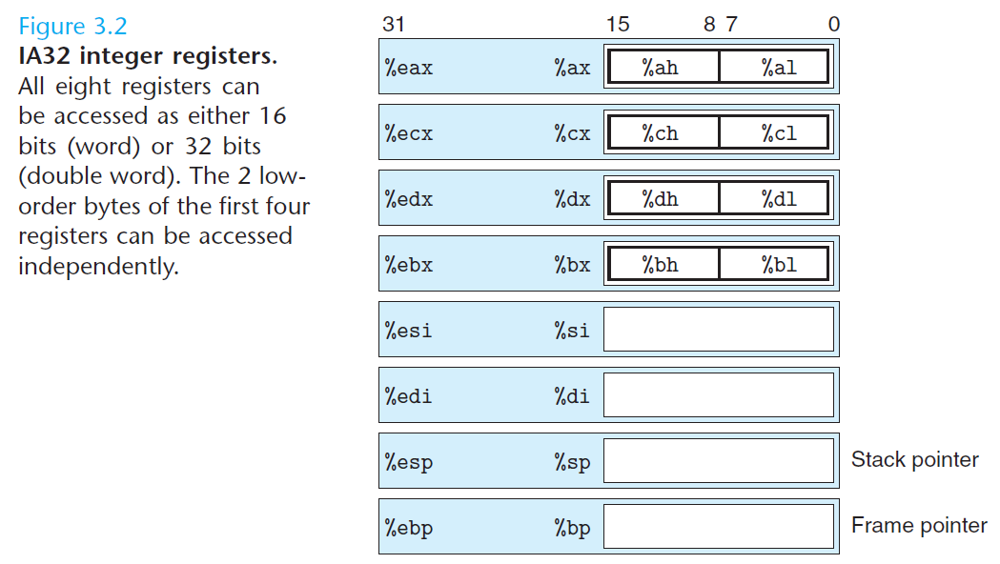
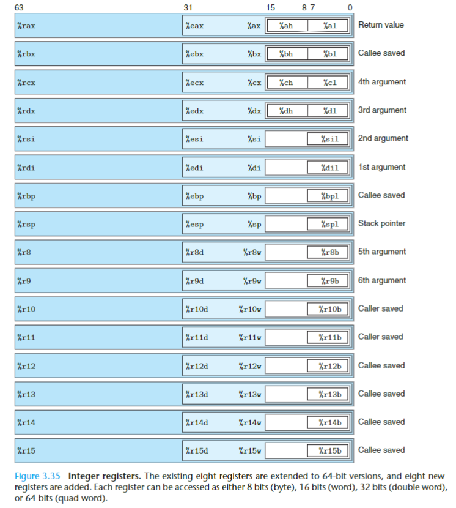
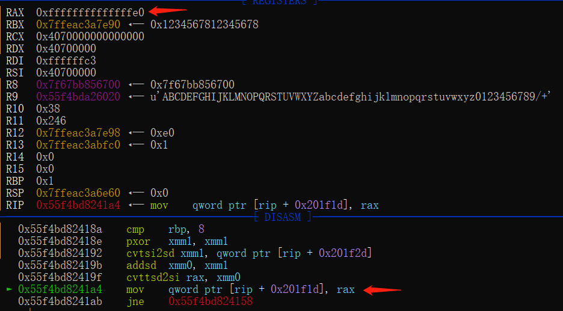

# x86 assembly language
  主流的两种汇编语言是 intel Assembly Language 和 AT&T Assembly language.
  x86汇编一直存在两种不同的语法，在intel的官方文档中使用intel语法，Windows也使用intel语法，而UNIX平台的汇编器一直使用AT&T语法。

## difference between AT&T and intel
- 操作数前缀。 在 Intel 的汇编语言语法中，寄存器和和立即数都没有前缀。但是在 AT&T 中，寄存器前冠以％，而立即数前冠以$。在 Intel 的语法中，十六进制和二进制立即数后缀分别冠以h和b，而在 AT&T 中，十六进制立即数前冠以0x。
- 源/目的操作数顺序。 Intel 汇编语言的指令与 AT&T的指令操作数的方向上正好相反：在 Intel 语法中，第一个操作数是目的操作数，第二个操作数源操作数。而在 AT&T 中，第一个数是源操作数，第二个数是目的操作数。
- 寻址方式。 Intel 的指令格式是segreg段寄存器： [base+index*scale+disp]，而 AT&T 的格式是%segreg：disp(base,index,scale)。
- 标识长度的操作码前缀和后缀。 在 AT&T 的操作码后面有时还会有一个后缀，其含义就是指出操作码的大小。l表示长整数（32 位），w表示字（16 位），b表示字节（8 位）。而在 Intel 的语法中，则要在内存单元操作数的前面加上 byte ptr、 word ptr,和 dword ptr，dword对应long。

---
## assemble instruction  
* neg : 把操作数按位取反加一
* NOT：把操作数按位取反
* nop : 空操作指令 延时一个机器周期。  
* push ax;  送入栈中，sp - 1  
* pop ax; $sp -> ax,sp + 1  
* movl dst src  四字节 赋值指令 src -> dst
* movl $-8192, %eax  将栈底四字节 移到 eax   $ = 0xffffffff  
* movl %eax, 4(%edx) 将%edx + 4地址中的内容 移入 %eax
* movzx dst src : 用于将较小值拷贝到较大值中, 扩展至16位或者32位,只适用于无符号整数
* movsx dst src : 将源操作数内容复制到目的操作数，并把目的操作数符号扩展到 16 位或 32 位。这条指令只用于有符号整数。存在符号扩展。
* lea 计算一个表达式的结果.  LEA EAX, [123 + 4*EBX + ESI]  
* jnz=jne: ZF标志位不为0时jmp; jz=je刚好相反  
* jg=ja 前大于后
* jge 前大于等于后
* jnb 前不低于后
* js 为负则跳转
* jl(jmp less)=jnge : 小于则转移，用于有符号数的条件转移
* cmp src des: 比较整数，des-src,修改标志位，不修改任何操作数。cmp 算术减法运算结果为零,就把ZF(零标志)置1.
* test arg1 arg2 : 执行bit间的逻辑and运算，z并设置标志寄存器，结果本身不会保存。test逻辑与运算结果为零,就把ZF(零标志)置1; 
* add src des <=> des = des + src
* sub des src <=> des = des - src
* rep ret 解决ret的分支预测问题。 [rep详解](http://repzret.org/p/repzret/ "rep")
* rep stosb/stosw/stosd 这三个指令把al/ ax/ eax的内容存储到edi指向的内存单元中，同时edi的值根据方向标志的值增加或者减少。这组指令需要以指定的字符填充整个字符串或数组时比较有用.
* cltq %eax->%rax的符号拓展转换 <=> movslq(s符号 l双字  q四字) %eax,%rax
* cdqe 使用eax的最高位拓展rax高32位的所有位
* int(32bit)/syscall(64bit) 系统中断 配合寄存器调用函数
* movl -8(%eax, %edx, 4), %ecx EDX乘以4再减去8，加到EAX，從該地址的內存中讀取4字節的值，並放入ECX中
* sar 算术右移，补符号位. SHR 逻辑右移，补0
* cdqe (convert doubleword to quadword extension) : 规定将EAX中的符号扩展到RAX中，执行这个指令就将EAX中的符号扩展到RAX中了。 
* shl des offset : 逻辑左移, 最低位用0补充,将最后移出的一位写入CF中,如果移动位数大于1时，必须将移动位数放在cl中。
* shr : 同理,逻辑右移
* sar : 算数右移, 保留操作数的符号，即用符号位来补足，而SHR右移时总是用0来补足.
* loop : loop指令会使每循环一次，cx就对自身值减1操作，直到等于0为止，在此之前，一直重复执行标识符到loop间的代码. a. (cx)=(cx)-1； b. 判断cx中的值不为零则转至标号处执行程序如果为零则向下执行。
* offset : 伪指令，在编译的过程中，编译器会将该伪指令进行计算，并且替换成标号/变量的地址偏移量。
* pushf/popf : 将标志寄存器(PSW,当前指令执行结果的各种状态信息)的值压入堆栈顶部(先高8位，后低8位), 同时栈指针SP值减2。这两条指令后面都不加东西，默认的操作对象是：所有的标志寄存器。 
* CVTTSD2SI : 将截断的标量双精度浮点值转换为有符号整数 d2i
* CVTSI2SD : 将双字整数转换为标量双精度浮点值 i2d
* FLD STReg/MemReal : 将浮点数据压入协处理器的堆栈中。 将值以浮点型放进ST0里面 
* FSTP STReg/MemReal : 进行堆栈的弹出操作，堆栈将发生变化。 将ST0里面的浮点值，放到STReg/MemReal里面，同是清空ST0里面的值
* FST STReg/MemReal : 将协处理器堆栈栈顶的数据传送到目标操作数中。不进行堆栈的弹出操作。

### 几个术语
* 字节：8位，后缀：b
* 字：16位，后缀：w
* 双字：32位，后缀：l
* 四字：64位，后缀：q

### 单字节指令
* nop
* inc/dec
* push/pop reg
* ret
* movsb : 通过SI和DI这两个寄存器控制字符串的源地址和目标地址，比如DS:SI这段地址的N个字节复制到ES:DI指向的地址，复制后DS:SI的内容保持不变。
```
# 从缓冲区FIRST传送100个字节到SECOND缓冲区.
MOV CX ,100
LEA SI,FIRST
LEA DI,SECOND
REP MOVSB
```
#### reference
- http://xxeo.com/single-byte-or-small-x86-opcodes : 单字节机器码

---
## disaseembly syntax
- $ 当前正汇编到的指令在代码段中的偏移量; 也可用于表达式。

---
## disassemble  
32bit: leave = mov esp ebp; pop ebp; 清除栈空间，弹出ebp  
retn = pop ip; pc 是非intel厂家对IP的称呼，和 CS:IP一样  
return 0; =  leave ; retn  

---
## linux下的段：  
* .text,存放编译后的机器指令。  
* .bss段(rw),数据不包含再可执行程序中，在文件中不占据空间，存放未初始化的全局变量和局部静态变量，而.data段相反，且必须被初始化,存放已初始化的全局变量和局部静态变量。  
* .rodata段(r), 存放字符串常量。  
* 进程逻辑地址低到高地址：其他 .text  .rodata  .data 其他 HEAP 其他  STACK  

---
## linux assemble:  
* as AT&T assembler
  * as -o file.o file.s --64
  * ld -m elf_x86_64 file.o -o file 
* ld  
* nasm Intel assembler
  * nasm -f elf32/elf64 file.asm
  * ld -m elf_i386/elf_x86_64 -s -o file file.o

---
## data type  
### x86_64
* dq 四字单元  
* db 字节单元  
* dw 单字单元  
* dd 双字单元
### arm
* dcb 一个字节
* dcw 单字
* dcd 两字
* dcq 四字
  
数据访问方式:immediate, register, memory.  

---
## architecture  
x86_64(ia32的64bit扩展): return value 使用寄存器的值当做返回值，减少从内存读取和写操作， 使用栈存储返回地址。  
ARM：使用R0 传递函数返回值。 LR寄存器 存储 函数结束之后的返回地址。  
ia32: intel architeture 32 bit  

## ia32_register  
  
方便处理byte,word,double word类型的数据,eax, ax, al 都不一样  

## x86_i64 register

64bit: %rax, %rdx, %rdx, %rbx, %rsi, %rdi, %rsp, %rbp, %r8-%r15.
访问低32bit/16bit/8bit register可以直接访问, 跟ia32类似,例如 %eax/%ax/%al.
用户态，cs寄存器=0x33，不能修改。

---
## other  
### shift  
left shift: fill 0  
logical right shift: fill 0  
arithmetic right shift: fill 最高位.  
对于无符号数，右移填充0.对于有符号数，右移可能是logical shift也或者是 arithmetic shift，大多数情况是算术右移，Java中明确规定了，c语言未明确规定右移采取哪种方式。  

### function return value  
* call fuction后相应寄存器会发生变化。
* 32bit: 存放在eax中  
* 64bit: 高位存放在edx,低位存放在eax/存放在rax中  

### data alignment
* 存储地址是2的倍数意味着地址最低一位为0.存储地址是4的倍数意味着地址最低两位为0.其他同理。
* linux中，short 2字节对齐；int,int*,float,double 四字节对齐。
* windows中，大多数情况，k字节的对象的地址必须是k的倍数。
* 汇编语法: .align number 
```c
struct S2 {
  int i;
  int j;
  char c;
};
struct S1 e;
struct S2 d[4];
```
  在上述代码中，e占9字节，而d数组中元素占12字节，需要考虑每个元素的对齐。
---

### instruction machine code
#### x86
- nop : 0x90


#### x64
- syscall : 0x0F05
- nop : 0x90

### thinking
* mov instruction.
          
	
	为啥经过mov后，[rip + 0x201f1d]=0xe000000000000000???

# mips assembly language
## base
### register
- a0-a3 : 存储参数
- fp: fram pointer，用来恢复栈之类的操作，可以理解为和ebp差不多的作用
- sp: 存储栈地址
- v0...: 存储一些变量或地址
- t8,t9: 临时寄存器
- t9常常用来调用函数

### assemble instruction  
- j target: unconditional jump to program label target　
- jr $t9: 先执行跳转指令的后一条指令，然后再跳转寄存器中的地址。
- jar sub_label : 保存pc到$ra中，再跳到sub_label, 用于子程序调用。如果子程序调用其他子程序，就把$rau压栈保存，再保存pc进行跳转。
- addiu RD, RS, CONST16 : RD = RS + const16(+- 符号操作或符号扩展)
- move $RD, $RS : $RD=$RS
- li $RD, $num : $RD=$num

# arm assembly language
## base
### architecture
- armel : 32bit, 传参数用普通寄存器
- armhf : 32bit, 传参数用的是fpu的寄存器，因此armhf的浮点运算性能更高。
- arm64 : 64bit.

### register
#### arm32
- r0 - r15：共16个通用寄存器，均为32bit
- FP：r11充当，栈帧寄存器
- sp：r13充当，堆栈指针寄存器
- LR：r14充当，保存函数返回后执行的下一条指令地址寄存器
- PC：r15充当，程序计数器
- Cpsr：状态寄存器

#### arm64
	x: 64bit; w: 32bit.
- x0 - x30 共31个通用寄存器，均为64bit，w0 - w30用来访问低32bit；
	- x0-x7 ： 8 个寄存器可用于传递参数或用作临时寄存器。
	- x9-x15 : caller saved temporary registers
	- x19-x28 : callee saved registers.
	- x8 : 间接结果寄存器， 用于保存子程序返回地址，一般不使用。
	- x16-x17 : 程序内 call scratch registers 
	- x29：用来充当FP，intel是ebp；
	- x30：充当lr寄存器，用来保存函数返回后的下一条执行地址；
- SP：保存栈顶指针,使用 SP/WSP来进行对SP寄存器的访问，64bit，intel是esp；
- PC：程序计数器，俗称PC指针，总是指向即将要执行的下一条指令,在arm64中，软件是不能改写PC寄存器的，64bit
- CPSR：状态寄存器，64bit；

##### reference
- https://winddoing.github.io/post/7190.html : ARMv8-aarch64 寄存器和指令集

### instruction
#### arm32

#### arm64
	一般都是 opc dst src or opc dst src1 src2.
	a. 指令格式：
```
<Opcode>{<Cond>}<S>  <Rd>, <Rn> {,<Opcode2>}
```
* Opcode：操作码，也就是助记符，说明指令需要执行的操作类型
* Cond：指令执行条件码；
* S：条件码设置项，决定本次指令执行是否影响 PSTATE 寄存器响应状态位值
* Rd/Xt：目标寄存器，A32 指令可以选择 R0-R14,T32 指令大部分只能选择 RO-R7，A64 指令可以选择 X0-X30；
* Rn/Xn：第一个操作数的寄存器，和 Rd 一样，不同指令有不同要求；
* Opcode2：第二个操作数，可以是立即数，寄存器 Rm 和寄存器移位方式（Rm，#shit）

	b. 指令：
- BL : 跳转。 将下一条指令的地址放入lr(x30)寄存器，转到标号处执行指令。
- ret : 默认使用lr(x30)寄存器的值,通过底层指令提示CPU此处作为下条指令地址.
- tbz : 测试位为0跳转。
- ORR dst src : 位或
- SUB R0,R1,R2/#3; R0=R1-R2/3
- EOR : 异或
- LDR dst src: 加载数据
	- LDRB : 一字节
- STR src dst : store 数据
- STP x29, x30, [sp, #0x10] : 入栈指令，一个寄存器是8Bytes，因此需要0x10个地址偏移的数据, SP也发生了变化？
- STP src1, src2, [dst, #num] : 一对数据，从右边那个地址开始按顺序存放。 格式：寄存器写在左边，内存寻址写右边。
	- 先src1, 后src2。
- LDP x29, x30, [sp, #0x10] : 出栈指令
- LDP dst1, dst2, [src, #num] : 根据地址读取一对数据，按地址顺序赋值给一对寄存器：
	- 先赋值给第一个寄存器；偏移地址后，取值赋值给第二个寄存器。
- LDP x29, x30, [sp],#32   //sp地址取的值分别放回x29 x30后sp=sp+32
- CBZ/CBNZ : 比较（Compare），如果结果为零/非0 就转移（只能跳到后面的指令）
- CMP ;比较指令，相当于SUBS，影响程序状态寄存器CPSR
- B/BL ;绝对跳转#imm， 返回地址保存到LR（X30）；B指令不改变LR寄存器，但BL指令修改LR寄存器
- RET ;子程序返回指令，返回地址默认保存在LR（X30）
- svc : 实现系统调用的指令
- ADRP register expre : 得到一个大小为4KB的基址，而且该页中有expre中的变量的地址。 
- SXTW dst, src: src 符号扩展成 dst。
- LSL/LSR : Logical Shift Left/right, 對 register 進行位元操作的指令.

##### reference
- https://blog.csdn.net/zkdemon/article/details/72967562
- https://courses.cs.washington.edu/courses/cse469/19wi/arm64.pdf ： ARMv8 A64 Quick Reference

### function call
#### arm32
	如果形参个数少于或等于4，则形参由R0(参数1),R1,R2,R3四个寄存器进行传递；若形参个数大于4，大于4的部分必须通过堆栈进行传递。
#### arm64
	x0,x1,x2...., 使用的是 sp 寻址的方式。 
#### reference
- https://blog.csdn.net/lxb122435677/article/details/100565362 : 详解

# ppc assembly language
## base
### architecute
- ppc64el : power系统，64bit, 小端

# s390x assembly language
## base
### architecture
- s390x : 64bit IBM/S 390 
 