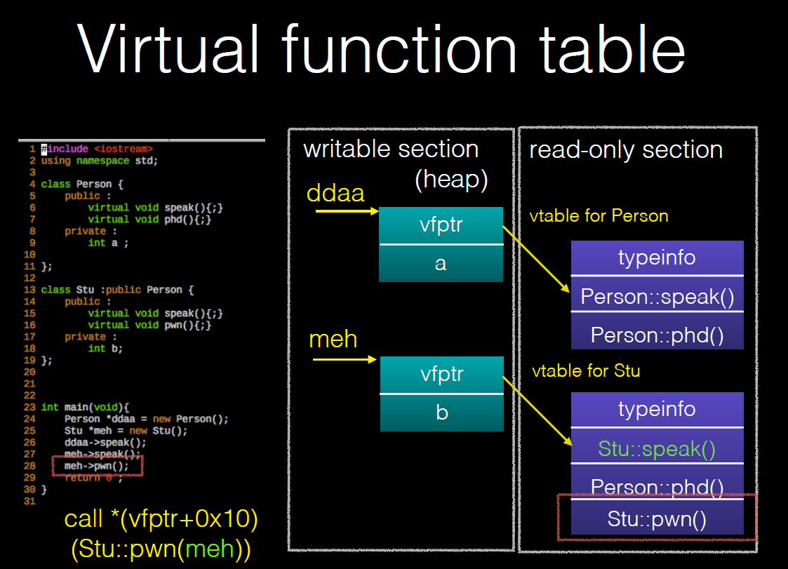
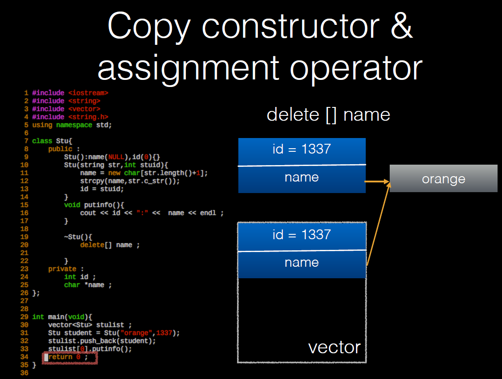

# pwn in c++
## virtual function table

### exploit
	Vtable 劫持，使vfptr指向伪造的虚表。

## vector
	分配在heap段。
	比⼀一般 c 中的陣列列更更有彈性，當空間不夠⼤大時，會重新兩兩倍⼤大的的⼩小來來放置新的 vector ，再把原本的空間還給系統。
```c
Vector
• member
	• _M_start : vector 起始位置
		• vector::begin()，迭代器/二级指针。
	• _M_finish : vector 結尾位置
		• vector::end(), 因此push_back()/pop_back()就是移动这个成员变量。
	• _M_end_of_storage ：容器最後位置
		• if _M_finish == _M_end_of_storage in push_back
			• It will alloca a new space for the vector
			• 把原来的元素复制过来，再将其delet掉
			• 以這個來來判斷空間是否⾜足夠放元素
```

## string 
	g++<5 的一种实现方式：
```
String
• member
	• size ：字串串的長度
	• Capacity : 該 string 空間的容量量, 不斷以⼆二的指數倍增長.
	• reference count : 引⽤用計數
		• 只要有其他元素引⽤用該字串串就會增加
		• 如果其他元素不引⽤用了了，也會減少
			• 當 reference == 0 時就會，將空間 delete 掉
	• value : 存放字串串內容
```
	g++>5
```
String
• g++ > 5 之後取消了了 Copy-on-Write 機制
	• 所以少掉了了 reference count 這個欄欄位
• 在 data length
	• <= 15 時會⽤用 local buffer
	• > 15 時則會在 heap allocate 空間給 data 使⽤用

----->
String
• data pointer : 指向 data 位置
• size : 分配出去 string 的長度
• union
	• local buffer : 在 size <= 15 時會直接把這欄欄位拿來來存data
	• allocated capacity : size > 15 時會拿來來紀錄 capcity
```

## New & Delete
	• new 大致上流程
		• operator new
			• 與 malloc 類似，單純配置記憶體空間，但配置失敗會進入 exception, ⽽ malloc 則是返回 null ，有點像在 malloc 上⼀一層 wrapper
		• constructor

	• delete ⼤致上流程
		• destructor
		• operator delete
			• 與 free 類似，釋放⼀一塊記憶體空間，有點像是在 free 上⼀一層 wrapper

## copy constructor & assignment operator

这个代码导致了double free.
### copy constructor
	• c++ 在進⾏行行複製 object 會使⽤用 copy constructor
		• 通常 class 的 member 有指標時，就需要⾃行去實作
	• 若未特別定義則會使⽤用 default copy constructor
		• 只做 shallow copy

	何時會使⽤用 copy constructor
	• func(Stu stu) 函数传递对象。
	• return stu
	• vector 等 STL 容器
### assignment operator
	c++ 在進⾏行行 “=“ 這個 operator 時 object 會使⽤用assignment operator 這個 function 去 assign object 的值
		• 通常 class 的 member 有指標時，就需要⾃行去實作
	• 若若未特別定義則會使⽤用 default assignment operator
		• 只做 shallow copy

	何時會使⽤用 assignment operator
	• stuA = stuB
	• vector 等 STL 容器
	• e.g. vector.erase()
	• …