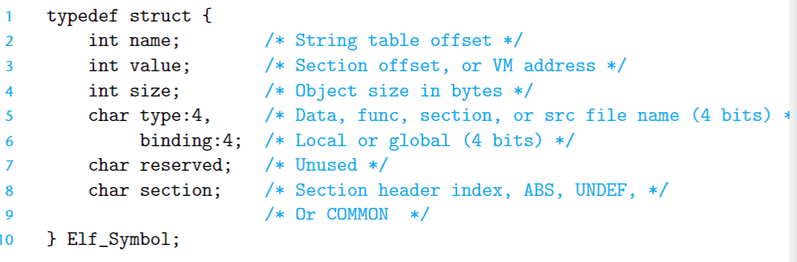

# csapp
  csapp 中一些难以理解或易忘记的点，在此纪录。
## linker
  linker 可以把许多文件 组合成单个可执行文件。
### 1. advantages
- 学习linker 可以帮助你解决一些由于缺失模块导致链接错误的问题。
- 帮助理解作用域怎么实现的。
- 理解其他重要的系统概念。

### 2. main tasks
- Symbol resolution. 将符号与符号定义关联。
- relocation. 将符号定义与内存位置关联。

### linker example
  动态链接器本身也是一个共享目标 ，在Linux系统中为ld-linux.so，因而 可以由加载器根据.interp节中指定的路径来加载并启动动态链接器运行。动态链接器完成相应的重定位工作后再把控制权交给可执行程序,启动其第一条指令执行。
#### dynamic link的全过程
  整个过程被分 成两步：首先，进行静态链接以生成部分链接的可执行目标文件myproc，该文件中仅包含共享库（包括指 定的共享目标文件mylib.so和默认的标准共享库文件libc.so） 中的符号表和重定位表信息，而共享库中的代码和数据并没有被合并到myproc 中；然后，在加载myproc时，由加载器将控制权转移到指定的动态链接器，由动态链接器对共享目标文件libc .so、mylib.so和myproc中的相应模块内的代码和数据进行重定位并加载共享库，以生成最终的存储空间中完全链接的可执行目标，在完成重定位和加载共享库后，动态链接器把控制权转移到程序myproc。在执行myproc 的过程中，共享库中的代码和数据在存储空间的位置一直是固定的。

### 3. object files
- relocatable object file(compiler and assembler产生). 用来创建executable object file.
- executable object file(linker). 可以执行
- shaired object file. 可以被装载和动态链接的目标文件。

#### relocatable object file
	ELF, executable and linkable file.
	ELF header, 头16字节是字长和字节序列.其他部分包含ELF大小、目标文件类型、机器类型、section header表的偏移以及它中入口的大小和数量。
	ELF = PH+SH+Text+Data+Linkage+Debug_info
##### sections
- .symtab, 一个包含函数和全局变量的符号表, 不含有局部变量的入口.
- .rel.text, .text中的位置列表, 引用外部函数或外部全局变量的指令需要修改。通常在executable object file 删掉了.rel.text
- .rel.data, 全局变量的重定位信息.
- .debug, -g 参数产生这个调试符号表.
- .line, c源程序中的行号与.text中的指令的映射。-g 参数才有这个section.
- .strtab, 符号表的字符串表。

### 4. symbol and symbol tables
static 限定的局部变量不是由栈管理的。
有一个Elf_Symbol结构体.

**其中 value 表示偏移量.**
  在linux中，readelf -s binary 可以查看symbol表. Ndx字段表示所属section.
#### three pseudo sections
- ABS 用于不能重定位的symbol
- UNDEF 用于未定义的符号(在其他地方定义的)
- COMMON 用于未初始化且为未分配的数据对象。

### 5. symbol resolution
  将 relocatable object file 中的symbol table的symbol definition 与 symbol 关联.
  对全局symbole的解析，先在当前module中找，未找到的话会生成一个symbol table的入口项让linker来处理。如果linker在其他module未找到定义，会打印错误。
  mangling of 链接器符号 in c++ 和 Java，为同名函数生成唯一的名字。例如，Foo::bar(int, long) -> bar__3Fooil,参考 csapp 第644页。
