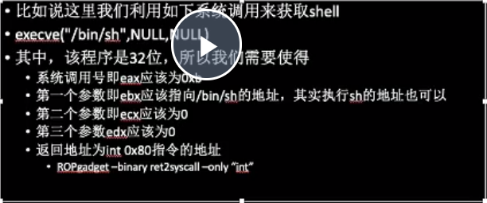
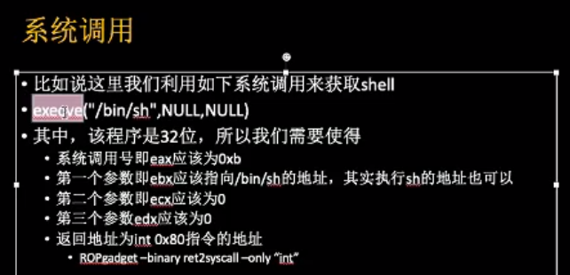

## py  
- p.interactive() 接下来自动交互。  
- context.arch = ''; flat([]); // no p32 p64 + for payload.  
- send() 
- sendline() 发送msg,并进行换行(末尾\n,多一个字节)
- sendlineafter() =  recvuntil() + sendline()  
- sendafter()
- recvline(keepends=True) : 接收一行，keepends为是否保留行尾的\n。
- recv(byte_num)
- recvuntil(str)
## python3
  bytes2str: bytes.decode(bytes, encoding='iso8859-1')

## 基础知识  
- x86 按字节编制，字节序：低字节放低地址  
    
随机数（伪随机数)利用： seed不变,随机数序列不变。  
    
dll = ctypes.cdll.LoadLibrary() 引用动态库。  
    
## checksec
* NX(no-execute)保护：堆栈内代码不可执行,是在硬件上实现的,可考虑ROP。  
* canary found是，触发check_failed(),ROP失效。 可以写超出当前ebp的范围. 触发*** stack smashing detected ***  
* PIE:地址随机化, data,code段都会变。 
  * vsyscall段的地址不会变，可以将这个段dump出来，用ida分析，查看有哪些vsyscall。使用vsyscall必须从函数开头执行，这是因为vsyscall执行时会进行检查，如果不是函数开头执行的话就会出错。
* RELRO: 重定位只读，保护库函数的调用不受攻击者重定向  
 * disabled got和plt都可写，fini_array也可写
 * partial(默认) got表可写，考虑劫持got表
 * fulled    load time的时候全部函数地址已经解析完成，不可写
* ASLR 每次执行时，stack,heap,libc的位置不一样，但是code段不变. 本地调试可关闭ASLR,cat /proc/sys/kernel/randomize_va_space
    
整型溢出： __int8等赋值修改变量。  
    
'x41' ='a'  
    
system的参数，可以通过gets，read, strcpy, strcat, sprintf读取任意字符串设置。  
    
strings -t x 可以查看在文件中字符串的0x偏移量  
libc 中 /bin/sh 是一个字符串，next(libc.search('/bin/sh')) / libc.search('/bin/sh').next()  
readelf -s  查找elf中的符号表。 .dynsym(运行时所需)   .symtab(编译时所需符号信息)  
readelf -S 查看section header的information.  
    
elf模块： 静态加载ELF文件  
所谓的动态链接在linux中是延迟绑定技术，涉及了got表和plt表。  
plt表(程序链接表)：跳板，跳转到一个地址来加载libc库。文件中会对每个用到的外部函数分配一个plt函数(函数入口地址),可从ida中读出。不能修改。第一次调用外部函数，会进行解析函数。  
got表(全局偏移量的表，数据段.data中)：经过plt表的跳转会跳转会在got表上写入地址，这个地址是函数调用或变量的**内存真实地址**,所以表项大小跟地址一样大，覆盖它的时候不能大于表项的大小.  
注意：plt表只在程序调用函数之前有用，调用函数之后第二次执行这个函数就不会经过plt表。  
加载：动态链接文件加载时有时候会重新改变基地址但是偏移(8位地址的后4位是一样的)是不变的(寻址方式是基地址+偏移量)  
address 获取ELF的基址  
symbols 获取函数的地址(跟是否开启PIE有关) ,未开启就是偏移量  
    
网络流传过来的需要u32解开,生成int类型地数据。  
    
可执行文件往往是第一个被加载的文件，它可以选择一个固定空间的地址，比如Linux下一般都是0x0804000,windows下一般都是0x0040000  
共享的指令可以使用地址无关代码技术(PIC)，装载地址不变，跟地址相关部分放到数据段里面。  
    
linux 延迟绑定PLT  
动态链接器需要某个函数来完成地址绑定工作，这个函数至少要知道这个地址绑定发生在哪个模块 哪个函数，如lookup(module,function)。  
    
在glibc中，lookup的函数真名叫做_dl_runtime_reolve(link_map,rel_offset)  
    
当我们调用某个外部模块时，调用函数并不直接通过GOT跳转，而是通过一个叫做PLT项的结构来进行跳转，每个外部函数在PLT中都有一个相应的项，比如bar()函数在PLT中的项地址叫做bar@plt，具体实现  
bar@plt：  
jmp *(bar@GOT)  
push n  
push moduleID  
jump _dl_runtime_resolve  
    
第一条指令是一条通过GOT间接跳转指令，bar@GOT表示GOT中保存bar()这个函数的相应项。  
但是为了实现延迟绑定，连接器在初始化阶段没有将bar()地址填入GOT,而是将push n的地址填入到bar@GOT中，所以第一条指令的效果是跳转到第二条指令，相当于没有进行任何操作。第二条指令将n压栈，接着将模块ID压栈，跳转到_dl_runtime_resolve。实际上就是lookup(module,function)的调用。  
_dl_runtime_resolve（link_map, rel_offset）在工作完成后将bar()真实地址填入bar@GOT中。  
```
typedef uint32_t Elf32_Addr;
typedef uint32_t Elf32_Word;
typedef struct
{
  Elf32_Addr    r_offset;               /* Address */
  Elf32_Word    r_info;                 /* Relocation type and symbol index */
} Elf32_Rel;
#define ELF32_R_SYM(val) ((val) >> 8) #define ELF32_R_TYPE(val) ((val) & 0xff)

typedef struct
{
  Elf32_Word    st_name;   /* Symbol name (string tbl index) */
  Elf32_Addr    st_value;  /* Symbol value */
  Elf32_Word    st_size;   /* Symbol size */
  unsigned char st_info;   /* Symbol type and binding */
  unsigned char st_other;  /* Symbol visibility under glibc>=2.2 */
  Elf32_Section st_shndx;  /* Section index */
} Elf32_Sym;

#根据readelf -d得到JMPREL(.rel.plt),readelf -r得到rel_offset,找到重定位条目
Elf32_Rel * rel_entry = JMPREL + rel_offset;
#根据*rel_entry*中的符号表条目编号，得到对应的符号信息：
Elf32_Sym *sym_entry = SYMTAB[ELF32_R_SYM(rel_entry->r_info)];
#再找到符号信息中的符号名称
char *sym_name = STRTAB + sym_entry->st_name;
由此名称，搜索动态库。找到地址后，填充至.got.plt对应位置。最后调整栈，调用这一解析得到的函数。

```
一旦bar（）解析完毕，再次调用bar@plt时，直接就能跳转到bar()的真实地址。  
    
PLT的真正实现要更复杂些，ELF将GOT拆分成两个表.got和".got.plt",前者用来保存全局变量引用的地址，后者用来保存函数引用的地址。  
    
数组越界漏洞利用。  
    
## static link  
静态编译的代码在同一架构上都能运行。IDA 红色部分为外部函数  
函数符号需要重新签名.  
static link 可以使用ROPgadget 生成 ROP chain  
    
## gdb调试  
context.terminal = ['tmux','sp','-h'] //当无图形时  
gdb.attach(p, 'gdb cmd') :  
context.log_level = 'debug'  
log.success()  
log.info()
    
## 栈溢出的简化计算：  
cyclic(0x100):生成0x100大小的pattern  
cyclic_find(0x61616161/'aaaa')：查找该数据在pattern的位置  
    
## ROPGadget 查看特殊代码段的工具  
ROPGaget --binary exe --only/--string "pop | ret(instruction)"  
ROPgadget --binary binary --ropchain 获取static execute ROP chain.  
    
## 系统调用获取shell  
当没有system()函数时  
linux: int 0x80 用于系统调用。  
只要我们把对应获取shell的系统调用的参数放到对应的寄存器中(指令地址+pop栈元素)，我们就能执行对应的系统调用。  
当存在栈溢出ROP时，可以将返回地址指向int 0x80指令的地址，再修改相应寄存器的地址(通过ROPgadget获得)  
  
  
---

## LibcSearcher
  这是针对CTF比赛所做的小工具，在泄露了Libc中的某一个函数地址后，常常为不知道对方所使用的操作系统及libc的版本而苦恼，常规方法就是挨个把常见的Libc.so从系统里拿出来，与泄露的地址对比一下最后12位。
  这个工具可以让我们获取到程序正在使用的libc文件中每个函数或字符串的偏移。
  当libc文件不准确时，可以用这个工具。
```py
from LibcSearcher import *

#第二个参数，为已泄露的实际地址,或最后12位(比如：d90)，int类型
obj = LibcSearcher("fgets", 0X7ff39014bd90)

obj.dump("system")        #system 偏移
obj.dump("str_bin_sh")    #/bin/sh 偏移
obj.dump("__libc_start_main_ret")    
```
    
## shellcode: 填入某个位置充当指令。  
https://www.exploit-db.com/shellcodes  
pwntools  asm(shellcraft.sh())  
asm(shellcraft.linux.sh()) getshell 注：shellcraft.linux.sh()是getshell的汇编指令,asm进行汇编，返回字符串。  
         
## other  
函数指针，可以使用shellcode的地址  
strcpy, 会将'x00'也拷贝过去。  
strlen, 遍历到'x00'终止  
vmmap 可用来看哪些空间可读写，执行。  
objdump -d binary 反汇编二进制  


## model
```python
from pwn import * 
import sys

context.terminal=['tmux', 'sp', '-h']
context.log_level='debug'

DEBUG=1

LOCAL=True
BIN=
HOST=
PORT=

def exploit(p):
  p.interactive()
  return

if __name__ == '__main__':
  elf = ELF(BIN)
  if len(sys.argv) > 1:
    LOCAL=False
    p = remote(HOST,PORT)
    exploit(p)
  else:
    LOCAL=True
    p = process(BIN)
    log.info('PID:' + str(proc.pidof(p)[0]))
    #pause()
    if DEBUG:
      gdb.attach(p)
    exploit(P)
```
