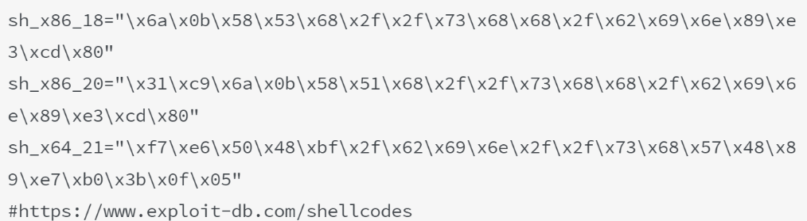

# ctf
## py  
- p.interactive() 接下来自动交互。  
- context.arch = ''; flat([]); // no p32 p64 + for payload.  
- send() 用于对抗 read()。
- sendline() 发送msg,并进行换行(末尾\n,多一个字节) 用于对抗scanf()。
- sendlineafter() =  recvuntil() + sendline()  
- sendafter()
- recvline(keepends=True) : 接收一行，keepends为是否保留行尾的\n。
- recv(byte_num)
- recvuntil(str)
- p = process(["/path/to/ld.so", "./test"], env={"LD_PRELOAD":"/path/to/libc.so.6"}) : 本地运行。注意ld要有执行权限。
- b64e/b64d(str)  : base64加解密。
- raw_input(">") ： 解决 sleep 同步问题。

### python3
	bytes2str: bytes.decode(bytes, encoding='iso8859-1') or b''

---
## base  
- x86 按字节编制，字节序：低字节放低地址   
- 随机数（伪随机数)利用： seed不变,随机数序列不变。    
- dll = ctypes.cdll.LoadLibrary() 引用动态库。  

## ELF
	ELF程序的调用流程：
	首先是_start函数，调用libc_start_main，再调用libc_csu_init，而__libc_csu_init循环调用_frame_dummy_init_array_entry[]里面的函数指针。

## IDA
- LOBYTE() 取最低的一字节。
- HIBYTE() 取最高的一字节。
- 同理有LOWORD(), HIWORD()。

---
## pwninit 
	自动化的获取libc、ld，patchelf，生成exp模板。
```
	# 安装
	$ cargo install pwninit
	
	# 使用
	$ 切换到二进制目录。
	$ pwninit
```
## checksec
	* NX(no-execute)保护：堆栈内代码不可执行,是在硬件上实现的,可考虑ROP。  
	* canary found是，触发check_failed(),ROP失效。 可以写超出当前ebp的范围. 触发*** stack smashing detected ***  
	* PIE:地址随机化, data,code段都会变。 
		* vsyscall段的地址不会变，可以将这个段dump出来，用ida分析，查看有哪些vsyscall。使用vsyscall必须从函数开头执行，这是因为vsyscall执行时会进行检查，如果不是函数开头执行的话就会出错。
	* RELRO: 重定位只读，保护库函数的调用不受攻击者重定向。 对于libc依然有用。
 		* disabled got和plt都可写，fini_array也可写
 		* partial(默认) got表可写，考虑劫持got表
 		* fulled    load time的时候全部函数地址已经解析完成，不可写
	* ASLR 每次执行时，stack,heap,libc的位置不一样，但是code段不变. 本地调试可关闭ASLR,cat /proc/sys/kernel/randomize_va_space。 
		* 测试： 对同一个地址泄露两次，看是否是一样的。

## ncat
	让程序运行在指定端口上。
	一般情况如下：
		ncat -vc ./binary -kl 127.0.0.1 $port
	下面两种方式指定运行时的库：
		* ncat -vc 'LD_PRELOAD=/path/to/libc.so ./binary' -kl 127.0.0.1 $port
		* ncat -vc 'LD_LIBRARY_PATH=/path/of/libc.so ./binary' -kl 127.0.0.1 $port
	然后你就可以使用 nc 连接到 binary 所运行的端口和它进行交互： nc localhost $port。

## seccomp
	沙箱保护，只有在白名单中的系统调用可以使用。
	解决办法： 使用 orw 解决。
### 查询沙箱规则
	seccomp-tools dump binary : 可以看到禁用的系统调用。
### 绕过
	orw -> open read write.

## /bin/sh的偏移查找           
- strings -t x 可以查看在文件中字符串的0x偏移量  
- libc 中 /bin/sh 是一个字符串，next(libc.search('/bin/sh')) / libc.search('/bin/sh').next()  / list(libc.search(b'/bin/sh'))[0]
- readelf -s  查找elf中的符号表。 .dynsym(运行时所需)   .symtab(编译时所需符号信息)  
- readelf -S 查看section header的information. 
- ida 打开二进制，计算偏移量。

## capstone
	二进制反汇编接口。

## pwntools    
	elf模块： 静态加载ELF文件  
	所谓的动态链接在linux中是延迟绑定技术，涉及了got表和plt表。  
	plt表(程序链接表)：跳板，跳转到一个地址来加载libc库。文件中会对每个用到的外部函数分配一个plt函数(函数入口地址),可从ida中读出。不能修改。第一次调用外部函数，会进行解析函数。  
	got表(全局偏移量的表，数据段.data中)：经过plt表的跳转会跳转会在got表上写入地址，这个地址是函数调用或变量的**内存真实地址**,所以表项大小跟地址一样大，覆盖它的时候不能大于表项的大小.  
	注意：plt表只在程序调用函数之前有用，调用函数之后第二次执行这个函数就不会经过plt表。  
	加载：动态链接文件加载时有时候会重新改变基地址但是偏移(8位地址的后4位是一样的)是不变的(寻址方式是基地址+偏移量)  
	address 获取ELF的基址  
	symbols 获取函数的地址(跟是否开启PIE有关) ,未开启就是偏移量  
    
	网络流传过来的需要u32解开,生成int类型地数据。  
    
	可执行文件往往是第一个被加载的文件，它可以选择一个固定空间的地址，比如Linux下一般都是0x0804000,windows下一般都是0x0040000  
	共享的指令可以使用地址无关代码技术(PIC)，装载地址不变，跟地址相关部分放到数据段里面。  
### func
- shoutdown(direction = "send") : 可以关闭输出流，让read函数返回0字节。
- shutdown('write') ： 关闭输入流。
- disasm(bytes) : 反汇编二进制指令流。 基于capstone实现的。
- asm(shellcode_str, arch='', os='linux')
- pwnlib.shellcraft.amd64 package 有支持多条汇编指令的函数，返回汇编代码。
    
## linux 延迟绑定PLT  
	动态链接器需要某个函数来完成地址绑定工作，这个函数至少要知道这个地址绑定发生在哪个模块 哪个函数，如lookup(module,function)。  
    
	在glibc中，lookup的函数真名叫做_dl_runtime_reolve(link_map,rel_offset)  
    
	.plt段是可执行可读的, 是一个代码块。
	当我们调用某个外部模块时，调用函数并不直接通过GOT跳转，而是通过一个叫做PLT项的结构来进行跳转，每个外部函数在PLT中都有一个相应的项，比如bar()函数在PLT中的项地址叫做bar@plt，具体实现
```  
bar@plt：  
jmp *(bar@GOT)  
push n  
push moduleID  
jump _dl_runtime_resolve  
```    
	第一条指令是一条通过GOT间接跳转指令，bar@GOT表示GOT中保存bar()这个函数的相应项。  
	但是为了实现延迟绑定，连接器在初始化阶段没有将bar()地址填入GOT,而是将push n的地址填入到bar@GOT中，所以第一条指令的效果是跳转到第二条指令，相当于没有进行任何操作。第二条指令将n压栈，接着将模块ID压栈，跳转到_dl_runtime_resolve。实际上就是lookup(module,function)的调用。  
	_dl_runtime_resolve（link_map, rel_offset）在工作完成后将bar()真实地址填入bar@GOT中。  
```
typedef uint32_t Elf32_Addr;
typedef uint32_t Elf32_Word;
typedef struct
{
  Elf32_Addr    r_offset;               /* Address */
  Elf32_Word    r_info;                 /* Relocation type and symbol index */
} Elf32_Rel;
#define ELF32_R_SYM(val) ((val) >> 8) #define ELF32_R_TYPE(val) ((val) & 0xff)

typedef struct
{
  Elf32_Word    st_name;   /* Symbol name (string tbl index) */
  Elf32_Addr    st_value;  /* Symbol value */
  Elf32_Word    st_size;   /* Symbol size */
  unsigned char st_info;   /* Symbol type and binding */
  unsigned char st_other;  /* Symbol visibility under glibc>=2.2 */
  Elf32_Section st_shndx;  /* Section index */
} Elf32_Sym;

#根据readelf -d得到JMPREL(.rel.plt),readelf -r得到rel_offset,找到重定位条目
Elf32_Rel * rel_entry = JMPREL + rel_offset;
#根据*rel_entry*中的符号表条目编号，得到对应的符号信息：
Elf32_Sym *sym_entry = SYMTAB[ELF32_R_SYM(rel_entry->r_info)];
#再找到符号信息中的符号名称
char *sym_name = STRTAB + sym_entry->st_name;
由此名称，搜索动态库。找到地址后，填充至.got.plt对应位置。最后调整栈，调用这一解析得到的函数。

```
	一旦bar（）解析完毕，再次调用bar@plt时，直接就能跳转到bar()的真实地址。  
    
	PLT的真正实现要更复杂些，ELF将GOT拆分成两个表.got和".got.plt",前者用来保存全局变量引用的地址，后者用来保存函数引用的地址。
### got表
- 使用pwndbg的got命令。
- 看二进制.plt段中的got表地址。 
 
### reference
- https://evilpan.com/2018/04/09/about-got-plt/#%E5%A4%A7%E5%B1%80%E8%A7%82 : 深入了解动态链接 
          
---
## static link  
	静态编译的代码在同一架构上都能运行。IDA 红色部分为外部函数  
	函数符号需要重新签名.  
	static link 可以使用ROPgadget 生成 ROP chain  
   
--- 
## gdb调试  
	context.terminal = ['tmux','sp','-h'] //当无图形时  
	gdb.attach(p, 'gdb cmd') :  
	context.log_level = 'debug'  
	log.success()  
	log.info()
  
---  
## 栈溢出的简化计算：  
	cyclic(0x100):生成0x100大小的pattern  
	cyclic_find(0x61616161/'aaaa')：查找该数据在pattern的位置  
    
## ROPGadget 查看特殊代码段的工具  
	ROPGaget --binary exe --only/--string "pop | ret(instruction)"  
	ROPgadget --binary binary --ropchain 获取static execute ROP chain.  
    
---
## one-gadget in glibc
	one-gadget 是glibc里调用execve('/bin/sh', NULL, NULL)的一段非常有用的gadget, 但是需要满足约束条件。
	或者
	用ida打开libc，寻找/bin/sh和execvpe.
### install
	1. gem install one_gadget
	OR
	2. pip3 install one_gadget
```py
from one_gadget import generate_one_gadget_full
for x,constraint in generate_one_gadget_full(LIBC):
	print((x),'\t',constraint)
```
### 绕过constraint
	通过调试，查看调用one-gadget时的寄存器以及堆栈信息。
### one-gadget+malloc_hook+realloc_hook
	一般用realloc_hook平衡栈帧，调用malloc或者realloc时满足例如rsp+0x30地址的值为0. 
	realloc_hook和malloc_hook相邻，且存在于libc可写段。
```disassembly
push r15
push r14
...
push rbx
sub rsp, 18h
然后获取realloc_hook的值
若不为空，调用realloc_hook函数
...
```
#### 利用方式
	1. 修改realloc_hook为one_gadget
	2. 修改malloc_hook为realloc+n.	

---
## 系统调用获取shell  
	当没有system()函数时  
	linux: int 0x80/syscall 用于系统调用。  
	只要我们把对应获取shell的系统调用的参数放到对应的寄存器中(指令地址+pop栈元素)，我们就能执行对应的系统调用。  
	当存在栈溢出ROP时，可以将返回地址指向int 0x80指令的地址，再修改相应寄存器的地址(通过ROPgadget获得)  
  
  
---

## DynELF
	是pwntools中专门用来应对没有libc情况的漏洞利用模块，在提供一个目标程序任意地址内存泄漏函数的情况下，可以解析任意加载库的任意符号地址,其中涉及ELF文件中的hash表、动态符号表、字符串表、Dynamic段，以及link_map结构等内容。
### 获取 ELF_PROGRAM 内存
	已知vul_elf加载内存范围内的一个地址ptr，将该地址进行页对齐。
```
page_size = 0x1000
page_mask = ~(page_size - 1)
ptr &= page_mask
```
	然后对比内存页起始字符串是否为'\x7fELF'，如果不是，一直向低地址内存页(ptr -= page_size)进行查找，找到符合该条件的页面，该页面起始地址就是vul_elf文件内存加载基地址。
### 获取 libc.so 内存加载基地址
	vul_elf是动态链接的可执行文件，在该类型文件中有一个link_map双向链表，其中包含了每个动态加载的库的路径和加载基址等信息，其数据结构为：
```c
struct link_map
{
   /* Shared library's load address. 模块基地址*/ 
   ElfW(Addr) l_addr;                 
   /* Pointer to library's name in the string table. 字符串*/                                 
   char *l_name;    
   /* 
        Dynamic section of the shared object.
        Includes dynamic linking info etc.
        Not interesting to us.  
		该模块Dynamic段基地址
   */                   
   ElfW(Dyn) *l_ld;   
   /* Pointer to previous and next link_map node. */                 
   struct link_map *l_next, *l_prev;   
};
```
### 获取libc.so的hash表、动态符号表、字符串表基地址
	在所有需要导出函数给其他文件使用的ELF文件（例如: “libc.so”）中，用动态符号表、字符串表、hash表等一系列表用于指示导出符号（例如:”system”）的名称、地址、hash值等信息。通过libc.so的Dynamic段DT_GNU_HASH、DT_SYMTAB、DT_STRTAB可以获取hash表、动态符号表、字符串表在内存中的基地址。
### 通过hash表获取system函数地址
	hash表是用于查找符号的散列表，通过libc.so的hash表可以找到system函数内存加载地址，在ELF文件中有SYSV、GNU两种类型的hash表。
### LibcSearcher
	这是针对CTF比赛所做的小工具，在泄露了Libc中的某一个函数地址后，常常为不知道对方所使用的操作系统及libc的版本而苦恼，常规方法就是挨个把常见的Libc.so从系统里拿出来，与泄露的地址对比一下最后12位。
	这个工具可以让我们获取到程序正在使用的libc文件中每个函数或字符串的偏移。
	当libc文件不准确时，可以用这个工具。
```py
from LibcSearcher import *

#第二个参数，为已泄露的实际地址,或最后12位(比如：d90)，int类型
obj = LibcSearcher("fgets", 0X7ff39014bd90)

obj.dump("system")        #system 偏移
obj.dump("str_bin_sh")    #/bin/sh 偏移
obj.dump("__libc_start_main_ret")    
```

## patchelf
	修改elf .interp 节内容, 工具链接： patchelf：https://github.com/NixOS/patchelf。
### usage
	patchelf --set-interpreter /ld_path/ld-2.27.so --set-rpath /libc_path/ filename
		* --set-interpreter：是设置ld解释器，精确到文件（ld-linux-x86-64.so.2 和 ld-2.27.so都行）
		*  --set-rpath：是设置 libc.so.6 的目录，文件名称默认是 libc.so.6，所以如果使用 libc-2.27.
### glibc-all-in-one
	下载ld和libc的工具，链接：https://github.com/matrix1001/glibc-all-in-one
#### usage
	1. # 获取能下载的版本列表
        ./update_list
    2. # 查看列表
        cat list
    3. # 下载列表中的版本
        ./download_old 2.24-3ubuntu2.2_amd64（与列表中名称一致）
#### other way to donwload ld
	在网上下载现成的 ld ： koji.fedoraproject.com

## heap
	对于非菜单题，需要抽象出 add, free, show ,edit等函数。        
    
## shellcode: 填入某个位置充当指令。  
- https://www.exploit-db.com/shellcodes : shellcode网站，有各种长度的，另外还有汇编源码以及编译方式。  注： 可能多了一个\x2f（斜杠）.

- pwntools  asm(shellcraft.sh())  
- asm(shellcraft.linux.sh()) getshell 注：shellcraft.linux.sh()是getshell的汇编指令,asm进行汇编，返回字符串。  
         
## other  
- 函数指针，可以使用shellcode的地址  
- strcpy, 会将'x00'也拷贝过去。  
- strlen, 遍历到'x00'终止  
- vmmap 可用来看哪些空间可读写，执行。  
- objdump -d binary 反汇编二进制  
- execve获取shell，参数得满足一些条件
 - argv和envp的数组得以0x0结尾
- execveat(dirfd, pathname, argv[], envp[], flags)
   execve ，由于缺少 gadget 或其他限制，执行起来总是很艰难的时候：
   让 pathname 指向 "/bin/sh"， 并将 argv, envp 和 flags 设置为 0， 那么无论 dirfd 的值是多少，我们仍然可以得到一个 shell。
- snprintf(str, size, format, ...) : 从字符串中拷贝size－1个字符到目标串中，然后再在size字节处加一个0。
- libc版本猜测
	出题起docker一般都是最新小版本的libc,除非出题人恶心你。
	- double free
		若free(0),free(0)爆fastbin attack错误, 则是2.23版本的libc。通过泄露libc地址，比对后12位地址判断版本。若未报错，大概率是2.27版本的libc。
		在远程的double free错误输出中，利用libcsearcher查找对应libc版本。
	- strings elf|grep GCC
		会显示ubuntu版本号，仅供参考。
		- 16.04 2.23  目前最新11.2
		- 18.04 2.27
		- 19.04 2.29
		- 19.10 2.30
		- 20.04 2.31
- 信息泄露
	- 栈地址泄露
	libc中有一个叫 environ 的 symbol ，他的值与 main 函数的第三个参数 char ** envp 相同, 就是栈上地址。
	gdb: 使用p/x &environ 或 libc_elf.symbols['environ'] 获取地址。
	- 内容泄露
	两个字符串在内存中紧挨，可以通过printf打印。
- 注意复用栈上数据或者寄存器数据。 例如复用寄存器作为参数。
- 若未开PIE, 数据段(.data, .bss) 上存有 stdout, stdin, strerr, 可以复用。
- 控制程序流，多调用几次相同函数，有意想不到的结果 (multi-staged exploit)。
- 错误码可以去 /usr/include 下搜索。
- 流关闭一次后就再也无法重新打开了。 close输入流后，可以使用pipe进行输入。
- 爆破
	- 若无法使用打印flag的函数，则需要爆破
		- 可以使用shellcode来比较字符进而爆破flag ： 参考 2020蓝帽杯线下赛 slient
	- 由 堆地址ALSR 导致的程序崩溃，可以爆破，总会遇到一个正常的。
- 大致浏览程序。可以猜测功能，再调试。 不用把程序都弄清楚。
- 对于未开 NX 的程序，shellcode, got表，jmp near ptr tag 很有用。
- 菜单题中的index，往往可以越界信息泄露。
- 如果shellcode被禁用了一些字符，可以使用 xor 获取一些被禁用的指令。
- 拟态防御：基于动态异构冗余构造一体化技术架构集约化地实现对未知威胁的防御。
	- 一种实现：使用不同的架构实现同一个程序。运行的时候，同时执行程序的多个实现，如果其中个程序奔溃或者多个实现的输出不一致，则所有程序直接挂掉。 


### reference
- https://www.cnblogs.com/crybaby/p/13294562.html#%E6%B3%84%E9%9C%B2%E6%A0%88%E5%9C%B0%E5%9D%80 : tips

## vulnerability
### logic bugs
	1. 绕过if，不进入正常的流程 -> 导致可利用的信息，信息泄露。
	2. 过程间分析。 返回到上一层进行free.

### 整数除法下溢漏洞
	len = (len/4)*3 --> 说明len可以有3个字节的多余。

## model
```python
from pwn import * 
import sys

context.terminal=['tmux', 'sp', '-h']
context.log_level='debug'

DEBUG=1

LOCAL=True
BIN=
HOST=
PORT=

def exploit(p):
  p.interactive()
  return

if __name__ == '__main__':
  elf = ELF(BIN)
  if len(sys.argv) > 1:
    LOCAL=False
    p = remote(HOST,PORT)
    exploit(p)
  else:
    LOCAL=True
    p = process(BIN)
    log.info('PID:' + str(proc.pidof(p)[0]))
    #pause()
    if DEBUG:
      gdb.attach(p)
    exploit(P)
```
