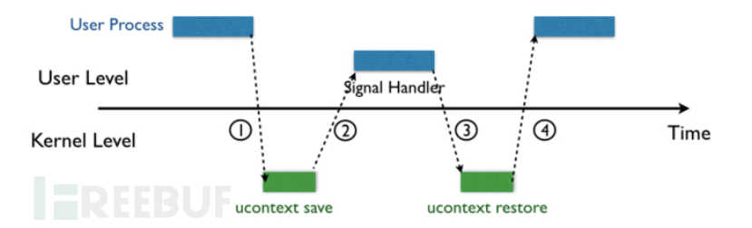
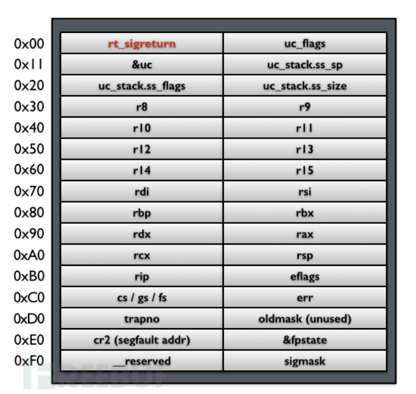
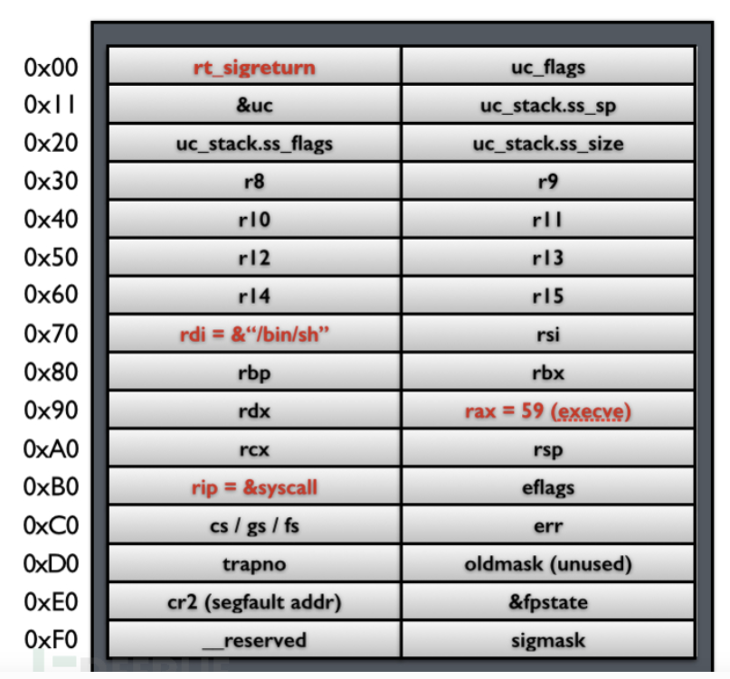
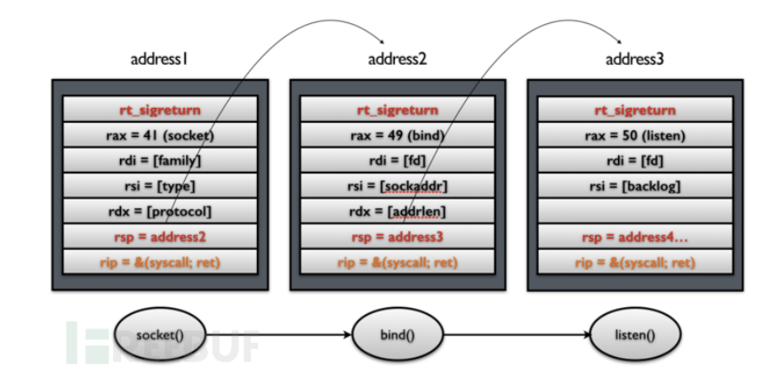
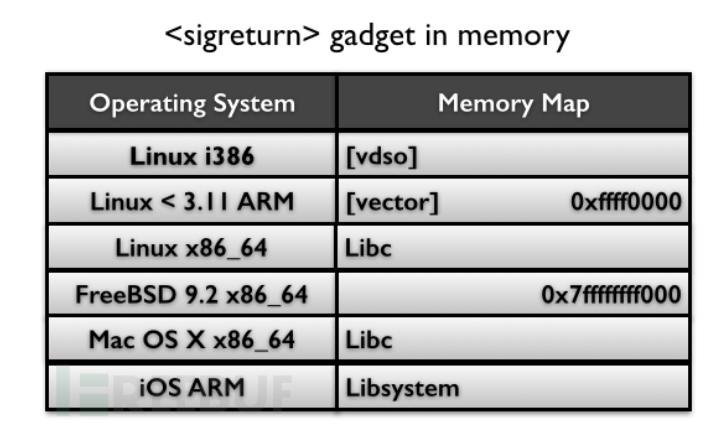
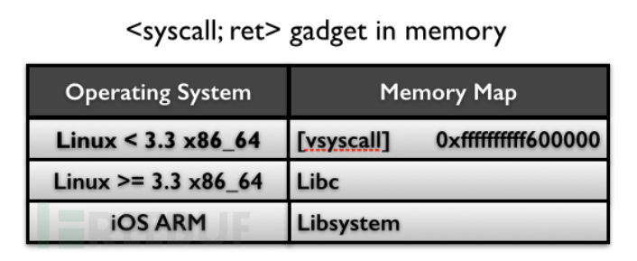
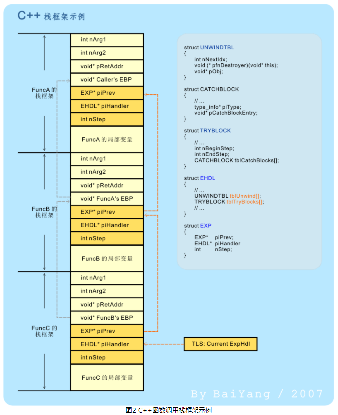

# ROP:  
	当开启了NX时，可考虑ROP.
	填充空间方法： 1> ida ; 2> gdb.  canary found是，触发check_failed(),ROP失效。  

## 前提条件
	1. 首先必须要有一个buffer overflow的漏洞（当然这个前提基本上所有攻击都必须得有）；
	2. 攻击者需要事先决定好完成攻击过程的所有gadgets。对于上面提到的赋值操作，总共只需要3个gadgets，每个gadget最长两条指令，但是如果需要进行一些复杂的操作，就有可能需要有很多gadgets；除了gadgets的数量多之外，单个gadget的指令数也需要考虑；
	3. 攻击者需要在被攻击程序所在的进程地址空间中找到所有的这些gadgets的首地址，并且将其填在栈的合适位置上。

## 危险函数
	1. scanf("%40s", buf) ： 从标准输入获取 40 个字节的数据，并将 NULL 放在输入数据的结尾
	2. fgets(buf, 40, stdin) ： 标准输入获取 39 个字节的数据，并将 NULL 放在输入数据的结尾
	3. read(stdin, buf, 40) ： 从标准输入获取 40 个字节的数据，但是不会把 NULL 放在输入数据的结尾

## 栈溢出利用：  
	32bit普通函数传参: ebp + 8h 第一个参数； ebp + 0ch 第二个参数 以此类推 ebp的位置是固定的  
	64bit普通函数传参: 参数和局部变量先存寄存器(rdi,rsi,rdx,rcx,r8,r9)(前六个参数)再存stack space(右边的存栈中)
	32bit syscall传参: eax对应于系统调用号，ebx，ecx,edx,esi,edi,ebp分别对应于前六个参数，多余的参数压在栈上。
	64bit syscall传参: rax对应于系统调用号，传参规则与普通函数传参一致。
### syscall
- execve()的调用号是0x3b,设置argv和envp为NULL,获取shell。
- __libc_csu_init()有pop指令和ret指令,可以利用,用来构造ROP链。

### SROP
	SROP的全称是Sigreturn Oriented Programming。在这里`sigreturn`是一个系统调用，它在unix系统发生signal的时候会被间接地调用。
	
	当内核向某个进程发起（deliver）一个signal，该进程会被暂时挂起（suspend），进入内核（1），
	然后内核为该进程保存相应的上下文，跳转到之前注册好的signal handler中处理相应signal（2），
	当signal handler返回之后（3），
	内核为该进程恢复之前保存的上下文，最后恢复进程的执行（4）。
如下图所示。

	在这四步过程中，第三步是关键，即如何使得用户态的signal handler执行完成之后能够顺利返回内核态。在类UNIX的各种不同的系统中，这个过程有些许的区别，但是大致过程是一样的。这里以Linux为例：
	在第二步的时候，内核会帮用户进程将其上下文保存在该进程的栈上，然后在栈顶填上一个地址`rt_sigreturn`，这个地址指向一段代码，在这段代码中会调用`sigreturn`系统调用。因此，当signal handler执行完之后，栈指针（stack pointer）就指向`rt_sigreturn`，所以，signal handler函数的最后一条`ret`指令会使得执行流跳转到这段sigreturn代码，被动地进行`sigreturn`系统调用。下图显示了栈上保存的用户进程上下文、signal相关信息，以及`rt_sigreturn`：

这段内存称为一个`Signal Frame`。在内核`sigreturn`系统调用处理函数中，会根据当前的栈指针指向的`Signal Frame`对进程上下文进行恢复，并返回用户态，从挂起点恢复执行。
#### Signal机制缺陷利用
	当无csu时，可以考虑这类攻击方式。
	内核替用户进程将其上下文保存在`Signal Frame`中，然后，内核利用这个`Signal Frame`恢复用户进程的上下文，done！那么，问题来了： 
	1. 这个`Signal Frame`是被保存在用户进程的地址空间中的，是用户进程可读写的；
	2. 内核并没有将保存的过程和恢复的过程进行一个比较，也就是说，在`sigreturn`这个系统调用的处理函数中，内核并没有判断当前的这个`Signal Frame`就是之前内核为用户进程保存的那个`Signal Frame`。
##### 一个最简单的攻击

这个攻击的4个前提条件:
	第一，攻击者可以通过stack overflow等漏洞控制栈上的内容；
	第二，需要知道栈的地址（比如需要知道自己构造的字符串`/bin/sh`的地址）；
	第三，需要知道`syscall`指令在内存中的地址；
	第四，需要知道`sigreturn`系统调用的内存地址。
从上可知，我们只需要知道两个`gadget`的地址。
注意: cs/gs/fs不要修改它的值,可以是0x2b000000000033, 未用到的位置全置0，比如说cs/gs/fs后面的空间(用于构建调用链)。
##### 利用SROP构造系统调用串（System call chains）
	只需要再额外添加一个对栈指针`rsp`的控制就行了。

	需要把原来单纯的`syscall` gadget换成`syscall; ret` gadget。在这个过程中，每次`syscall`返回之后，栈指针都会指向下一个`Signal Frame`，因此，在这个时候执行`ret`指令，就会再次调用`sigreturn`系统调用。这样就可以通过操作栈来达到连续进行系统调用的效果。

##### 两个重要的gadgets
	* gadget sigreturn指令
		在系统中一般会有一段代码专门用来调用`sigreturn`，在不同的类UNIX系统中，这段代码会出现在不同的位置。

		如果我们将`sigreturn`当做一个系统调用来看待的话，那么其实这个单独的gadget并不是必须的。因为我们可以将`rax`寄存器设置成`15`（sigreturn的系统调用号），然后调用一个`syscall`，效果和调用一个`sigreturn`是一样一样的。那么，问题就从“如何找到一个`sigreturn` gadget”变成了“如何控制寄存器`rax`的值”。而`rax`这个寄存器非常特殊，它除了被用来指定系统调用的调用号之外，也是函数返回值最后存放的地方。因此，我们可以利用控制函数返回值来控制`rax`寄存器的值。
	* gadget syscall;ret指令

##### pwntools中的SigreturnFrame库。
	在构建栈帧过程中，建议使用pwntools，可以避免一些莫名其妙的错误。
```python
def rt_sigreturn_stack_frame(rt_sigreturn, rax, rdi, rsi, rdx, rbp, rsp, rip):
	payload = p6(rt_sigreturn)
	sig = SigreturnFrame()
	sig.rax = rax
	sig.rdi = rdi
	sig.rsi = rsi
	sig.rdx = rdx
	sig.rbp = rbp
	sig.rsp = rsp
	sig.rip = rip
	sig.r15 = 0x00000067616c662f # flag字符串
	payload += byte2str(bytes(sig))
	return payload #0x100
```
		
#### reference
- https://www.freebuf.com/articles/network/87447.html : SROP解释性资料
- 在目前的pwntools中已经集成了对于srop的攻击。

### system
	system() 是一个单参数的函数，汇编过程： push 参数地址(说明调用system之前，参数在栈顶);    call _system;  原因如下：  
	函数地址调用函数，参数入栈，[返回地址入栈，ip ->函数地址](call function),相当于ic语言调函数入栈的情况,参数入栈,call function入栈.  
	call function指令调用函数，将函数的返回地址入栈，ip指向函数开始处(函数地址). 开始进入函数体中，ebp入栈， esp = ebp, esp -**h (在call function之前参数已经入栈).
  
### nop slide/nop sled/nop ramp
  通过命中一串连续的 NOP (no-operation) 指令/无用函数调用，从而使CPU指令执行流一直滑动到特定位置(one_gadget)。
- 使用前提：未开启栈破坏检测（canary）和限制可执行代码区域。
- 一般将注入的代码放到存在溢出的缓冲区中，再将其所在栈帧返回地址用其起始地址覆盖，如此栈帧在返回时%rip就会转向缓冲区的位置，再执行注入的指令。*特殊的情况*，可以在溢出的缓冲区中找可用的地址(参考2020_DASCTF的magic_number)。

--- 
## ret2libc 
### libc函数利用：  
	1. 通过栈溢出泄露write,puts的运行地址got。  
	2. 利用libc里write,puts中的地址， 函数偏移地址不变，得到system的运行地址。  

---

## ret2csus
	主要利用__libc_csu_init中的gadget, 可以控制rdi,rsi,rdx这三个寄存器，还能控制ip寄存器。
    可以用来调用任意少于或等于三个参数的函数，例如execve()。
### 前提
	1. 栈溢出的长度足够长。
	2. 可以配合栈迁移。
### gadget
	objdump -d binary -M intel 获取__libc_csu_init中的gadget。
	以下代码是编译器生成的一种可以利用的gadget例子，其他情况类似：
```
  4005f0:       4c 89 fa                mov    rdx,r15
  4005f3:       4c 89 f6                mov    rsi,r14
  4005f6:       44 89 ef                mov    edi,r13d
  4005f9:       41 ff 14 dc             call   QWORD PTR [r12+rbx*8]
  4005fd:		48 83 c3 01				add 	   rbx,0x1
  400601:		48 39 eb					cmp	   rbx,rbp
  400604:		75 ea					jne	   0x4005f0
  400606:       48 8b 5c 24 08          mov    rbx,QWORD PTR [rsp+0x8]
  40060b:       48 8b 6c 24 10          mov    rbp,QWORD PTR [rsp+0x10]
  400610:       4c 8b 64 24 18          mov    r12,QWORD PTR [rsp+0x18]
  400615:       4c 8b 6c 24 20          mov    r13,QWORD PTR [rsp+0x20]
  40061a:       4c 8b 74 24 28          mov    r14,QWORD PTR [rsp+0x28]
  40061f:       4c 8b 7c 24 30          mov    r15,QWORD PTR [rsp+0x30]
  400624:       48 83 c4 38             add    rsp,0x38
  400628:       c3                      ret
```
#### gadget1
```
  400606:       48 8b 5c 24 08          mov    rbx,QWORD PTR [rsp+0x8]
  40060b:       48 8b 6c 24 10          mov    rbp,QWORD PTR [rsp+0x10]
  400610:       4c 8b 64 24 18          mov    r12,QWORD PTR [rsp+0x18]
  400615:       4c 8b 6c 24 20          mov    r13,QWORD PTR [rsp+0x20]
  40061a:       4c 8b 74 24 28          mov    r14,QWORD PTR [rsp+0x28]
  40061f:       4c 8b 7c 24 30          mov    r15,QWORD PTR [rsp+0x30]
  400624:       48 83 c4 38             add    rsp,0x38
  400628:       c3                      ret
```
	可以看到rbx、rbp、r12、r13、r14、r15 可以由栈上rsp偏移+0x8 、+0x10、+0x20、+0x28、+0x30来决定最后rsp进行+0x38,然后ret,这里就很好形成了一个gagdet了,因为ret的作用就是 pop rip,也就是说我们能控制gadget1结束后的rip。
#### gadget2
```
  4005f0:       4c 89 fa                mov    rdx,r15
  4005f3:       4c 89 f6                mov    rsi,r14
  4005f6:       44 89 ef                mov    edi,r13d
  4005f9:       41 ff 14 dc             call   QWORD PTR [r12+rbx*8]
```
	
### exploit
```python
def csu(rbx, rbp, r12, r13, r14, r15, last):
    # pop rbx,rbp,r12,r13,r14,r15
    # rbx should be 0,
    # rbp should be 1,enable not to jump (ensure rbx=rbp before jne 0x4005f0)
    # r12 should be the function we want to call
    # rdi=edi=r13d
    # rsi=r14
    # rdx=r15
    payload = p64(csu_end_addr) + p64(0) + p64(rbx) + p64(rbp) + p64(r12) + p64(
        r13) + p64(r14) + p64(r15)
    payload += p64(csu_front_addr) #执行完进入0x4005fd.
	payload += 'A' * 0x38
    payload += p64(last) 
    return payload
```
	解释：
	1.  rdi由r13d来控制，rsi由r14来控制，rdx由r15来控制。
	2.  csu_end_addr是gadget1的开始地址,csu_front_addr是gadget2的开始地址。
	3.  payload是从ret_addr开始算的。
	4.  last是执行完目标函数的返回地址。

### reference
- https://www.anquanke.com/post/id/205858 ： 解释性文章

---
## usable gadget
	1. rdi可控时。
```assembly
mov rbp, [rdi+48h]
mov rax, [rbp+18h]
lea r13, [rbp+10h]
mov dword ptr [rbp+10h], 0
mov rdi, r13
call qword ptr [rax+28h]
```
	rdi 可控 -> rbp, rax 可控 -> 在[rax+28h] 出放上 leave_retn 即可实现栈迁移。 可用于栈迁移到堆上。

---
## canary  
	当函数返回之时检测canary的值是否经过了改变，以此判断stack/buffer overflow 是否发生。  
	canary 与 windows下的GS保护都是防止栈溢出的手段。  
### gcc 下使用canary  
- -fstatck-protector-*  
- -fno-stack-protector  

### canary 实现原理  
  
	启用canary，函数体多了几个操作，取fs寄存器0x28处的值，存放在$ebp -0x8/0x4的位置，函数返回之前，再与fs:0x28的值异或。如果canary非法修改，会走__stack_chk_fail(glibc中的函数，打印stack smashing detected),默认延迟绑定。  
	每次进程重启后的 Canary 不同 (相比 GS，GS 重启后是相同的)，但是同一个进程中的不同线程的 Canary 是相同的， 并且 通过 fork 函数创建的子进程的 Canary 也是相同的。每个函数的canary是相同的。
	解决方法： 劫持__stack_chk_fail的got值劫持流程或者利用__stack_chk_fail泄漏内容。fs寄存器 指向的是当前栈的TLS结构(tcbhead_t结构体），fs:0x28指向的是stack_guard指针(存的是stack_chk_fail)，TLS的值是由security_init进行初始化  

### canary绕过技术  
canary 设计为以0x00结尾，为了保证截断字符串。  
- 通过**printf或格式化字符串**输出canary.  
- SSP leak是否能使用跟 glibc 的版本有关。覆盖 __libc_argv[0]的内容，canary出错会打印出来。  
- 多线程下, TLS 与当前栈差距不足一个page，溢出的字节够大才能溢出tls的位置从而修改canary。  
- 对于多进程，forkd出来的子进程与父进程的内存布局一样，所以canary也一样。子进程crash，父进程不会，因此，可以逐个字节**爆破**  
- **绕过canary**,让他不执行canary的报错或者直接跳过canary的检查  
	1. 利用格式化字符串或数组下标越界，不必连续向栈上写，直接写ebp或ret。  
	2. hyjack __stack_chk_failed,让它不完成该功能。hyjack got表，让它执行其他的函数，然而__stack_chk_fail不行，需要overwrite 尚未执行的stack_chk_failed的got表项。  
	3. 通过一些其他机制跳过canary的检查。如c++异常机制绕过canary检查。  

#### c++异常机制
##### C++ 函数的调用和返回
	异常机制中最重要的三个关键字就是：throw try catch，Throw抛出异常，try 包含异常模块，catch 捕捉抛出的异常，三者各有各的分工，集成在一起就构成了异常的基本机制。


	由图2可见，在每个 C++ 函数的栈框架中都多了一些东西。仔细观察的话，你会发现，多出来的东西正好是一个 EXP 类型的结构体。进一步分析就会发现，这是一个典型的单向链表式结构：
	1. piPrev 成员指向链表的上一个节点，它主要用于在函数调用栈中逐级向上寻找匹配的 catch 块，并完成栈回退工作。
	2. piHandler 成员指向完成异常捕获和栈回退所必须的数据结构（主要是两张记载着关键数据的表：“try”块表：tblTryBlocks 及“栈回退表”：tblUnwind）。
	3. nStep 成员用来定位 try 块，以及在栈回退表中寻找正确的入口。
	需要说明的是：编译器会为每一个“C++ 函数”定义一个 EHDL 结构，不过只会为包含了“try”块的函数定义 tblTryBlocks 成员。此外，异常处理器还会为每个线程维护一个指向当前异常处理框架的指针。该指针指向异常处理器链表的链尾，通常存放在某个 TLS 槽或能起到类似作用的地方。

##### 异常抛出
	在编译一段 C++ 代码时，编译器会将所有 throw 语句替换为其 C++ 运行时库中的某一指定函数，这里我们叫它 __CxxRTThrowExp（与本文提到的所有其它数据结构和属性名一样，在实际应用中它可以是任意名称）。该函数接收一个编译器认可的内部结构（我们叫它 EXCEPTION 结构）。这个结构中包含了待抛出异常对象的起始地址、用于销毁它的析构函数，以及它的 type_info 信息。对于没有启用 RTTI 机制（编译器禁用了 RTTI 机制或没有在类层次结构中使用虚表）的异常类层次结构，可能还要包含其所有基类的 type_info 信息，以便与相应的 catch 块进行匹配。

	工作流程：
	1. __CxxRTThrowExp 首先接收（并保存）EXCEPTION 对象；
	2. 然后从 TLS（TLS 通常是线程控制块（TCB）中的某个指针所指向的一个指针数组，数组中的每个元素称为一个槽（Slot），每个槽中的指针由使用者定义，可以指向任意位置（但通常是指向堆存储中的某个偏移）。）：Current ExpHdl 处找到与当前函数对应的piHandler、nStep 等异常处理相关数据；
	3. 并按照前文所述的机制完成异常捕获和栈回退。由此完成了包括“抛出”->“捕获”->“回退”等步骤的整套异常处理机制。
##### 异常捕获机制
	一个异常被抛出时，就会立即引发 C++ 的异常捕获机制： 根据 c++ 的标准，异常抛出后如果在当前函数内没有被捕捉(catch)，它就要沿着函数的调用链继续往上抛，直到走完整个调用链，或者在某个函数中找到相应的 catch。如果走完调用链都没有找到相应的 catch，那么std::terminate() 就会被调用，这个函数默认是把程序 abort，而如果最后找到了相应的 catch，就会进入该 catch 代码块，执行相应的操作。

	程序中的 catch 那部分代码有一个专门的名字叫作：Landing pad（不十分准确），从抛异常开始到执行 landing pad 里的代码这中间的整个过程叫作 stack unwind，这个过程包含了两个阶段：
    1. 从抛异常的函数开始，对调用链上的函数逐个往前查找 landing pad。
    2. 如果没有找到 landing pad 则把程序 abort，否则，则记下 landing pad 的位置，再重新回到抛异常的函数那里开始，一帧一帧地清理调用链上各个函数内部的局部变量，直到 landing pad 所在的函数为止。

	为了能够成功地捕获异常和正确地完成栈回退（stack unwind）。
##### 栈回退（Stack Unwind）机制
	“回退”是伴随异常处理机制引入 C++ 中的一个新概念，主要用来确保在异常被抛出、捕获并处理后，所有生命期已结束的对象都会被正确地析构，它们所占用的空间会被正确地回收。
##### 总结调试过程
	1. 异常对象由函数 __cxa_allocate_exception() 进行创建
	2. __cxa_free_exception() 进行销毁
	3. 调用 __cxa_throw 函数，这个函数会将异常对象做一些初始化，调用 Itanium ABI 里的 _Unwind_RaiseException() 从而开始 unwind。
	4. _Unwind_RaiseException() 对调用链上的函数进行 unwind 时，调用 personality routine。
	5. 如果该异常如能被处理(有相应的 catch)，则 personality routine 会**依次对调用链上的函数进行清理**。
	6. _Unwind_RaiseException() **将控制权转到相应的catch代码**。
	7. unwind 完成，catch所在帧的用户代码继续执行（导致跳过了canary的检查），然后我们很惊讶的发现，程序跳过了canary检查的环节。
	8. 异常处理函数结束后，执行下面两句：leave;ret;
##### 绕过canary检查
	如果异常被上一个函数的catch捕获，所以[当前rbp]变成了上一个函数的rbp， 而通过构造一个payload把上一个函数的rbp([当前rbp])修改成stack_pivot地址， 之后上一个函数返回的时候执行leave ret，这样一来我们就能成功绕过canary的检查。
##### reference
- http://baiy.cn/doc/cpp/inside_exception.htm : c++异常机制原理解释
- https://www.cnblogs.com/catch/p/3604516.html : c++实现方式解释
- https://www.anquanke.com/post/id/89855 ： Shanghai-DCTF-2017 线下攻防Pwn题

---
## ASLR
	堆、栈、共享库的地址随机化。
### 绕过技术
	1. 利用其它未随机化的代码或数据，例如未开启PIE程序的数据段和代码段 或 vsyscall段。

## PIE
	text,rodata,bss段地址随机化。
### 绕过技术
#### partial overwrite
	由于内存的页载入机制，PIE的随机化只能影响到单个内存页。通常来说，一个内存页大小为0x1000，这就意味着不管地址怎么变，某条指令的后12位，3个十六进制数的地址是始终不变的。因此通过覆盖EIP的后8或16位 (按字节写入，每字节8位)就可以快速爆破或者直接劫持EIP。因此，每个函数之后的末尾三位是不同的。
##### 爆破思路
	爆破失败会导致程序奔溃，此时io会断开连接，因此调用io.recv()(在这之前必须没有可以收到的数据)会触发一个EOFError。由于这个特性，我们可以使用python的try...except...来捕获这个错误并进行处理。
```python
// 判断程序是否崩溃
try:
    io.recv(timeout=1)  or io.send()
except EOFError as e:
    io.close()
    continue
else:
    log.success("nice")
    io.interactive()
```
##### reference
- https://blog.csdn.net/wxh0000mm/article/details/90485711 : 详解

## 栈迁移
	主要利用leave;ret;（mov esp,ebp; pop ebp; ret;)这样的gadgets。
### exploit
	1. 修改rbp.
	2. 执行leave;ret； -> 更新rbp的值。
	  2.1 跳转到bss或其他可修改的内存段。 -> control rip/data. or 控制rbp寻址的变量。

## 特性
### ARMv8.3-A中的安全特性：指针验证
	用于防御ROP/JOP攻击的指针验证。
	这个特性会对寄存器的内容在间接分支和数据引用作为地址使用前进行验证，64位地址的一些最高有效位会作为Pointer Authentication Code (PAC)和地址本身一起存在，验证失败的地址会造成一个异常。
	不管是Intel CET还是ARMv8.3-A的PA，作为硬件类CFI实现都还停留在未投产阶段，期待未来这些硬件实现可以为目前最强的CFI实现PaX_RAP提供更好的性能提升。
#### 原理
	指针的高位用于存储指针身份验证代码（PAC），该功能本质上是对指针值和一些上下文进行加密签名。插入到指针未使用的位中的加密签名称为“指针身份验证码”或PAC。这将指针中未使用的位可用于存储其他数据。在指针验证的情况下，这些位将用于存储关于原始64位指针值和64位上下文值的验证码。 We could insert a PAC into each pointer we want to protect before writing it to memory, and verify its integrity before using it.

	白皮书建议使用称为QARMA的分组密码。 根据白皮书，QARMA是专门为指针身份验证设计的“轻量级可调整分组密码的新家族”。 
	标准中使用的变体QARMA-64，将一个128位秘密密钥，一个64位明文值（指针）和一个64位调整项（上下文）作为输入，产生一个64位密文作为输出。截断的密文成为PAC，该PAC将插入到指针的未使用扩展位中。
	该体系结构提供5个秘密的128位指针身份验证密钥。APIAKey和APIBKey用于指令指针。APDAKey和APDBKey用于数据指针。APGAKey是一个特殊的“通用”密钥，用于通过PACGA指令对较大的数据块进行签名。这些密钥的值是通过写入特殊系统寄存器来设置的。

	引入了特殊指令，以向指针添加身份验证代码，并验证经过身份验证的指针的PAC并恢复原始指针值。
	ARMv8.3-A引入了三种新的用于处理PAC的指令类别：
	- PAC* 指令生成PAC并将其插入指针的扩展位。 例如，对于PACIA X8，X9将使用X9中的值作为上下文，在A指令密钥APIAKey下计算寄存器X8中指针的PAC ，然后将所得的PAC'd指针写回到X8中。
	- AUT* 指令验证指针的PAC（以及64位上下文值）。如果PAC有效，则将PAC替换为原始扩展位。否则，如果PAC无效（表明该指针已被篡改），则将错误代码放置在指针的扩展位中，以便在取消引用指针时触发错误(异常处理函数中进行分辨)。例如，AUTIA X8，X9将使用X9作为上下文在A指令密钥下验证X8中PAC的指针，如果成功，则将有效指针写回X8 ，否则写入无效值。
	- XPAC* 指令删除指针的PAC并恢复原始值，而无需执行验证。
	
	除了这些通用的“指针认证”指示之外，还引入了许多专门的变体，以将“指针认证”与现有操作结合起来。
	- BLRA* 指令执行组合的身份验证和分支操作。
	- LDRA* 指令执行组合的身份验证和加载操作。
	- RETA* 指令执行组合的身份验证和返回操作。

#### compilation
	gcc使用-march=armv8.3a -mbranch-protection=pac-ret。
#### sample use cases
	

#### reference
- https://www.qualcomm.com/media/documents/files/whitepaper-pointer-authentication-on-armv8-3.pdf : 详解
- https://googleprojectzero.blogspot.com/2019/02/examining-pointer-authentication-on.html : 例子
---
## other
- red zone: %rsp指向的栈顶之后的128字节是被保留的 -> 叶子函数可能使用这块空间,不额外申请空间。
- rbp是当前栈帧的栈底。[rbp]是上一个栈帧的栈顶，因为push rbp;rbp=rsp。
