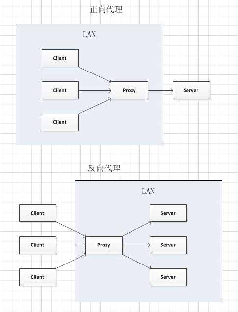

#web
## basic
### concept
- APTs: Advanced Persistent Threats
- Botnets: 使用 drive-by-download(浏览即下载) 的感染技术，在合法网站中安装恶意软件。
- Rootkits: modifies the OS to hide malicious activity of itself or other malware.
- Drive-by download: code executed by visiting a malicious website.
- Trojan: malicious program that provides some useful service in order to pose as legitimate.
- CSP(content security policy): Server send a response header that tells browser a whitelist of what resources can be loaded and what scripts can be executed, and from where.

### network
#### Linker layer
	frame, 封装IP数据报文。
	48bit MAC地址识别 source,destination.
	链路层在NIC or chip 中实现。
##### multiple access links
	Link type:
	1. point-to-point
		PPP protocol
	2. broadcast
		802.11 wireless LAN
	访问协议：
	a. TDMA: 时分复用。
	b. FDME: 频分复用
	c. Random access protocols:
		1. CSMA/CD: 冲突检测(适用于wired)，冲突则中止。
	d. taking turns MAC protocol
		主节点邀请其他节点轮流传输。
##### ARP
	ARP table: <IP, MAC, TTL> TTL:停留时间。
	ARP query: A 广播 ARP query(包含目标IP, 目的mac是ff-ff-ff-ff-ff-ff)，LAN中的节点都会收到。 目标IP向A回应 ARP response.
##### Ethernet
	bus: 电缆。
	Ethernet switch: 交换机。 存储和simultaneously转发 Ethernet frames，但不能向同一个端口转发。
		switch table: 记录发送者的mac与其interface。 
	Ethernet frame structure: preambel+dest_addr+src_addr+data+crc
	1. CRC: 接收端校验未通过，则drop。
##### flow control
##### error detection
##### error correction
##### half-duflex & full-duflex 半/全双工
	
#### network layer
	forward & route.
	两种构建 network control panal 的方式：
	1. per-router control: 根据每个路由器的路由表计算。
	2. logically centralized control (software defined networking)
##### AS
	1. AS中的路由器必须运行相同的域内路由协议（RIP, EIGRP, OSPF)， 不同的AS不受限制。
		a. OSPF: 每个路由器把OSPF link-state发送给AS内所有其他路由器。 每个路由器有全局的topology (Dijkstra)。 所有OSPF message 需要验证，防止恶意入侵。
	2. AS内有一个 gateway router.
	3. BGP. inter-AS routing. based on TCP.
		a. eBGP: 获取邻近AS的可达性。
		b. iBGP: 传播可达性到所有AS。  
##### ICMP
	ICMP message: type, code + first 8 bytes of IP datagram causing error.
##### security
	eavesdrop, impersonation, hijacking, denial of service
###### Digital signature
	Enc(H(m)){sk}.
###### TLS
	hierarchy: HTTP/2, TLS, TCP, IP.
	SSL handshake:
	1. client hello: supported cipher suites.
	2. server hello: selected cipher, server-signed certificate
	3. client: 验证证书，取出公钥。产生 pre-masker secret,加密&发送。
	5. Both: 独立产生 symmetric and mac keys.

##### IPSec
	提供IP数据报文级别的加密，验证，完整性。
	a. transport mode
		只加密和验证payload。
	b. tunnel mode
		加密和验证整个报文。
	IPSec protocol: AH和ESP
	

### Access Control
#### term
- authentication: username, password and additional factors.
- Session management: Keep track of authenticated users across sequence of requests.
	- Server generate session ID and gives it to browser.
		- Temporary token that identifies and authenticates user.
	- Browser returns session ID to server in subsequent requests.
- Authorization: Check and enforce permissions of authenticated users.

#### Session ID的实现
- Cookie: 在HTTP头中传递。 Set-Cookie 或者 Cookie.
	1. cookie 被所有浏览器 tabs 共享。
	2. cookie 自动被浏览器返回，有可能不是用户行为导致。
- Get请求中的变量： SID
	1. 只有用户请求是才发送cookie.
- POST请求： SID.
	1. 只有用户请求时才发送cookie。
	2. 导航必须通过POST请求。
 
### 正则表达式
- ？ : 匹配前面的子表达式零次或一次，或指明一个非贪婪限定符。要匹配 ? 字符，请使用 \?。

### get和post请求
	GET 一般用于获取/查询资源信息；POST 一般用于更新资源信息。
	最直观的区别就是GET把参数包含在URL中，POST通过request body传递参数。
	* get把请求的数据放在url上，即HTTP协议头上，其格式为： 以?分割URL和传输数据，参数之间以&相连。数据如果是英文字母/数字，原样发送；如果是空格，转换为+；如果是中文/其他字符，则直接把字符串用BASE64加密；及“%”加上“字符串的16进制ASCII码”。
	
	对于GET方式的请求，浏览器会把http header和data一并发送出去，服务器响应200（返回数据）；
	而对于POST，浏览器先发送header，服务器响应100 continue，浏览器再发送data，服务器响应200 ok（返回数据）。 但并不是所有浏览器都会在POST中发送两次包，Firefox就只发送一次。
	它们的应用区别：
	1. GET在浏览器回退时是无害的，而POST会再次提交请求。
	2. GET产生的URL地址可以被Bookmark，而POST不可以。
	3. GET请求会被浏览器主动cache，而POST不会，除非手动设置。
	4. GET请求只能进行url编码，而POST支持多种编码方式。
	5. GET请求参数会被完整保留在浏览器历史记录里，而POST中的参数不会被保留。
	6. GET请求在URL中传送的参数是有长度限制的，而POST么有。
	7. 对参数的数据类型，GET只接受ASCII字符，而POST没有限制。
	8. GET比POST更不安全，因为参数直接暴露在URL上，所以不能用来传递敏感信息。
	9. GET参数通过URL传递，POST放在Request body中。
	
	get请求发送： 直接在URL中输入参数。
	post请求发送： 使用浏览器插件 hackbar 发送post请求。
### Robots协议
	/robots.txt文件 是搜索引擎中访问网站的时候要查看的第一个文件。当一个搜索蜘蛛访问一个站点时，它会首先检查该站点根目录下是否存在robots.txt，如果存在，搜索机器人就会按照该文件中的内容来确定访问的范围；如果该文件不存在，所有的搜索蜘蛛将能够访问网站上所有没有被口令保护的页面。
#### HTTP 
#### cookie
	Cookie是当主机访问Web服务器时，由 Web 服务器创建的，将信息存储在用户计算机上的文件。一般网络用户习惯用其复数形式 Cookies，指某些网站为了辨别用户身份、进行 Session 跟踪而存储在用户本地终端上的数据，而这些数据通常会经过**加密处理**。
#### XFF头（X-Forwarded-For）
	它代表客户端，也就是HTTP的请求端真实的IP，只有在通过了HTTP 代理或者负载均衡服务器时才会添加该项。
#### Referer
	HTTP Referer是header的一部分，当浏览器向web服务器发送请求的时候，一般会带上Referer，告诉服务器我是从哪个页面链接过来的。
	一般用来防盗链。
### php
- === 会同时比较字符串的值和类型, == 会先将字符串换成相同类型，再作比较，属于弱类型比较（PHP是一种弱类型的语言）。
- eval() - 执行函数(需要以分号结尾)。
- _FILES数组 - 二维数组，获取上传文件信息。
- preg_split(pattern, subject) - 用于正则表达式分割字符串。 
- \r回车，表示使光标下移一格。
- \n换行, 表示使光标到行首。
- 

#### web vulnerable
##### SQL Injection
	Elevation of privilege， Information disclosure， Tampering， Denial of service。
	* Blind SQLi. Try payloads that cause a delay in processing.
	* Second-order SQLi. User may submit payloads that are dangerous only on the second usage.
###### countermeasures
	Input filtering. Prepared statements. Stored procedures. Static/dynamic analysis of server-side code interfacing with database. Rate-limit requests to web server or database server. Web Application Firewall (WAF)(An IDS in front of the database, aware of the web application). Rely on a programming framework.
##### 文件上传漏洞
	上传一句话木马。
##### 文件包含漏洞
	文件包含漏洞是“代码注入”的一种，其原理就是注入一段用户能控制的脚本或代码，并让服务端执行。
	成功利用文件包含漏洞进行攻击，需要满足以下两个条件：
	1. 采用include()等文件包含函数通过动态变量的方式引入需要包含的文件。
	2. 用户能够控制该动态变量。 
##### csrf ( cross site request forgery )
	我们在用浏览器浏览网页时通常会打开好几个浏览器标签（或窗口），假如我们登录了一个站点A，站点A如果是通过cookie来跟踪用户的会话，那么在用户登录了站点A之后，站点A就会在用户的客户端设置cookie，假如站点A有一个页面siteA-page.php（url资源）被站点B知道了url地址，而这个页面的地址以某种方式被嵌入到了B站点的一个页面siteB-page.php中，如果这时用户在保持A站点会话的同时打开了B站点的siteB-page.php，那么只要siteB-page.php页面可以触发这个url地址（请求A站点的url资源）就实现了csrf攻击。
	Attacker’s site has script that issues a request on target site.
###### Mitigation
	1. use a cookie in combination with a post variable, called CSRF token.
	2. server 验证 cookie 和 CSRF token.
##### XSS
	将恶意代码注入进系统，让其触发。
	* DOM-based XSS
		A trusted script reads an attacker-controlled parameter and embeds it in the page。
	* Reflected XSS
		A an attacker-controlled URL parameter is embedded in the page by the server.
	* Stored XSS
		An attacker stores malicious data on a server, which later embeds it in user pages.
	* Self XSS
		Users can be tricked into injecting malicious JavaScript in the page.
	* Cross-channel scripting (XCS)
		Attack is triggered when user visits admin console using browser.
###### Mitigation
	1. whitelist
	2. blacklist
	3. Validate inputs
	4. XSS filters: htmlspecialchars() in PHP.
	5. Use templates or frameworks to validate inputs consistently.
	6. Browsers enforced defenses: X-XSS-Protection header
	7. Finding new XSSs
	8. 
##### other
	- 扫目录脚本dirsearch(项目地址：https://github.com/maurosoria/dirsearch(https://github.com/maurosoria/dirsearch)) : 可以查看有哪些文件。
	- 利用加密函数绕过 字符过滤， e.g. base64_decode(target_base64)
### js
#### base
	* 对象
		* 对象也可以有方法。方法是在对象上执行的动作。方法以函数定义被存储在属性中。
#### vulnerability
	1. 对象隐式强转成字符串，可以触发恶意代码执行。

### nginx
#### alias_traversal
##### Path traversal via misconfigured alias
	有以下配置：
```
location /i/ {
    alias /data/w3/images/;
}
```
	请求 /i../top.gif, /data/w3/images/../top.gif将被发送。
###### reference
- https://github.com/yandex/gixy/blob/master/docs/en/plugins/aliastraversal.md : 检测工具。

### wasm
	让 JavaScript 直接执行高级语言生成机器码的一种技术

## proxy

- 正向代理中, proxy 和 client 在一个互联的网络中，对server透明。
- 反向代理中，proxy 和 server 在一个互联的网络中，对client透明, 也就是一个服务端的负载均衡器。
注: proxy在两种代理中做的事都是代为收发请求和响应,，不过从结构上来看正好左右互换了下，所以把后出现的那种代理方式叫成了反向代理。

## DVWA
  渗透测试的演练系统，用于web攻击学习。

## xampp(Apache + MySQL + PHP + PERL)
  建站集成软件包.

## burpsuit
  抓包软件
### intruder爆破
  可以用于字典爆破密码。

## wireshark
  抓包软件
### common command
- ip.src/dst  
- tcp.port

## sqlmap
- sqlmap -u url --batch -a : sql注入
- sqlmap -r post.txt --batch -a : post请求注入

## suricata
  一种一种基于规则的IDS工具，检测各种网络攻击手段，记录攻击流量。

## hping3
  一种命令行形式的用于生成和解析TCP/IP协议数据包汇编/分析，例如进行DoS攻击，伪造源IP等.

## JSON
### JSON format
  {"field1":value1,"field2":value2,...}

## other
	* 翻墙
		* 代理
		* api
		* 云服务器
## todo